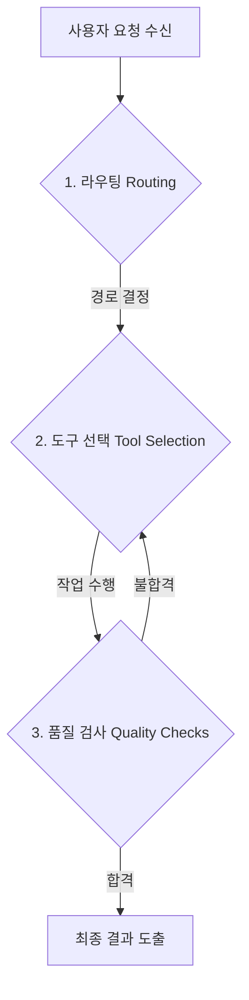

# Module 1: Introduction to AI Agents 🤖

LangGraph를 활용한 AI 에이전트 구축 과정의 **모듈 1: AI 에이전트 소개** 학습 노트입니다. AI 에이전트의 정의, 대표적인 행동 양식, 그리고 핵심 특성을 중심으로 정리되어 있어, 누구나 직관적으로 에이전트의 개념을 이해할 수 있도록 구성했습니다.

---

## 📌 모듈 개요 (Module Overview)

본 모듈에서는 AI 에이전트의 세계와 특성을 탐구하며, LLM 기반 시스템의 패러다임이 어떻게 변화하고 있는지 이해합니다.
- **주요 학습 목표:**
  - AI 에이전트의 핵심 개념 및 정의 이해
  - 에이전트의 추론 능력과 도구 사용(Tool Use)
  - 현실 세계의 다양한 에이전트 적용 사례 학습
  - 추론과 행동을 결합한 **ReAct 아키텍처** 이해
  - **단일 에이전트(Single-Agent)** vs **다중 에이전트(Multi-Agent)** 아키텍처 비교 및 선택 기준

---

## 📖 Lesson 1: AI 에이전트의 정의와 핵심 요소

### 1. AI 에이전트(AI Agent)란?
> **대형 언어 모델(LLM)을 의사결정 엔진(Brain)으로 삼아, 애플리케이션의 제어 흐름(Control Flow)을 스스로 결정하고, 계획을 세우며, 여러 번의 반복(Iteration) 과정을 거쳐 목표를 완수할 수 있는 정교한 엔티티(Entity)입니다.**

에이전트는 문제를 추론하고, 필요한 도구를 선택해 작동하며, 도구·인간·다른 에이전트로부터 얻은 피드백과 결과를 종합하여 목적을 달성합니다.

#### 💡 일반적인 시스템 vs 에이전트의 차이점
* **기존 제품 엔지니어링 (Traditional Software):** 개발자가 작성한 규칙(예: `if-else`문 기반의 고정된 제어 흐름)에 따라 동작합니다.
* **에이전틱 시스템 (Agentic Software):** LLM이 제어의 주체가 되어 입력값과 상황에 맞춰 동적으로 실행 흐름을 구성합니다.

---

### 2. 대표적인 에이전트의 3대 행동 양식 (Agentic Behaviors)

에이전트가 워크플로우를 주도할 때 나타나는 대표적인 의사결정 및 행동 양식입니다.

#### 📞 ① 라우팅 (Routing)
* **개념:** 에이전트가 기반 LLM을 활용하여 입력된 작업을 처리하기 위해 **어떤 경로로 흐름을 보낼지(Route) 스스로 결정**하는 분기 처리 행동입니다.
* **역할 비유:** 전화를 건 고객의 목적에 따라 알맞은 부서나 담당자에게 전화를 돌려주는 **전화 교환원**과 같습니다.
* **예시:** 사용자의 요청을 수신했을 때, 이를 `검색 에이전트`, `코드 실행 에이전트`, `데이터베이스 저장 프로세스` 중 어느 쪽으로 보낼지 에이전트가 스스로 제어 흐름을 결정합니다.

#### 🧰 ② 도구 선택 (Tool Selection)
* **개념:** 라우팅을 거쳐 지정된 단계에서, 목적 달성에 필요한 **구체적인 외부 기능이나 서비스를 선택하고 호출**하는 작업입니다.
* **역할 비유:** 상황에 맞는 최적의 도구를 공구함에서 꺼내 쓰는 **전문 작업가**와 같습니다.
* **예시:** 에이전트의 추론 컴포넌트가 웹 검색, 이메일 발송, 데이터베이스 쿼리, 코드 실행 등 다양한 도구 세트(Toolkit) 중에서 무엇을 사용할지 평가하고 실행합니다. 도구 실행 결과에 따라 추가 도구가 필요할지도 스스로 판단합니다.

#### 🔍 ③ 품질 검사 (Quality Checks)
* **개념:** 자신이 생성한 작업물(중간 산출물 또는 최종 산출물)이 요구 기준을 충족하는지 **스스로 검증하고 자가 평가(Self-Evaluation)** 하는 과정입니다.
* **역할 비유:** 생산 라인에서 부품과 완제품의 불량 여부를 판별하여 합격/불합격을 결정하는 **품질 관리 검사관**과 같습니다.
* **예시:** 작성된 코드에 문법 오류가 없는지 검증하거나, 생성된 보고서가 사용자의 지침을 정확히 따랐는지 검사하여 기준 미달 시 수정을 반복(Iteration)합니다. 이 평가는 사용자에게 제공할 최종 결과물뿐만 아니라 협업하는 다른 에이전트에게 전달될 중간 결과물에도 필수적입니다.

---

### 3. AI 에이전트의 3대 근본적 특성 (Core Characteristics)

에이전트를 구성하는 3가지 핵심 축(Pillars)입니다.

| 특성 | 상세 설명 | 비유 및 역할 |
| :--- | :--- | :--- |
| **추론 및 계획 (Reasoning & Planning)** | • 주어진 맥락(Context), 입력값, 이전 지식을 바탕으로 정보에 입각한 판단을 내립니다. • 목표 달성을 위해 행동을 논리적 순서로 구조화하여 계획을 세웁니다. | **두뇌 (Brain)** 문제를 이해하고 어떻게 풀어나갈지 사고하는 단계 |
| **행동 및 도구 사용 (Action & Tool Use)** | • 에이전트가 특정 업무를 수행하기 위해 연동하는 외부 함수(Function)나 서비스(API)입니다. • 의사결정된 계획을 외부 시스템과의 상호작용을 통해 실천에 옮깁니다. | **손과 발 (Hands & Feet)** 환경과 상호작용하여 데이터를 가져오거나 시스템 상태를 변경하는 단계 |
| **메모리 (Memory)** | • 과거의 대화 기록, 이전 단계의 상호작용 내용, 행동에 대한 결과를 기억합니다. • 과거 경험을 기반으로 추후 진행될 단계의 의사결정을 더욱 지능적으로 고도화합니다. | **기억력 (Memory/Storage)** 컨텍스트를 잃지 않고 피드백을 반영하며 지속적으로 발전하는 단계 |

---

## 📝 다음 단계 예고
에이전트의 이러한 행동과 특성들은 기존 소프트웨어 아키텍처의 한계를 뛰어넘는 유연함을 선사합니다. 다음 레슨에서는 **이러한 에이전트들이 왜 강력한지**, 그리고 **전통적인 제품 엔지니어링 방식을 어떻게 뛰어넘는지** 구체적으로 알아보겠습니다.
