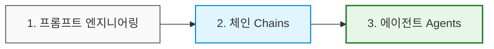

# Lesson 1.2: 왜 AI 에이전트가 필요한가? (Why Do We Need AI Agents?) 🚀

이 레슨에서는 AI 에이전트가 등장하게 된 배경, 프롬프트 엔지니어링으로부터의 진화 과정, 그리고 기존 AI 기술의 한계를 극복하는 에이전트만의 강력한 핵심 역량에 대해 배웁니다.

---

## 1. LLM 활용 기술의 3단계 진화 과정

LLM을 활용하여 가치를 창출하는 기술은 크게 3단계의 진화 흐름을 거쳐 발전해 왔습니다.

1. **프롬프트 엔지니어링 (Prompt Engineering)**
   * **설명:** LLM이 사용자가 원하는 맞춤형 출력물을 생성하도록 정교한 입력값(프롬프트)을 설계하고 튜닝하는 작업입니다.
   * **대표 기법:** 논리적 추론 능력을 극대화하기 위한 **생각의 사슬(Chain of Thought, CoT)** 프롬프팅 등.

2. **체인 (Chains)**
   * **설명:** 단일 프롬프트를 넘어 여러 개의 프롬프트, LLM 호출, 도구(Tool) 사용, 그리고 데이터 처리 단계들을 **일련의 순차적인 흐름**으로 연결하여 처리하는 아키텍처입니다.

3. **에이전트 (Agents)**
   * **설명:** 프롬프트 엔지니어링과 체인의 기능을 기본으로 탑재하고, 여기에 **스스로 계획을 세우고, 행동을 취하며, 여러 번의 반복(Iteration)을 통해 자율적으로 목표를 실행하는 능력**을 더한 정교한 시스템입니다.

---

## 2. 기존 프롬프트 엔지니어링의 한계와 에이전트의 필요성

* **기존 프롬프트 엔지니어링의 한계:**
  * 해결하려는 태스크가 복잡해질수록 정확도가 급격히 떨어집니다.
  * 특히 계층적인 지시사항을 처리하거나 고차원적인 다단계 추론(Multi-step Reasoning)을 요구할 때 한계를 드러냅니다.
* **AI 에이전트가 제공하는 해결책:**
  * 동적 문제 해결, 실시간 계획 수립, 자율적 도구 사용을 바탕으로 복잡한 워크플로우를 유연하게 처리합니다.
  * 연구 결과에 따르면, 에이전트 기반 기술은 **동적인 피드백 루프, 도구 사용, 실시간 상태 조정**을 통해 기존 CoT(생각의 사슬) 추론보다 **환각(Hallucinations)과 오류를 획기적으로 감소**시킵니다.

---

## 3. 프롬프트를 뛰어넘는 AI 에이전트의 3대 핵심 역량

에이전트가 기존 단순 LLM 호출 시스템과 차별화되는 결정적인 역량들입니다.

### 🔄 ① 사이클과 루프 (Cycles and Loops)
* **개념:** 단방향으로만 흐르는 순차적 체인(Chaining)과 달리, 에이전트는 **자신의 작업을 되돌아보고(Retry), 실패한 행동을 다시 시도하며, 결과가 개선될 때까지 반복 루프**를 돌 수 있습니다.
* **예시:** 웹 스크래핑을 수행할 때, 특정 사이트에서 수집에 실패하면 에이전트가 실패 원인을 분석하여 다른 방법으로 성공할 때까지 재시도함으로써 최종적으로 완결성 있는 데이터를 수집합니다.

### 🧰 ② 양방향 도구 사용 (Tool Use: Read & Write)
* **개념:** 에이전트는 외부 API 및 서비스와 실시간으로 상호작용하여 정보를 읽고(Read) 상태를 변경하는 쓰기(Write) 작업을 자율적으로 수행합니다.
* **예시:** 데이터베이스에서 특정 고객의 정보를 조회(Read/Fetch)하고, 이를 바탕으로 맞춤형 이메일 초안을 작성한 뒤, 이메일 전송 API를 통해 메일을 발송(Write)하는 일련의 복합적인 상호작용 프로세스를 인간의 개입 없이 스스로 처리합니다.

### ⚖️ ③ 자가 성찰 및 지속적 개선 (Reflect and Continuously Improve)
* **개념:** 다른 에이전트의 피드백이나 자체 품질 검증 기준을 반영하여 **자신의 결과물을 스스로 다듬고 지속해서 업그레이드**합니다.
* **예시:** 
  1. **작성 에이전트**가 블로그 포스팅 초안을 작성합니다.
  2. **교정 에이전트**가 초안을 검토하여 수정 및 개선 사항을 제안합니다.
  3. 이 피드백 루프는 콘텐츠가 **목표 품질 기준을 완벽하게 만족할 때까지 반복**됩니다.
