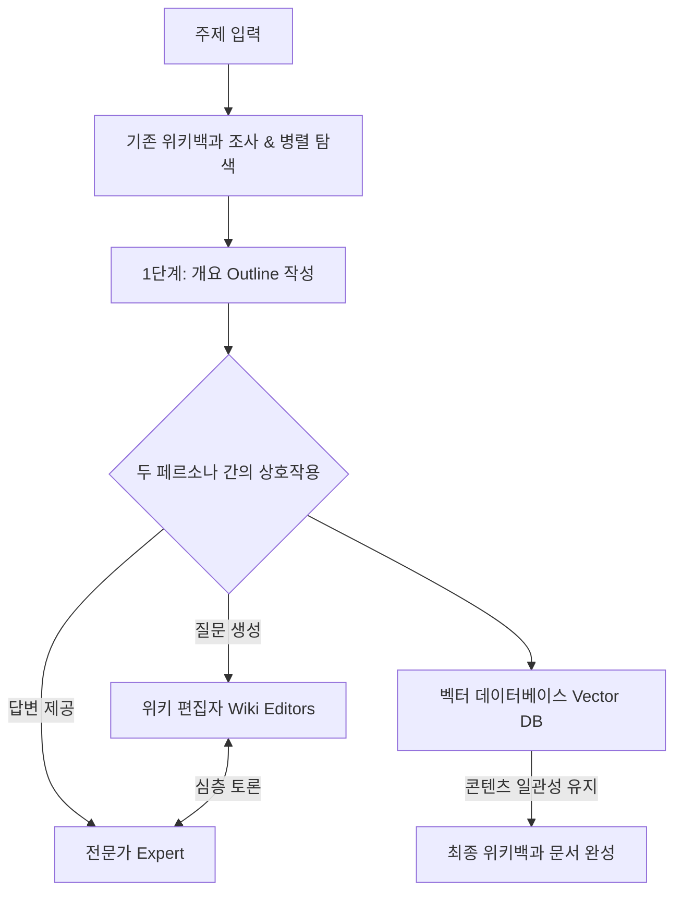
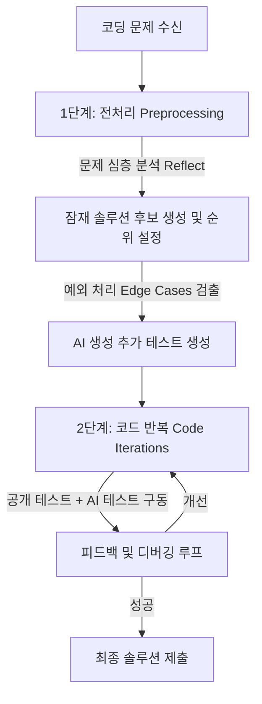

# Lesson 1.3: AI 에이전트의 실제 적용 사례 (Applications of AI Agents)

이 레슨에서는 학술 연구, 코드 생성, 자율 웹 브라우징 등 실제 현실 세계에서 성공적으로 적용되고 있는 고도화된 AI 에이전트 시스템의 대표적인 3가지 사례를 살펴봅니다.

---

## 1. STORM (스탠퍼드 대학교 개발)
* **풀네임:** Synthesis of Topic Outlines through Retrieval and Multiperspective Question Asking
* **개념:** 사용자가 입력한 특정 주제에 대해 **위키백과(Wikipedia) 스타일의 포괄적인 연구 문서를 생성**하는 AI 연구 보조원 시스템입니다.
* **주요 특징:** 단순 텍스트 생성이 아닌 개요 작성과 정보 수집을 유기적으로 병렬 처리하며, 다중 에이전트 협업 구조를 갖추고 있습니다.

### ⚙️ 핵심 작동 방식
* **다중 페르소나 협업:** 질문을 만드는 **'위키 편집자(Wiki Editors)'** 페르소나와 지식을 바탕으로 답변을 내는 **'전문가(Expert)'** 페르소나가 상호 작용하며 심층적인 토론을 유도합니다. 이 토론 결과가 개요를 다듬고 세부 섹션을 채우는 핵심 데이터로 쓰입니다.
* **벡터 저장소 활용:** 병렬로 검색된 데이터와 에이전트가 생성한 콘텐츠의 흐름 및 일관성이 깨지지 않도록 벡터 데이터베이스(Vector DB)를 통해 문서를 정렬합니다.

---

## 2. AlphaCodium (Codium AI 개발)
* **개념:** 고난도 코드 생성(특히 Competitive Programming 및 알고리즘 경진대회 문제 해결)을 위해 고안된 **흐름 엔지니어링(Flow Engineering)** 아키텍처입니다.
* **성과:** GPT-4를 단일 호출하는 전통적인 방식보다 컴퓨팅 자원을 훨씬 적게 쓰면서도, 코드 생성 작업의 **정확도를 최대 2배** 향상시켰습니다.

### ⚙️ 핵심 작동 방식
1. **전처리 단계 (Preprocessing)**
   * 문제를 다각도로 분석(Reflect)하고 기본 테스트 케이스를 검토해 잠재적인 솔루션 후보들을 생성하고 우선순위(Rank)를 매깁니다.
   * AI 에이전트가 스스로 예외적인 상황(Edge Cases)을 가정하고 이를 잡아내기 위한 **추가 테스트 케이스를 직접 설계**합니다.
2. **코드 반복 단계 (Code Iterations)**
   * 기본으로 주어진 테스트 케이스와 AI가 임의로 만든 테스트 케이스를 통과할 때까지 **테스트 ➡️ 피드백 ➡️ 코드 개선 ➡️ 재시험**의 순환(Iteration) 구조를 자율적으로 반복하며 완벽한 정답 코드를 완성해 나갑니다.

---

## 3. WebVoyager
* **개념:** 사람이 직접 인터넷 브라우저를 조작하는 것처럼 **자율적으로 웹 페이지를 탐색하고 상호작용**할 수 있도록 설계된 멀티모달 AI 에이전트입니다.
* **비유:** 백엔드 API를 사용하는 대신 직접 프론트엔드 UI를 마우스와 키보드로 컨트롤하여 웹을 '사용'하는 자율주행 웹 브라우저 비서입니다. (Anthropic의 *Computer Use* API와 매우 유사한 개념)

| 구분 | 상세 동작 및 활용 도구 |
| :--- | :--- |
| **입력 인식** | 사용자의 텍스트 요청과 웹 페이지의 **실시간 스크린샷**을 동시에 프로세싱하는 멀티모달(Multimodal) 분석을 진행합니다. |
| **탐색 및 제어 도구** | 사람과 동일하게 웹사이트와 상호작용하기 위해 다음과 같은 도구 세트를 자율 선택하여 수행합니다. • **스크롤(Scroll)**: 화면 상하좌우 이동 • **클릭(Click)**: 링크 및 버튼 활성화 • **타이핑(Typing)**: 양식 제출(Form Submissions) 및 검색어 입력 • **탐색 제어(Navigation)**: 뒤로 가기, 새로고침 등 |
| **동적 이해 업데이트** | 조작 후 돌아오는 화면 피드백 및 웹 페이지 주석(Annotation)을 바탕으로 현재 페이지 상태에 대한 이해도를 실시간 업데이트하고 다음 액션을 계획합니다. |
