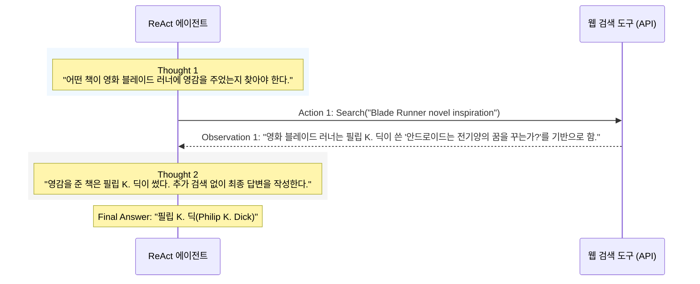

# Lesson 1.6: ReAct 패턴 - 추론과 행동의 결합 (ReAct Pattern: Synergizing Reasoning and Action Taking) 🔄

이 레슨에서는 에이전트가 문제를 해결할 때 추론(Reasoning)과 행동(Action)을 유기적으로 엮어내는 핵심 아키텍처인 **ReAct 프레임워크**의 개념, 작동 흐름, 성능 지표, 그리고 명확한 장단점에 대해 배웁니다.

---

## 1. ReAct 프레임워크란?

* **개념:** ReAct는 추론과 행동(Reasoning + Acting)의 합성어로, 에이전트가 문제를 풀기 위해 **'생각하기(Thinking)'와 '행동하기(Doing)'를 교대로 반복**하는 프레임워크입니다.
* **아키텍처:** 일반적으로 **단일 에이전트(Single-agent) 구조**로 구현되며 매우 간결하면서도 강력한 문제 해결 능력을 보장합니다.

```
[ ReAct의 핵심 메커니즘 ]
생각 (Thought) ➡️ 행동 (Action) ➡️ 관찰 (Observation) 🔄 (루프 반복)
```

1. **생각 (Thought):** 당면한 문제를 분석하고, 무엇을 처리해야 하는지 논리적인 추론을 진행합니다.
2. **행동 (Action):** 생각한 판단을 바탕으로 외부 도구(APIs, 검색, DB 등)를 호출하여 실행합니다.
3. **관찰 (Observation):** 도구가 반환한 결과물(데이터)을 확인하고 상황을 인지하여 다음 '생각'의 재료로 삼습니다.

---

## 2. ReAct 동작 예시: 블레이드 러너 질문 해결 과정

> **사용자 질문:** "영화 *블레이드 러너(Blade Runner)*에 영감을 준 책은 누가 썼나요?"



---

## 3. 타 접근 방식과의 성능 비교 (HotpotQA 데이터셋 예시)

> **복잡한 질문:** "태양의 서커스(Cirque du Soleil)의 미스테레(Mystery) 공연이 열리는 호텔에는 몇 개의 객실이 있나요?"

| 접근 방식 | 문제 해결 과정 | 결과 |
| :--- | :--- | :--- |
| **일반 LLM (Standard)** | 외부 연동 없이 모델 내부 지식으로만 답변을 찍어냄 (예: "3,000개") | ❌ **오답** (환각 발생) |
| **추론 중심 (Reason-only)** | 생각 과정은 논리적이나, 정적인 학습 컷오프 데이터 내에 갇혀 있음 | ❌ **오답** (구식 정보) |
| **행동 중심 (Action-only)** | 웹 검색을 끊임없이 호출하지만, 검색된 파편 정보 간의 인과관계를 엮지 못함 | ❌ **오답** (추론 결여) |
| **ReAct 접근법** | 공연 검색 ➡️ 상영 호텔(트레저 아일랜드) 파악 ➡️ 해당 호텔 객실 수 검색(3,104개 도출)을 논리적으로 제어 |  **정답** (3,104개) |

### 📊 ReAct의 장점
* **우수한 의사결정력:** 제로샷 프롬프팅 및 기존 추론 기법들보다 높은 정답률을 보입니다.
* **환각(Hallucination)률 감소:** HotpotQA 데이터셋 기준, CoT(생각의 사슬)의 환각률이 14%인 것에 비해 ReAct는 **6%** 수준으로 감소시킵니다.
* **높은 해석 가능성(Interpretability)과 신뢰성:** 에이전트가 정답에 도달하기까지의 사고 흐름(Thought)이 투명하게 로그로 기록되므로 디버깅 및 시스템 분석이 용이합니다.

---

## 4. ReAct의 한계점

1. **루프 탈출의 어려움 (Loop-exit Challenges)**
   * 에이전트가 동일한 생각과 행동 루프에 갇혀(Infinite Loop) 진전을 보이지 못하는 경우가 발생할 수 있습니다.
   * 최대 반복 횟수 제한(Max Iterations)을 두어 강제 종료할 수 있으나, 이 경우 미완성된 차선의 결과를 그냥 반환해야 하는 한계가 있습니다.
2. **확장성 한계 (Scalability Issues)**
   * **병렬 처리 불가:** 단일 에이전트가 한 단계씩 순차적으로 Thought-Action-Observation을 거치기 때문에 여러 분기를 동시에 처리하기 어렵고 복잡한 작업에서 속도가 느려집니다.
   * **도구 포화(Tool Saturation):** 제공되는 도구의 수가 너무 많아지면 LLM이 어떤 도구를 선택해야 할지 혼란을 겪어 정확도가 급격히 떨어집니다.
