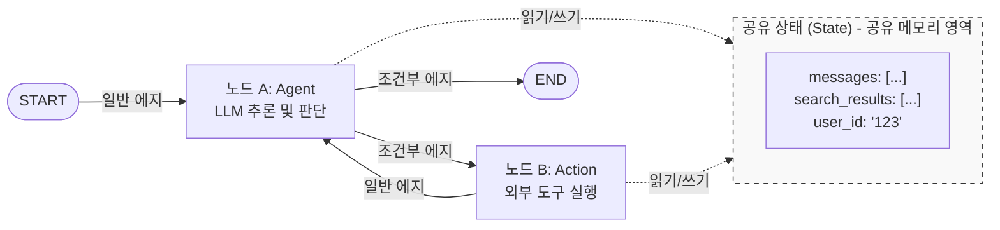
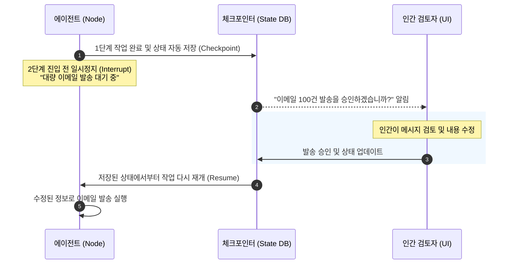

# Lesson 3.1: LangGraph란 무엇인가? (What Is LangGraph?) 🕸️

이 레슨에서는 복잡한 ReAct 루프를 하드코딩하지 않고, 에이전트의 제어 흐름과 데이터를 정밀하게 설계할 수 있게 돕는 프레임워크인 **LangGraph**의 정의, 핵심 구성 요소, 강력한 기능군 및 사용 가치를 학습합니다.

---

## 1. LangGraph의 핵심 개념

> **정의: LLM을 활용하여 상태가 유지되는 다중 액터(Stateful Multi-actor) 애플리케이션을 구축할 수 있도록 지원하는 라이브러리입니다.**

이전 모듈(Module 2)에서 우리는 `while` 루프와 `next_prompt` 변수를 사용해 원시적으로 상태를 제어했습니다. 하지만 에이전트의 규모가 커지고 연동할 도구가 많아지면 하드코딩으로 모든 상태를 제어하기가 불가능해집니다.

LangGraph는 에이전트의 워크플로우를 하나의 **'그래프(Graph)'**로 시각화하고 모델링하여 미세한 수준의 **제어력(Controllability)**과 **상태 관리(State Management)**를 보장합니다.

---

## 2. 그래프의 3대 빌딩 블록 (Building Blocks)

LangGraph로 설계하는 모든 에이전트 워크플로우는 다음 3가지 핵심 요소로 구성됩니다.

### ① 노드 (Nodes)
* **역할:** 그래프 상의 **행동(Action), 작업 단계(Step), 혹은 특정 에이전트**를 나타내는 독립적인 실행 단위(함수)입니다.
* **예시:** 질문 분석 노드, 검색 API 실행 노드, 데이터베이스 갱신 노드, 이메일 전송 노드 등.

### ② 에지 (Edges)
* **역할:** 노드와 노드를 연결하는 연결선으로, **제어 흐름의 방향**과 **데이터의 흐름**을 정의합니다.
* **유형:**
  * **일반 에지 (Normal Edges):** 무조건 노드 A에서 노드 B로 제어가 이동합니다.
  * **조건부 에지 (Conditional Edges):** 노드 A의 실행 결과(State)에 따라, 다음으로 갈 노드를 동적으로 결정합니다. (예: "답을 찾았으면 `END` 노드로 가고, 아니면 `TOOL` 노드로 가라")

### ③ 상태 (State)
* **역할:** 그래프 전체에서 노드들이 공유하는 **중앙 집중식 데이터베이스(상태 공간)**입니다.
* **특징:** 각 노드는 이 상태 객체를 읽고(Read) 수정(Write/Update)하며 작업을 진행합니다. 이전 모듈에서 우리가 직접 구현했던 `messages = []` 리스트가 LangGraph에서는 이 `State`에 속합니다.

---

## 3. LangGraph의 5대 핵심 기능

| 기능 | 상세 설명 | 실무적 의의 |
| :--- | :--- | :--- |
| **사이클과 분기 (Cycles & Branching)** | 루프(반복)와 동적 조건문 분기를 간결하게 구현합니다. | 예측 불가능한 복잡한 경로를 가진 유연한 자율주행 에이전트 구축 가능 |
| **상태 지속성 (Persistence)** | 각 노드의 실행이 완료될 때마다 상태를 백업(체크포인트)합니다. | 프로그램 에러 시 마지막 안전 상태에서 복구(Error Recovery)가 가능 |
| **인간 참여형 (Human-in-the-loop)** | 민감한 액션(결제, 승인 등) 전에 에이전트를 일시정지시킵니다. | 인간 검토자(Human Reviewer)의 개입, 계획 수정 및 최종 실행 승인 보장 |
| **스트리밍 지원 (Streaming)** | 각 노드의 가공 결과물이나 LLM의 토큰을 실시간으로 중계합니다. | 대화 인터페이스(UI/UX)에서 사용자 대기 시간을 최소화하고 투명성 제공 |
| **LangChain 생태계 연동** | 독립 동작도 가능하나, LangChain 생태계와 긴밀히 엮입니다. | 디버깅 및 모니터링 플랫폼인 **LangSmith**를 사용해 에이전트 모니터링 가능 |

---

## 4. 인간 참여형(Human-in-the-loop) 작동 메커니즘

상태 지속성(Persistence) 덕분에 가능한 LangGraph만의 대표적인 고급 의사결정 프로세스입니다.

---

## 💡 LangGraph는 언제 적용해야 할까요?

* **적합한 유즈케이스:**
  1. **복잡한 자율 제어 루프:** 단순한 sequential chain을 넘어, 수십 번의 Thought-Action 피드백 사이클을 세밀히 조율해야 할 때.
  2. **다중 에이전트 시스템:** 다수의 특화된 에이전트가 각자의 고유 노드를 구성하고, 중앙 상태(State)를 참조해가며 상호작용하는 협업 시나리오.
