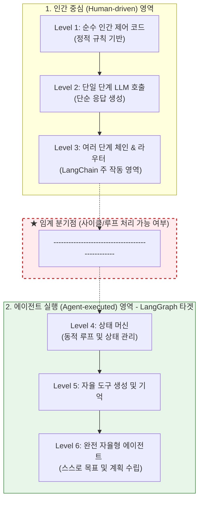
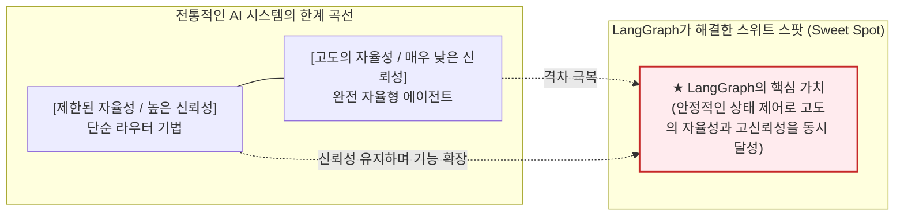

# Lesson 3.2: 언제 다른 프레임워크 대신 LangGraph를 사용해야 할까? (When to Use LangGraph Over Other Frameworks?) ⚖️

이 레슨에서는 에이전트의 자율성과 시스템의 안정성이 어떤 관계를 갖는지 탐구하고, 단순한 단방향 체인을 넘어 **왜 LangGraph가 복잡한 에이전트 시스템의 유일한 대안이 되는지** 선택의 기준과 설계 원칙을 배웁니다.

---

## 1. AI 자율성(Autonomy)의 6단계 스펙트럼

AI 애플리케이션의 동작 방식은 인간이 미리 짜놓은 고정 코드(하드코딩)에서 출발하여, LLM이 모든 제어 흐름을 주도하는 완전 자율 시스템으로 진화하고 있습니다.

* **LangChain의 한계:** 기존의 LangChain은 주로 **Level 3 (체인 및 단순 라우터)** 단계에서 작동하도록 최적화되어 있어, 사이클이 빈번하고 고도로 복잡한 자율 제어를 감당하기 어렵습니다.
* **LangGraph의 영역:** **Level 4 ~ Level 6**의 고수준 자율 제어 영역에서 상태를 보존하고 루프를 지능적으로 제어하는 데 최적화되어 있습니다.

---

## 2. 자율성(Autonomy) vs 신뢰성(Reliability)의 절충(Trade-off)

AI 시스템을 설계할 때 직면하는 가장 큰 절충 관계는 **"에이전트의 제어권을 넓혀줄수록 전체 시스템의 신뢰성과 결과의 예측 가능성이 급격히 떨어진다"**는 사실입니다.

* **전통적인 접근법:** 에이전트가 자유롭게 판단할 수 있는 범위를 늘려주면(자율성 향상), 결과물이 엇나가거나 무한 루프에 빠지는 등 신뢰성이 붕괴됩니다.
* **LangGraph의 해결책 (빨간색 화살표):** 정교하게 제어되는 그래프 아키텍처와 상태 검증 장치를 엮어, **더 높은 자율성을 가지면서도 프로덕션 환경에 바로 투입할 수 있는 신뢰성(Reliability)을 유지**해 줍니다.

---

## 3. LangGraph를 지탱하는 3대 설계 원칙

### ⚙️ ① 제어 가능성 (Controllability)
* LangGraph는 미세 수준의 코드를 제어할 수 있는 **로우 레벨(Low-level) 프레임워크**입니다.
* 개발자가 에이전트의 이동 경로와 예외 처리를 하나하나 수동으로 고정 및 강제할 수 있어, 오차가 허용되지 않는 **미션 크리티컬(Mission-critical) 비즈니스 환경**에서 예측 가능한 결과를 보장합니다.

### 👥 ② 인간 참여형 (Human-in-the-loop)
* 상태 지속성(Persistence)과 체크포인터 메모리를 활용해 작동합니다.
* 에이전트가 단독으로 실행하기 위험한 작업(대량 메일 전송, 결제 API 호출 등)에 도달하면 상태를 잠시 멈추고, 인간 검토자(Human Reviewer)의 개입과 편집을 받은 뒤 다시 그 지점부터 작업을 재개(Resume)하거나 타임 트래블(되감기)하게 만듭니다.

### 📺 ③ 스트리밍 (Streaming)
* 긴 시간이 소요될 수 있는 복잡한 에이전트의 처리 과정을 멍하니 기다리게 만들지 않습니다.
* 그래프 내부의 노드들이 가공하는 과정의 데이터, LLM이 출력 중인 실시간 문자 토큰을 사용자 화면에 실시간으로 지속 송출해 줌으로써 사용자 경험(UX)을 대폭 향상시킵니다. (진행률 표시줄 역할 수행)

---

## 💡 LangGraph 도입을 결정하는 4가지 기준

이 4가지 시나리오에 해당한다면 다른 프레임워크 대신 LangGraph를 반드시 도입해야 합니다.

1. **자율성과 신뢰성의 타협이 불가능할 때:** 유연한 사고방식을 하면서도 최종 결과물의 출력 포맷과 절차가 엄격히 규제되어야 하는 경우.
2. **의사결정 경로의 정밀한 예외 처리가 필요할 때:** 단순한 에러 리트라이를 넘어, 실패 지점 별로 복구 노드를 정교하게 설계해야 하는 경우.
3. **인간의 감독과 수정이 수시로 개입해야 할 때:** 콘텐츠 초안 생성 후 승인 절차를 거치거나, 에이전트가 기획한 파이썬 코드를 실행하기 전 검토가 필요한 경우.
4. **여러 에이전트 간의 정교한 분업이 요구될 때:** 각 에이전트가 고유의 작업 노드를 가지고 하나의 큰 공유 상태(State)를 협업하여 업데이트해야 하는 경우.
