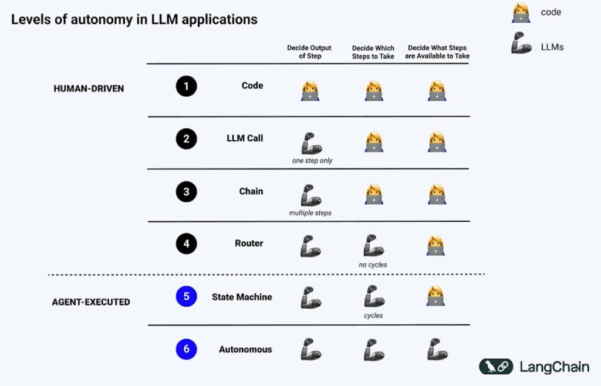
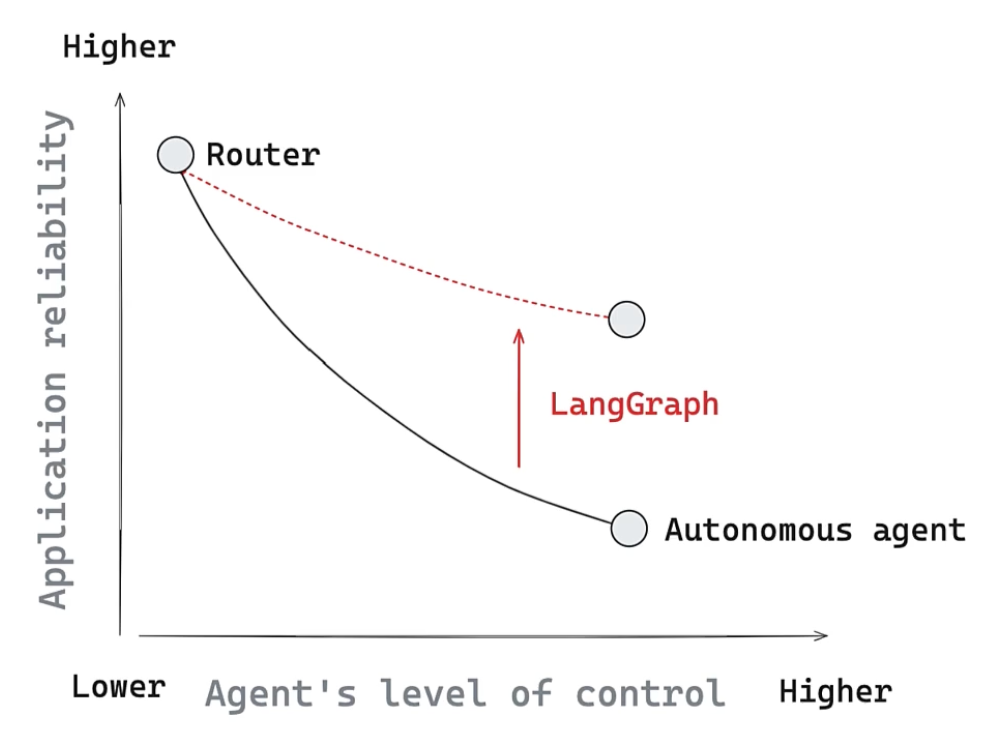

# Lesson 3.2: 언제 다른 프레임워크 대신 LangGraph를 사용해야 할까? (When to Use LangGraph Over Other Frameworks?) ⚖️

이 레슨에서는 에이전트의 자율성과 시스템의 안정성이 어떤 관계를 갖는지 탐구하고, 단순한 단방향 체인을 넘어 **왜 LangGraph가 복잡한 에이전트 시스템의 유일한 대안이 되는지** 선택의 기준과 설계 원칙을 배웁니다.

---

## 1. AI 자율성(Autonomy)의 6단계 스펙트럼

AI 애플리케이션의 동작 방식은 인간이 미리 짜놓은 고정 코드(하드코딩)에서 출발하여, LLM이 모든 제어 흐름을 주도하는 완전 자율 시스템으로 진화하고 있습니다.

### 💡 자율성 레벨별 제어 주체 비교
* **Level 1 (Code):** 어떤 단계의 결과를 낼지, 어떤 단계를 밟을지, 어떤 도구가 사용 가능한지 **모두 인간이 코드로 사전에 결정**합니다.
* **Level 2 (LLM Call):** 단일 단계의 출력 내용만 LLM이 결정하고, 이후 단계는 인간의 코드가 통제합니다.
* **Level 3 (Chain):** 여러 단계에 걸쳐 출력은 LLM이 결정하지만, 실행 경로는 여전히 인간의 정적 코드가 주도합니다. (주로 LangChain이 작동하는 수준)
* **Level 4 (Router):** 입력에 따라 어떤 실행 흐름(경로)으로 보낼지(Decide Which Steps to Take)를 LLM이 결정하기 시작합니다. 단, 되풀이(Cycles)는 없습니다.
* **Level 5 (State Machine):** LLM이 단계의 결과뿐만 아니라, **루프(Cycles)를 포함하여 어떤 단계를 더 실행해야 할지 스스로 결정**합니다. (LangGraph 주 활약 영역)
* **Level 6 (Autonomous):** 어떤 단계들을 사용할 수 있는지(Decide What Steps are Available to Take) 도구의 세트까지 LLM이 스스로 자율 결정하고 통제합니다.

---

## 2. 자율성(Autonomy) vs 신뢰성(Reliability)의 절충(Trade-off)

AI 시스템을 설계할 때 직면하는 가장 큰 절충 관계는 **"에이전트에게 제어 자율성을 많이 부여할수록(Agent's level of control) 전체 시스템의 신뢰성(Application reliability)은 급격히 떨어진다"**는 점입니다.

* **전통적인 한계 곡선 (검은색 실선):**
  * 에이전트의 제어권(Autonomy)이 높아질수록 예상치 못한 예외 상태에 빠지거나 무한 루프를 돌면서 신뢰성이 급감합니다.
* **LangGraph의 해결책 (빨간색 화살표):**
  * 정밀한 그래프 설계, 상태 제어, 예외 상태 복구 로직 등을 통해 **에이전트의 자율적 제어 수준을 극대화하면서도, 프로덕션 투입이 가능할 정도의 고신뢰성을 유지**하도록 이 격차를 메워 줍니다.

---

## 3. LangGraph를 지탱하는 3대 설계 원칙

### ⚙️ ① 제어 가능성 (Controllability)
* LangGraph는 미세 수준의 코드를 제어할 수 있는 **로우 레벨(Low-level) 프레임워크**입니다.
* 개발자가 에이전트의 이동 경로와 예외 처리를 하나하나 수동으로 고정 및 강제할 수 있어, 오차가 허용되지 않는 **미션 크리티컬(Mission-critical) 비즈니스 환경**에서 예측 가능한 결과를 보장합니다.

### 👥 ② 인간 참여형 (Human-in-the-loop)
* 상태 지속성(Persistence)과 체크포인터 메모리를 활용해 작동합니다.
* 에이전트가 단독으로 실행하기 위험한 작업(대량 메일 전송, 결제 API 호출 등)에 도달하면 상태를 잠시 멈추고, 인간 검토자(Human Reviewer)의 개입과 편집을 받은 뒤 다시 그 지점부터 작업을 재개(Resume)하거나 타임 트래블(되감기)하게 만듭니다.

### 📺 ③ 스트리밍 (Streaming)
* 긴 시간이 소요될 수 있는 복잡한 에이전트의 처리 과정을 멍하니 기다리게 만들지 않습니다.
* 그래프 내부의 노드들이 가공하는 과정의 데이터, LLM이 출력 중인 실시간 문자 토큰을 사용자 화면에 실시간으로 지속 송출해 줌으로써 사용자 경험(UX)을 대폭 향상시킵니다. (진행률 표시줄 역할 수행)

---

## 💡 LangGraph 도입을 결정하는 4가지 기준

이 4가지 시나리오에 해당한다면 다른 프레임워크 대신 LangGraph를 반드시 도입해야 합니다.

1. **자율성과 신뢰성의 타협이 불가능할 때:** 유연한 사고방식을 하면서도 최종 결과물의 출력 포맷과 절차가 엄격히 규제되어야 하는 경우.
2. **의사결정 경로의 정밀한 예외 처리가 필요할 때:** 단순한 에러 리트라이를 넘어, 실패 지점 별로 복구 노드를 정교하게 설계해야 하는 경우.
3. **인간의 감독과 수정이 수시로 개입해야 할 때:** 콘텐츠 초안 생성 후 승인 절차를 거치거나, 에이전트가 기획한 파이썬 코드를 실행하기 전 검토가 필요한 경우.
4. **여러 에이전트 간의 정교한 분업이 요구될 때:** 각 에이전트가 고유의 작업 노드를 가지고 하나의 큰 공유 상태(State)를 협업하여 업데이트해야 하는 경우.
