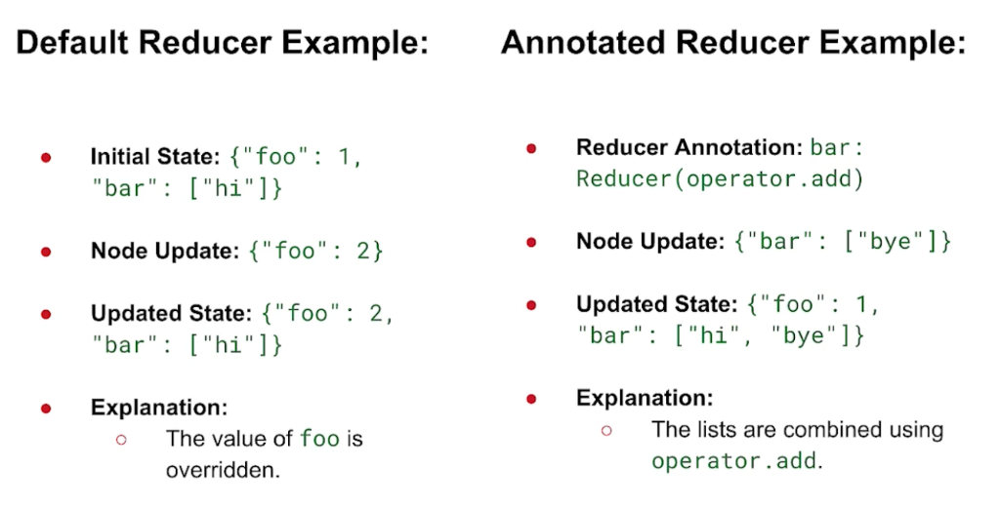
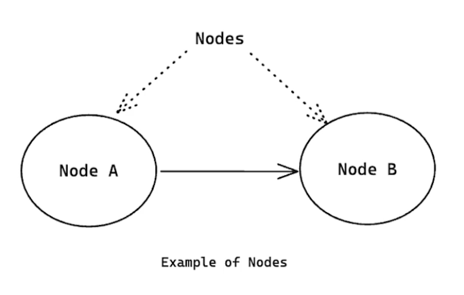
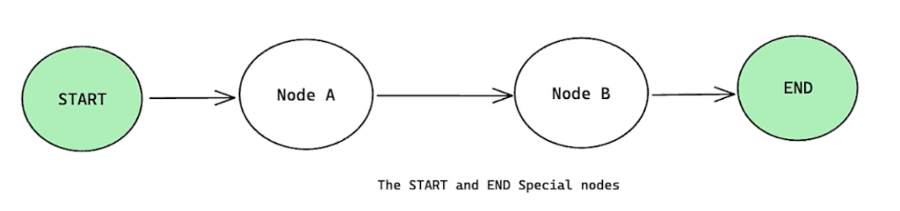
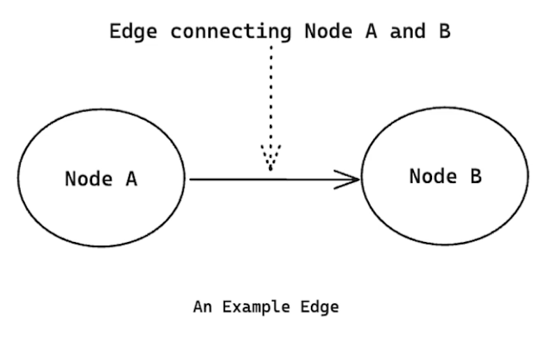
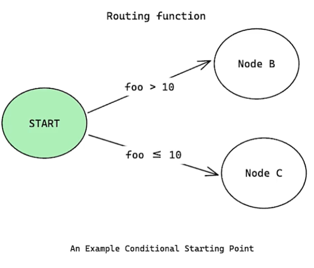

# Lesson 3.3: LangGraph의 핵심 기본기 (Fundamentals of LangGraph) 🧱

이 레슨에서는 LangGraph를 구성하고 작동하게 만드는 3대 핵심 컴포넌트인 **상태(State), 노드(Nodes), 에지(Edges)**의 상세 개념과 작동 구조, 그리고 이를 파이썬으로 구현하는 기초 문법에 대해 학습합니다.

---

## 1. LangGraph의 3대 핵심 기둥

LangGraph 워크플로우는 모든 동작을 그래프 형태로 매핑하며, 이를 위해 아래의 세 가지 요소를 기반으로 설계됩니다.

1. **상태 (State):** 그래프가 살아 움직이며 데이터를 기억하고 수정해 나가는 공유 메모리 영역입니다.
2. **노드 (Nodes):** 실제로 계산을 하거나 LLM을 호출하고 상태를 업데이트하는 행동(함수) 단위입니다.
3. **에지 (Edges):** 노드 사이의 제어 흐름과 데이터가 흐르는 연결 통로입니다.

---

## 2. 첫 번째 기둥: 상태 (State)와 리듀서 (Reducers)

상태는 그래프 내의 모든 노드가 데이터를 읽고 쓸 수 있는 **'공유 데이터 구조(Shared Data Structure)'**이며, 입력과 출력의 스키마 역할을 합니다.

### 스키마(Schema) 정의 도구
* **`TypedDict`:** 기본적인 타입 매칭 검사만을 제공하는 파이썬 딕셔너리 구조입니다.
* **Pydantic `BaseModel`:** 보다 견고한 프로덕션 앱을 위해 유효성 검증(Validation) 및 기본값(Default values) 설정을 추가로 지원합니다.

### 상태 업데이트 메커니즘: 리듀서 (Reducers)
상태의 특정 데이터가 업데이트될 때, 어떤 방식으로 데이터를 저장할지 결정하는 함수가 리듀서입니다.

* **기본 리듀서 (Default Reducer):** 새로운 값이 전달되면 기존 값을 그대로 **덮어씁니다(Override)**.
* **애노테이션 리듀서 (Annotated Reducer):** 기존 값과 새로운 값을 특정 연산자(예: `operator.add`)를 통해 **병합(Merge)하거나 추가(Append)**합니다.



#### 📝 리듀서 작동 방식 비교 예시
* **기본 리듀서:** 
  * 초기 상태 `{"foo": 1, "bar": ["hi"]}` ➡️ 노드에서 `{"foo": 2}` 업데이트 ➡️ 최종 상태 `{"foo": 2, "bar": ["hi"]}` (`foo` 값이 2로 완전히 대체됨).
* **애노테이션 리듀서 (`operator.add` 지정):** 
  * 초기 상태 `{"bar": ["hi"]}` ➡️ 노드에서 `{"bar": ["bye"]}` 업데이트 ➡️ 최종 상태 `{"foo": 1, "bar": ["hi", "bye"]}` (`bar` 리스트의 끝에 새로운 값 `bye`가 누적 결합됨).

---

## 3. 두 번째 기둥: 노드 (Nodes)

노드는 현재 상태(`State`)를 인자로 받아 계산을 진행하고, 결과로써 **업데이트할 상태 객체를 반환하는 파이썬 함수**입니다. LLM 호출부터 데이터 전처리 코드에 이르기까지 어떤 로직이든 포함할 수 있습니다.



### ⚙️ 노드 정의 및 추가 문법
```python
# 노드 함수 정의 (state는 필수 인자, config는 옵션)
def my_node(state, config=None):
    # 계산 및 업데이트할 데이터 반환
    return {"foo": state["foo"] + 1}

# StateGraph 인스턴스 생성 후 add_node로 노드 등록
builder = StateGraph(MyStateClass)
builder.add_node("node_a", my_node) # 고유 ID와 함수 매핑
```

### 🏁 특별한 시작(START) 노드와 종료(END) 노드
LangGraph에는 그래프 흐름의 입출구를 관장하는 특별한 노드가 사전에 정의되어 있습니다.
* **`START` 노드:** 외부로부터 사용자의 최초 입력을 받아 그래프 워크플로우를 진입시키는 시작점입니다.
* **`END` 노드:** 그래프의 모든 프로세스가 정상 종료되었음을 선언하는 도달점입니다.



---

## 4. 세 번째 기둥: 에지 (Edges)

에지는 현재 상태를 모니터링하여 다음에 실행할 최적의 노드를 가리키는 제어 흐름 규칙입니다.



### 🔀 에지의 3가지 유형
1. **일반 에지 (Normal Edges):**
   * 노드 간의 직접적이고 단선적인 전이를 나타냅니다. A 노드가 끝나면 지체 없이 B 노드로 이동합니다.
   * **코드:** `builder.add_edge("node_a", "node_b")`
2. **조건부 에지 (Conditional Edges):**
   * 상태 데이터를 평가하여 다음 경로를 실시간 판단(Branching)하는 에지입니다.
   * **코드:** `builder.add_conditional_edges("node_a", routing_function, path_map_dict)`
3. **조건부 진입점 (Conditional Entry Points):**
   * 항상 일정한 시작점에서 출발하지 않고, 초기 입력 데이터 조건에 맞춰 동적으로 실행을 개시할 첫 노드를 분기 선택합니다.
   * **코드:** `builder.add_conditional_edges(START, routing_function, path_map_dict)`



---

## 💾 상태 지속성 (State Persistence)과 스레드 (Threads)

LangGraph는 에이전트의 견고한 작동을 위해 상태를 저장하고 분리하는 강력한 메커니즘을 제공합니다.

* **체크포인터 (Checkpointer):**
  * 각 처리 단계(Super Step)가 끝날 때마다 그래프 상태를 저장소(Memory/DB)에 저장하는 장치입니다. 이를 통해 에러 복구와 인간 개입(일시정지)이 가능해집니다.
* **스레드 (Threads):**
  * 독립적인 개별 대화 세션을 구별하기 위한 식별 장치입니다. 각 대화방이 서로 다른 `thread_id`를 가짐으로써, 여러 사용자가 동시에 접근해도 메모리가 혼선 없이 개별 관리됩니다.

---

## 🛠️ 파이썬으로 구현하는 LangGraph 기본 패턴

LangGraph 워크플로우를 조립하고 준비하는 3단계 과정입니다.

```python
from typing import TypedDict, Annotated
import operator
from langgraph.graph import StateGraph, START, END

# 1단계: 공유 상태(State) 설계
class State(TypedDict):
    foo: int
    bar: Annotated[list[str], operator.add] # 리듀서로 operator.add를 설정하여 누적

# 2단계: 노드(함수) 및 에지 조립
def node_a(state):
    return {"foo": state["foo"] + 1, "bar": ["Node A executed"]}

def node_b(state):
    return {"bar": ["Node B executed"]}

# 그래프 빌더 설정
builder = StateGraph(State)

# 노드 추가
builder.add_node("A", node_a)
builder.add_node("B", node_b)

# 에지 흐름 연결
builder.add_edge(START, "A")
builder.add_edge("A", "B")
builder.add_edge("B", END)

# 3단계: 그래프 컴파일
# 컴파일 과정에서 고립된 노드 유무, 연결 유효성을 엄격히 체크합니다.
graph = builder.compile()
```
