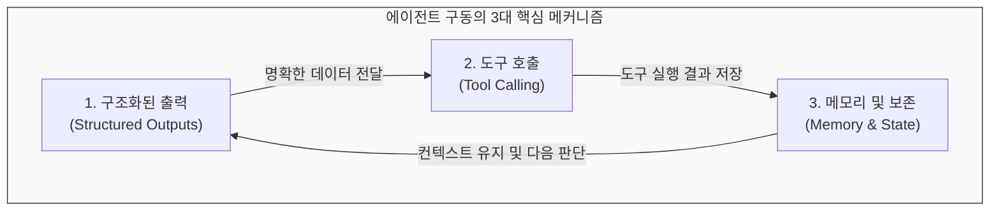
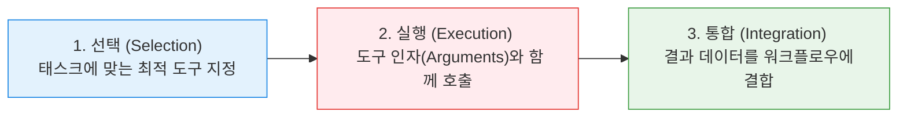

# Lesson 3.4: 에이전트 메커니즘 (Agentic Mechanisms) ⚙️

이 레슨에서는 에이전트 프레임워크의 종류에 관계없이, 자율 시스템이 실제 외부 세계 및 다른 에이전트와 오차 없이 상호작용하기 위해 반드시 탑재해야 하는 3대 핵심 기술 메커니즘인 **구조화된 출력(Structured Outputs), 도구 호출(Tool Calling), 메모리(Memory)**의 설계 원리를 학습합니다.

---

## 1. 에이전트 문제 해결을 위한 3대 핵심 메커니즘

에이전트가 단독으로 텍스트를 생성하는 Chatbot 수준을 넘어, 동적인 워크플로우를 소화하도록 지원하는 3대 컴포넌트입니다.



---

## 2. 메커니즘 ①: 구조화된 출력 (Structured Outputs)

에이전트는 단계적으로 다차원 작업을 수행하므로, 이전 단계 노드가 생성한 데이터를 다음 단계 노드가 **오차 없이 기계적으로 파싱(해석)**할 수 있어야 합니다.

* **포맷의 종류:**
  * **JSON:** 범용적인 호환성과 가독성을 위해 가장 널리 쓰이는 표준 형식.
  * **Pydantic Model (Python):** 클래스 형식으로 데이터 타입을 강제(Type Enforcement)하고 스키마 유효성을 사전 검증(Validation)하는 안전한 기법.

### 📝 실전 예시: 개체명 추출 (Entity Extraction) 및 요약
에이전트가 뉴스 원문 텍스트(비구조화 데이터)를 입력받아 구조화된 JSON 데이터로 파싱하여 전달하는 흐름입니다.

```json
{
  "entities": [
    {
      "name": "John Doe",
      "type": "Person"
    },
    {
      "name": "OpenAI",
      "type": "Organization"
    },
    {
      "name": "San Francisco",
      "type": "Location"
    }
  ],
  "summary": "John Doe가 샌프란시스코의 OpenAI 본사를 방문하여 미래 협력 방안에 대해 논의함."
}
```
* **효과:** 텍스트에서 중요한 키워드 정보가 명확히 라벨링되어 구조화되었으므로, 다음 단계 노드는 문자열 정규식 파싱 등의 지저분한 처리 없이 `data.entities[0].name`과 같이 객체 속성으로 안전하게 접근할 수 있습니다.

---

## 3. 메커니즘 ②: 도구 호출 (Tool Calling)

에이전트가 외부 데이터베이스 검색, 연산 처리, 이메일 발송 등 자체 지식 이외의 시스템 자원을 끌어다 쓰는 능력입니다. LangGraph에서는 모든 노드가 파이썬 함수이므로, 커스텀 코드를 매우 쉽게 도구로 바인딩하여 실행할 수 있습니다.

### 🔄 도구 호출의 3단계 프로세스



### 📝 실전 예시: 이메일 자동 발송 도구 (`send_email`)
* **1단계 (선택):** 에이전트가 감사 메일을 보내야 한다는 판단을 내리고 `send_email` 도구 사용을 결정.
* **2단계 (실행):** 필요한 인자값인 수신자(To), 제목(Subject), 본문(Body)을 구조화된 데이터 형태로 작성하여 도구 API 호출.
  ```python
  # 에이전트가 채워 넣은 인자 구조
  {
      "to": "customer@email.com",
      "subject": "감사 이메일",
      "body": "안녕하세요, 저희 서비스를 이용해 주셔서 진심으로 감사드립니다."
  }
  ```
* **3단계 (통합):** 이메일 전송 API가 반환한 전송 성공 여부(`{"status": "success", "message_id": "msg_01"}`)를 받아 그래프의 공유 상태(State)에 주입하여 다음 단계로 흐름 이동.

---

## 4. 메커니즘 ③: 메모리 (Memory)

대화의 컨텍스트를 잃지 않고 긴 흐름 속에서 이전 대화와 사고 과정의 일관성을 유지하게 돕는 기능입니다. LangGraph는 이를 두 가지 레이어로 구현하여 신뢰성을 극대화합니다.

1. **상태 관리 (State Management):**
   * 그래프에 소속된 모든 노드가 공통으로 접근하고 업데이트하는 **'공유 단기 메모리'**입니다. 작업 중 획득한 데이터가 증발하지 않고 노드 간에 전파되도록 관리합니다.
2. **체크포인팅 (Checkpointing):**
   * 작업 단계마다 상태 데이터를 물리적으로 저장하는 **'장기/지속성 세이브 포인트'**입니다.
   * 작업 도중 오류가 나거나 인간의 컴플라이언스 체크를 위해 실행이 멈추더라도, 처음부터 다시 연산할 필요 없이 **마지막 세이브 포인트 지점에서 안전하게 복구 및 재개**할 수 있도록 지탱합니다.
