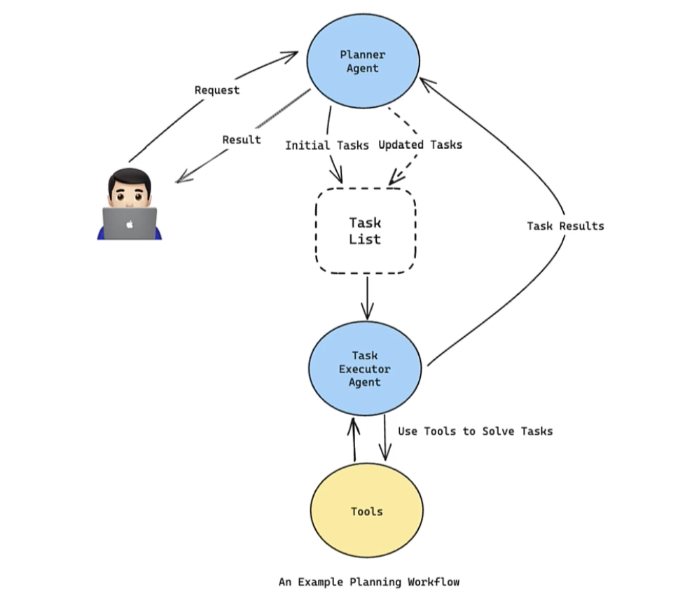
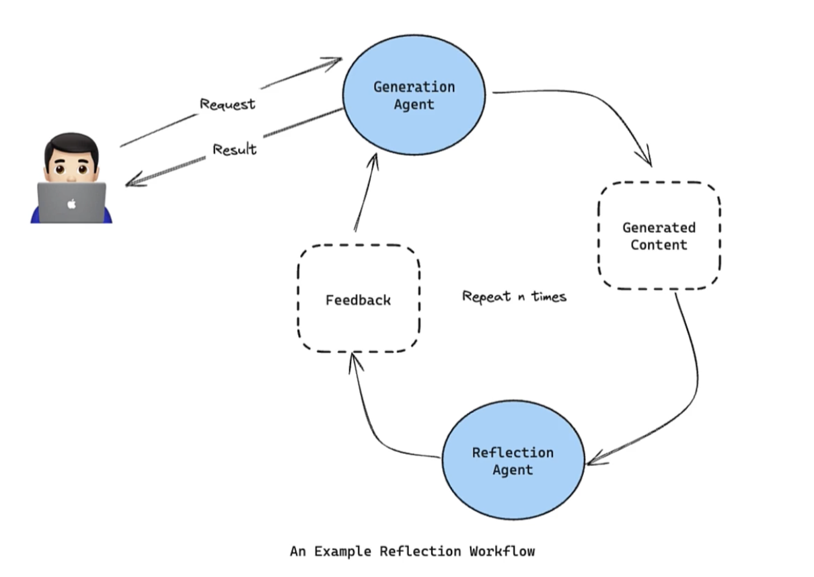
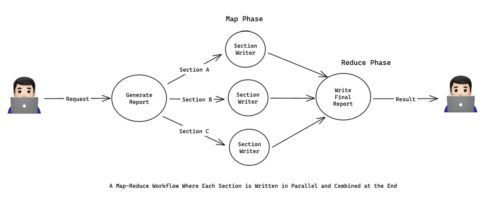
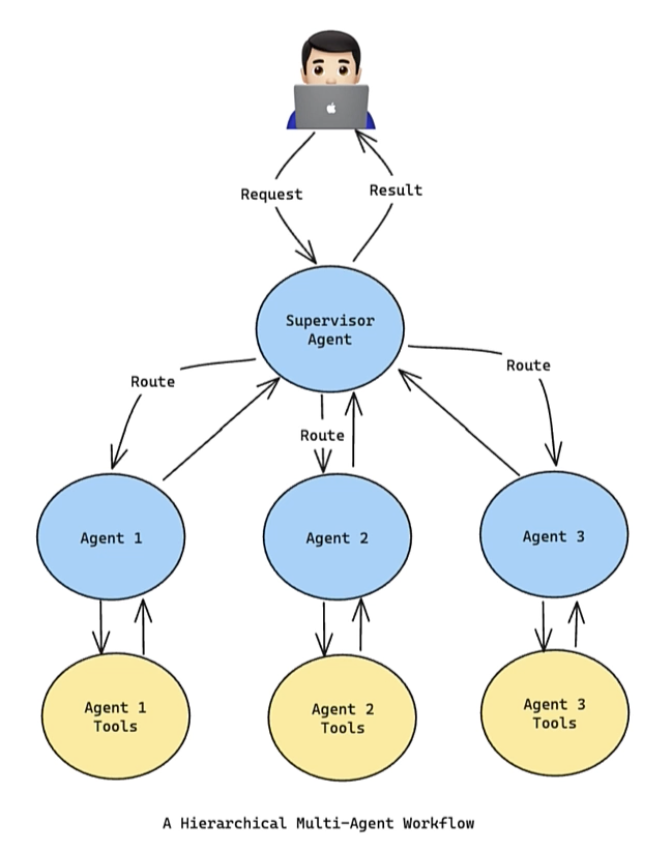
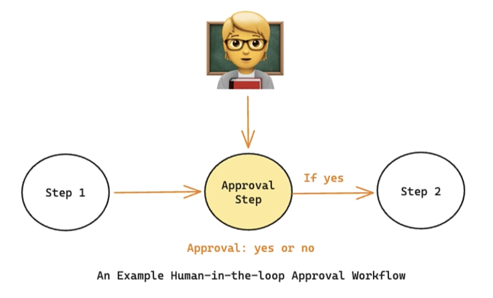
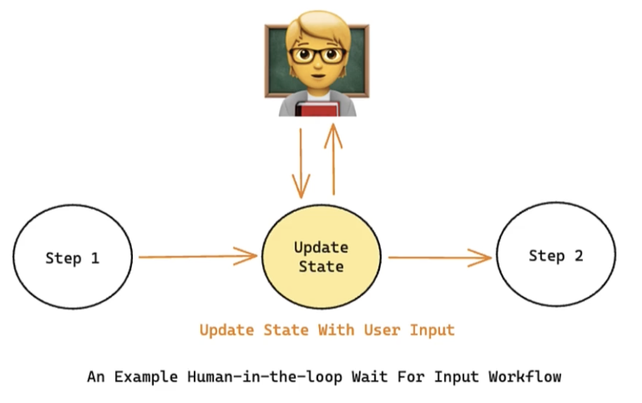
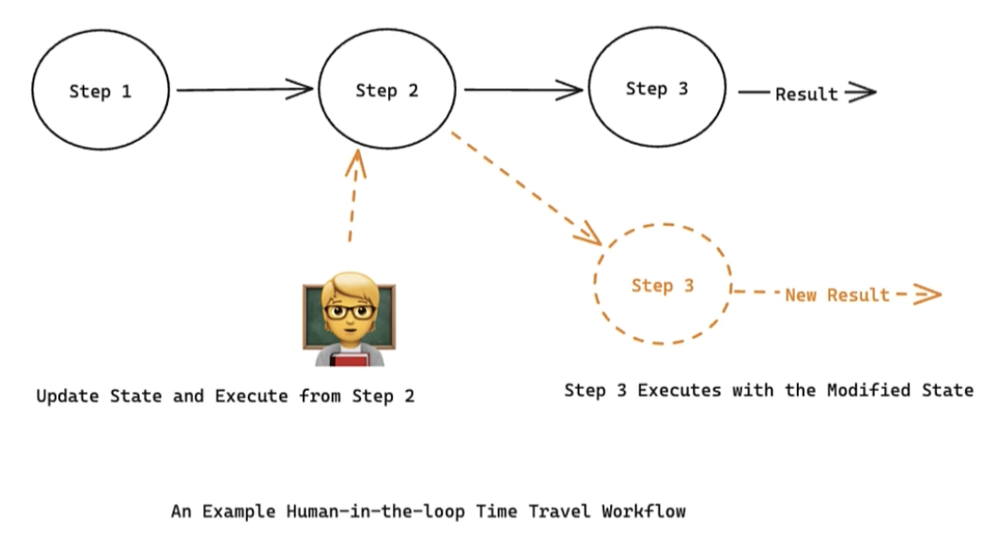
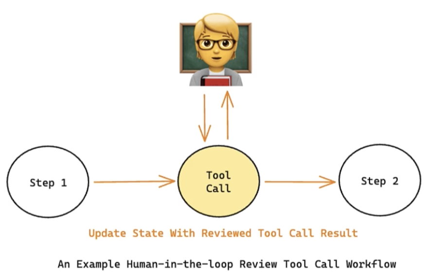

# Lesson 3.5: 에이전트 디자인 패턴 (Agentic Design Patterns) 심화 가이드 📐

이 가이드는 단순한 설명에 그치지 않고, 각 패턴이 **해결하고자 하는 비즈니스/개발적 한계(도전 과제)**, **구체적인 알고리즘 프로세스**, **실무 적용 사례(Use Cases)**, 그리고 **엔지니어링 트레이드오프(Trade-offs)**를 심층적으로 다룹니다. 이를 통해 프로덕션 레벨의 에이전트 시스템을 설계할 수 있는 실무 역량을 다집니다.

---

## 1. 계획 (Planning) 패턴

**계획(Planning) 패턴**은 최종 목표를 달성하기 위해 에이전트가 동적으로 수행할 **'일련의 행동 단계를 사전에 쪼개고 전략적으로 수립'**하는 디자인 패턴입니다.

### 🔴 Core Challenge (도전 과제)
단일 LLM 호출이나 단순한 ReAct 흐름만으로는 복잡한 장기 실행 과제(Long-term Tasks)를 해결하기 어렵습니다. 연산 단계가 10단계가 넘어가면 LLM은 주의력 결핍으로 인해 최초의 목표를 잊어버리거나(Lost in the Middle), 중간에 길을 잃고 엉뚱한 행동을 반복하게 됩니다.

### ⚙️ Step-by-Step 실행 프로세스
1. **초기 작업 분해 (Decomposition):** 플래너 에이전트가 사용자 요청을 분석하여 실행 가능한 하위 작업 리스트(Task List)를 동적으로 생성합니다.
2. **작업 할당 및 실행 (Execution):** 작업 실행자 에이전트(혹은 하위 에이전트들)가 현재 처리해야 할 하위 태스크를 전달받아 필요한 도구를 활용해 수행합니다.
3. **결과 피드백 및 계획 재조정 (Plan Refinement):** 실행 노드가 결과를 플래너에게 반환하면, 플래너는 그 성공/실패 여부와 새로운 정보를 바탕으로 남은 작업 리스트를 동적으로 수정(추가, 삭제, 순서 변경)합니다.
4. **종료 판단:** 모든 하위 작업이 성공적으로 완수되거나 최종 목표에 도달하면 결과를 사용자에게 반환하고 종료합니다.

### 💼 실무 유즈케이스 (Use Cases)
* **소프트웨어 개발 및 디버깅 에이전트:** 1) 요구사항 분석 ➡️ 2) 클래스 설계 ➡️ 3) 코드 작성 ➡️ 4) 테스트 코드 작성 ➡️ 5) 에러 발생 시 디버깅 계획 수립 및 디버그 실행 ➡️ 6) 검증 완료 후 배포.
* **심층 시장 분석 보고서 작성:** 특정 산업군 조사를 위해 국가별 정책, 주요 경쟁사, 시장 재무제표 조사를 차례로 기획하고 데이터 수집 현황에 따라 조사 방향을 변경하며 보고서를 작성하는 프로세스.

### ⚖️ 엔지니어링 고려사항 (Trade-offs)
* **장점:** 복잡한 대형 프로젝트를 체계적으로 수행하여 완결성을 극대화합니다.
* **단점:** 매 단계마다 계획을 검토하고 업데이트하는 LLM 호출 비용이 추가되므로 레이턴시(속도)가 느려지고 토큰 소모량이 증가합니다.

---

## 2. 성찰 (Reflection) 패턴

**성찰(Reflection) 패턴**은 에이전트가 완성한 결과물을 즉시 사용자에게 반환하지 않고, 리뷰어 역할의 다른 노드를 거쳐 **'자가 평가(Self-Evaluation)'** 및 수정을 거듭하여 품질을 극대화하는 패턴입니다.

### 🔴 Core Challenge (도전 과제)
LLM은 한 번에 복잡한 작문이나 코딩을 완벽하게 해내기 어렵습니다. 팩트 체크 오류(환각), 서식 누락, 코드 구문 오류 등이 초기 답변에 쉽게 포함되므로, 이를 자동 검수하고 걸러줄 수 있는 품질 보증(QA) 메커니즘이 부재하면 신뢰도가 붕괴됩니다.

### ⚙️ Step-by-Step 실행 프로세스
1. **초안 생성 (Generation):** 생성 노드(Generator)가 주어진 지침을 기반으로 산출물(코드, 글 등)을 작성합니다.
2. **비판적 성찰 (Reflection):** 성찰 노드(Reflector)가 초안을 전달받아 명확한 기준(서식 준수 여부, 사실 확인, 실행 가능성 등)에 비추어 비판적으로 평가하고, 구체적인 개선 및 피드백 지침을 텍스트로 작성합니다.
3. **개선 및 재수정 (Refinement):** 생성 노드는 피드백을 컨텍스트로 받아들이고 초안을 전면 보완하여 개선안을 작성합니다.
4. **종료 조건 매칭:** 성찰 노드가 "더 이상 개선 사항이 없다(Pass)"고 판단하거나, 사전에 지정한 최대 루프 횟수(예: 3회)에 도달하면 최종 결과물을 발행합니다.

### 💼 실무 유즈케이스 (Use Cases)
* **Self-Healing Code 에이전트:** 개발자가 작성한 코드를 입력받아 에이전트가 코드를 컴파일해 본 후, 에러 로그(Observation)를 분석하여 스스로 코드를 고쳐 쓰는 프로세스.
* **블로그/마케팅 이메일 교정:** 원문 작성 에이전트가 글을 쓰고, 교정 에이전트가 맞춤법과 타깃 독자에 맞는 뉘앙스 검수 후 수정을 유도하는 흐름.

### ⚖️ 엔지니어링 고려사항 (Trade-offs)
* **장점:** 인간의 수동 감수 작업을 획기적으로 줄이며, 산출물의 신뢰성과 일관성이 완벽에 가깝게 향상됩니다.
* **단점:** 품질 만족 시까지 루프가 무한정 돌 수 있어 타임아웃 처리가 중요하며, API 비용이 급증할 수 있습니다.

---

## 3. 맵리듀스 (Map-Reduce) 패턴

**맵리듀스(Map-Reduce) 패턴**은 하나의 큰 작업을 여러 개의 작은 작업으로 병렬 쪼개어 동시 처리(Map)하고, 최종 결과를 하나로 응집력 있게 수집/가공(Reduce)하는 패턴입니다.

### 🔴 Core Challenge (도전 과제)
대량의 파일(예: 수십 개의 소스 코드 파일)을 스캔하거나 아주 긴 논문을 요약할 때, 순차적으로 하나씩 처리하면 실행 시간(Latency)이 지나치게 길어집니다. 또한, 모든 정보를 한 번에 LLM에 욱여넣으면 컨텍스트 한계(Context Window limit)를 초과해 정보 유실이 발생합니다.

### ⚙️ Step-by-Step 실행 프로세스
1. **작업 분할 (Map / Fan-out):** 하나의 대용량 작업을 병렬로 처리 가능한 고유 조각들로 분할합니다.
2. **병렬 독립 실행:** LangGraph의 `Send` API나 서브그래프를 호출하여, 각 분할된 조각들을 전용 노드 또는 스레드에 실어 독립된 LLM/도구에서 병렬로 동시 연산합니다.
3. **동적 병합 (Reduce / Fan-in):** 모든 병렬 노드의 연산이 완료될 때까지 대기(Barrier sync)한 후, 반환된 개별 결과 리스트를 한곳에 모읍니다.
4. **최종 종합:** 수집된 리스트 데이터를 취합 노드로 넘겨, 전체 요약 보고서나 최종 결합 코드를 완성합니다.

### 💼 실무 유즈케이스 (Use Cases)
* **대형 코드베이스 보안 스캔:** 수백 개의 코드 파일을 맵 단계에서 병렬로 개별 보안 검사하고, 리듀스 단계에서 발견된 모든 취약점 목록을 종합 보고서로 취합.
* **다차원 논문 요약:** 수십 장에 달하는 논문의 장(Chapter)별 요약을 병렬 처리하고 최종적으로 단 한 장의 초록(Abstract)으로 합성.

### ⚖️ 엔지니어링 고려사항 (Trade-offs)
* **장점:** 분산 처리를 통해 레이턴시를 획기적으로 단축시킵니다.
* **단점:** 맵 단계에서 수십 개의 LLM 호출이 동시다발적으로 발생하므로 분당 토큰 제한(TPM/RPM Rate Limit)에 걸리기 쉬우며, 병렬 처리가 끝날 때까지 대기하는 동기화 시점에 병목 현상이 생길 수 있습니다.

---

## 4. 다중 에이전트 (Multi-Agent) 아키텍처 패턴

각각의 도구와 언어 모델로 무장한 전문성 있는 다수 에이전트가 공통 목표를 향해 협력하는 구조입니다.

### 🔴 Core Challenge (도전 과제)
단일 에이전트에 너무 많은 프롬프트 지침(System Prompt)과 수십 개의 외부 도구(APIs)를 쑤셔 넣으면, LLM의 상황 인지 능력이 크게 상실됩니다. 에이전트가 엉뚱한 프롬프트를 뱉거나 툴 호출 매개변수를 망가뜨리는 **도구 포화(Tool Saturation) 및 프롬프트 혼선** 현상이 발생합니다.

### ⚙️ Step-by-Step 실행 프로세스
1. **오케스트레이션 및 라우팅:** 감독 에이전트(Supervisor)가 사용자 입력을 청취하고 요구 분야를 진단합니다.
2. **작업 분배:** Supervisor는 작업을 잘 처리할 수 있는 특화 에이전트(예: 데이터베이스 에이전트, 코딩 에이전트)에게 제어권과 상태(State)를 전달합니다.
3. **독립 해결:** 위임받은 전문 에이전트는 자신에게 좁게 규정된 프롬프트와 소수의 도구(Local Tools)만 사용하여 깔끔하게 결과를 도출한 뒤 Supervisor에게 복귀합니다.
4. **종합 및 피드백:** Supervisor는 결과물을 수집해 최종 사용자에게 반환하거나, 미진한 경우 다른 전문 에이전트에게 추가 작업을 위임합니다.

### 💼 실무 유즈케이스 (Use Cases)
* **가상 제품 개발팀:** 프로젝트 매니저(Supervisor) 에이전트가 고객의 요구사항을 받아, 기획 에이전트, 백엔드 코딩 에이전트, 그리고 QA 테스트 에이전트에게 순차적으로 작업을 배정하고 최종 승인을 관리하는 시스템.
* **법률 및 세무 패키지 서비스:** 고객의 종합 자산 분석 요청을 받고, 법률 분석 에이전트와 세무 분석 에이전트가 각자의 DB 도구로 분석한 뒤 오케스트레이터가 하나의 패키지 자문서로 합성하는 구조.

### ⚖️ 엔지니어링 고려사항 (Trade-offs)
* **장점:** 에이전트별 프롬프트 크기가 극적으로 감소하여 모델이 툴을 다루는 정확도가 향상되고, 개별 모듈 단위로 고치고 테스트하기 쉬워집니다.
* **단점:** 에이전트 간의 데이터 상태 변환 및 프로토콜 설계가 어렵고, 조율 실패 시 연쇄 고장(Cascading Failure)의 위험이 큽니다.

---

## 5. 인간 참여형 (Human-in-the-loop) 4대 패턴

에이전트의 완전 자율 실행에 제동을 걸어, 안전한 비즈니스 룰을 지키기 위해 활용하는 인간 개입 패턴입니다.

### ① 승인 워크플로우 (Approval Workflows)
에이전트가 다음 행동(예: 데이터베이스 쓰기, 금융 결제)을 계획하면 실행 전에 사용자에게 보고하고 진행 신호(Go-ahead)가 떨어질 때까지 대기합니다.

* **상세 작동:**
  1. 에이전트가 데이터 업데이트 스키마를 구성하고 `Interrupt`를 걸어 상태를 저장소(Checkpointer)에 고정시킵니다.
  2. UI 단에서 인간 관리자에게 "해당 데이터를 입력하시겠습니까? [승인] / [반려]" 메시지를 보냅니다.
  3. 승인 클릭 시에만 `Resume`하여 실제 데이터베이스 노드로 상태를 천이시킵니다.

---

### ② 입력 대기 (Wait for Input)
에이전트가 미비한 필수 정보(사용자의 상세 예산, 여행 희망일 등)가 있음을 자각했을 때, 상태를 일시정지하고 적극적으로 사용자에게 입력을 구합니다.

* **상세 작동:**
  1. 에이전트가 작업을 수행하다가 판단에 필요한 매개변수가 누락되었음을 확인합니다.
  2. 그래프 실행을 즉시 일시정지하고 사용자 입력 활성화 상태로 상태를 보존합니다.
  3. 사용자가 UI 창에 입력 값을 채워 넣으면, 그 데이터가 그래프 `State`에 병합되고 다음 실행 노드가 이를 읽어들여 동작을 진행합니다.

---

### ③ 타임 트래블 (Time Travel)
에이전트가 지나왔던 과거 시점(예: 2단계)의 상태 스냅샷으로 되감기(Rewind)를 하여 데이터를 수정한 후, 수정한 상태 지점으로부터 새로운 흐름의 실행 결과를 분기 생성하여 결과를 시뮬레이션합니다.

* **상세 작동:**
  1. 그래프가 실행을 종료했거나 대기 중일 때, 사용자는 특정 스레드(`thread_id`)의 체크포인트 히스토리를 확인합니다.
  2. 수정하고자 하는 문제의 시점(예: 잘못된 검색 결과를 가져왔던 시점)으로 체크포인트 포인터를 되감습니다.
  3. 사용자가 해당 시점의 상태 데이터를 직접 원하는 값으로 덮어쓴 뒤 다시 그래프를 구동하면, 수정된 데이터를 바탕으로 다른 결과(주황색 점선 경로)를 향해 그래프가 재구동됩니다.

---

### ④ 도구 호출 리뷰 (Review Tool Calls)
에이전트가 외부 시스템과 상호작용하는 도구 API를 실제로 기동하기 전에, 어떤 데이터를 보내려고 하는지 초안을 먼저 사용자 화면에 띄우고(예: 메일 본문 리뷰) 최종 허가를 득한 뒤 발송합니다.

* **상세 작동:**
  1. LLM이 `tool_calls` 목록(예: `Send_Email(to='test@test.com', body='...')`)을 출력합니다.
  2. 해당 도구를 바로 백엔드에서 구동하지 않고, 사용자의 피드백 화면에 도구의 파라미터 값(Arguments)을 렌더링하여 보여줍니다.
  3. 사용자는 이메일 수신인이나 본문 내용을 텍스트 필드로 수정한 뒤 전송 버튼을 누르면, 수정된 인자값으로 API를 교신하고 다음 관찰(Observation) 노드로 진입합니다.
