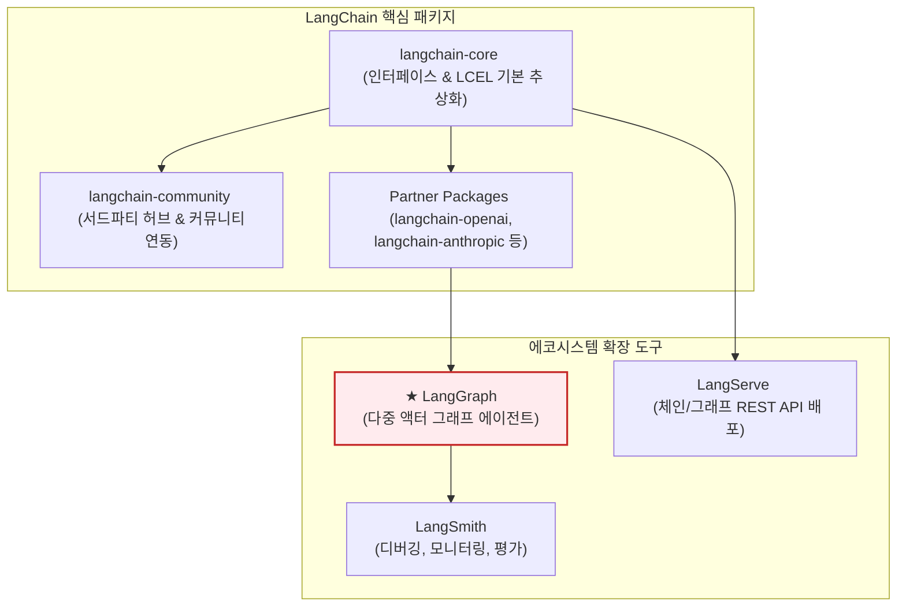

# Lesson 4.1: 핵심 LangChain 개념 (Core LangChain Concepts) 🦜

이 레슨에서는 LangGraph 에이전트 시스템의 기초 뼈대가 되는 **LangChain 프레임워크의 핵심 개념**과 **LCEL(LangChain Expression Language)**을 활용한 선언적 체인(Chain) 설계, 그리고 RAG의 기초 구성 요소를 학습하고 실제 작동하는 파이썬 코드를 한 줄씩 상세히 분석합니다.

---

## 1. LangChain 에코시스템 및 모듈식 아키텍처

LangChain은 LLM 기반의 애플리케이션을 유기적으로 조립하고 빠르게 개발할 수 있도록 설계된 **모듈식 소프트웨어 개발 키트(SDK)**입니다.

과거에는 모든 기능이 하나의 거대한 패키지에 포함되어 있어 배포 용량이 크고 서드파티 라이브러리 간 의존성 충돌 문제가 잦았습니다. 이를 해결하기 위해 현재 LangChain은 기능별로 패키지를 분리한 **모듈식 아키텍처**를 채택하고 있습니다.

### 📦 패키지별 역할과 의존성 구조

1. **`langchain-core` (추상화 및 기본 규격):**
   * **역할:** 모델, 프롬프트, 도구, 아웃풋 파서 등 프레임워크를 구성하는 모든 객체의 공통 인터페이스(규격)를 정의합니다. 컴포넌트들을 유기적으로 연결해 주는 선언적 조립 문법인 **LCEL(LangChain Expression Language)**의 실행 엔진이 포함되어 있습니다.
   * **특징:** 외부 라이브러리 의존성을 최소화하여 가볍고 독립적으로 작동하므로 배포 환경을 경량화하는 데 유리합니다.
2. **`langchain-community` (외부 연동 통합 모듈):**
   * **역할:** 수백 개의 서드파티 서비스 및 데이터베이스와 연결할 수 있는 통합 컴포넌트를 보관합니다.
   * **예시:** 특정 Vector DB(예: Pinecone, Chroma) 연동 모듈, Slack/Notion API 호출 도구 등 개발자들이 커뮤니티 전반에서 필요로 하는 연동 코드가 포함되어 있습니다.
3. **Partner Packages (공식 파트너 연동 모듈):**
   * **역할:** OpenAI(`langchain-openai`), Anthropic(`langchain-anthropic`) 등 주요 LLM 제공업체들과 협력하여 만든 공식 패키지입니다.
   * **특징:** 핵심 코어의 인터페이스 규격을 상속받아 개발되었으며, 각 AI 사의 최신 모델 API 사양이 변경되거나 새로운 기능이 출시되었을 때 가장 빠르게 업데이트되어 안정적인 성능을 냅니다.
4. **`langchain` (체인 및 에이전트 조립 패키지):**
   * **역할:** 개별 컴포넌트들을 조합하여 특정 비즈니스 문제를 해결할 수 있는 기성 체인(Chains)과 이전 버전의 자율 에이전트 클래스들을 정의합니다.

---

### 🚀 에코시스템의 확장 도구와 연계 시나리오



* **LangGraph (순환 그래프 기반 에이전트):**
  * 에이전트의 작동 흐름을 상태(State)와 루프(Cycles)가 있는 그래프 구조로 설계하도록 돕습니다. 여러 특화된 노드가 공동의 데이터를 공유하며 협업하는 다중 에이전트 워크플로우를 미세 제어하기 위해 필수적입니다.
* **LangServe (웹 서비스 API 배포):**
  * 구현한 LCEL 체인이나 LangGraph 그래프 객체를 단 몇 줄의 코드로 `FastAPI` 기반의 REST API 웹 서버로 구축해 줍니다. 클라이언트 애플리케이션과의 통신을 원활하게 돕습니다.
* **LangSmith (추적 및 실시간 모니터링):**
  * 전체 체인 및 에이전트의 세부 실행 단계를 실시간으로 추적(Tracing)합니다. 입력값, 모델이 거쳐 간 프롬프트, 도구의 반환값, API 소모 비용(토큰 수 및 요금), 레이턴시를 한눈에 모니터링하고 평가할 수 있습니다.

---

## 2. 모델 구분: 챗 모델 (Chat Models) vs LLM (Legacy)

LangChain은 텍스트 처리를 위한 언어 모델 인스턴스를 크게 두 가지 범주로 분류합니다. 실무 에이전트 개발에서는 구조화된 대화 관리가 가능한 **챗 모델(Chat Models)**을 주로 사용합니다.

### 텍스트 완료 모델 (Legacy LLMs)
* **개념:** 입력으로 하나의 긴 문자열(Prompt)을 받아 그 뒤에 올 단어들을 이어붙이는 전통적인 텍스트 생성 모델입니다.
* **작동:** `String -> String` 구조로 동작합니다.
* **한계:** 시스템의 기본 지침(System Prompt)과 사용자의 발언(User Message), 어시스턴트의 답변(AI Message)을 명확하게 구분하기 힘듭니다. 이로 인해 개발자가 직접 대화 이력 사이에 특수 태그(예: `[INST]`, `<|im_start|>`)를 삽입해야 하므로 포맷팅 에러가 자주 발생하고 관리가 어렵습니다.

### 챗 모델 (Chat Models) - 실무 권장
* **개념:** 입력으로 단순 텍스트가 아닌, 명확한 **역할(Role)**을 명시한 구조화된 메시지 객체들의 리스트(`List[BaseMessage]`)를 사용합니다.
* **작동:** `List[BaseMessage] -> AIMessage` 구조로 동작합니다.
* **장점:** 
  * 역할 구분이 엄격하여 시스템 지침의 무시 현상(프롬프트 인젝션 등)이 덜 발생합니다.
  * 이미지나 오디오 등 멀티모달(Multi-modality) 데이터를 표준화된 객체 포맷으로 쉽게 포장하여 입력할 수 있습니다.
  * 도구를 실행하기 위해 LLM이 내보내는 정형화된 JSON 데이터(`tool_calls`)가 `AIMessage` 객체의 메타데이터 속성으로 깔끔하게 담겨 나옵니다.

### 📁 챗 모델에서 사용되는 3대 메시지 유형
1. **`SystemMessage` (시스템 메시지):** 에이전트의 페르소나, 사용 가능한 도구 목록, 최종 답변 양식 등 시스템 전체의 작동 규칙과 지침을 주입합니다.
2. **`HumanMessage` (사용자 메시지):** 에이전트에게 전달하는 사용자의 실질적인 쿼리나 질문 텍스트입니다.
3. **`AIMessage` (어시스턴트 메시지):** 모델이 대화 흐름의 응답으로 내놓은 객체입니다. 일반 텍스트 답변뿐만 아니라, 특정 API를 실행하라는 구조적인 호출 인자(`tool_calls`) 정보가 탑재될 수 있습니다.

---

## 3. 프롬프트 템플릿 (Prompt Templates)

사용자가 전달한 원시 입력(Raw Inputs)을 모델이 잘 해석할 수 있는 명확한 지침 형태로 치환(Formatting)해 주는 도구입니다.

### ① 문자열 프롬프트 템플릿 (String Prompt Template)
* 단일 문자열 템플릿으로, 플레이스홀더를 단순히 채워 넣습니다.
* **코드 예시:**
  ```python
  from langchain_core.prompts import PromptTemplate
  
  template = PromptTemplate.from_template("Tell me a joke about {topic}")
  formatted = template.format(topic="cats") # "Tell me a joke about cats" 생성
  ```

### ② 챗 프롬프트 템플릿 (Chat Prompt Template)
* 역할(Role)이 할당된 여러 메시지의 시퀀스를 생성합니다. 시스템 프롬프트 조율에 핵심적입니다.
* **코드 예시:**
  ```python
  from langchain_core.prompts import ChatPromptTemplate
  
  chat_template = ChatPromptTemplate.from_messages([
      ("system", "You are a helpful assistant specialized in {specialty}."),
      ("user", "Hello, help me with {question}")
  ])
  ```

---

## 4. LCEL (LangChain Expression Language)

LCEL은 다양한 컴포넌트(프롬프트, 모델, 파서 등)를 파이프 연산자(`|`)를 사용해 직관적인 체인(Chain)으로 엮을 수 있게 해주는 **선언적 언어**입니다.

### 🔄 LCEL 데이터 흐름 및 파이프라인 구성

```mermaid
graph LR
    Input["1. 입력 데이터 <br> (Dictionary 형식)"] -->|전달| Prompt["2. 프롬프트 템플릿 <br> (ChatPromptTemplate)"]
    Prompt -->|포맷팅 완료 메시지| LLM["3. 언어 모델 <br> (ChatOpenAI)"]
    LLM -->|원시 AI 응답 <br> (AIMessage)| Parser["4. 아웃풋 파서 <br> (StringOutputParser)"]
    Parser --> Output["5. 최종 가공 데이터 <br> (Clean String / JSON)"]

    style Prompt fill:#e8f5e9,stroke:#2e7d32
    style LLM fill:#e3f2fd,stroke:#1e88e5
    style Parser fill:#fff3e0,stroke:#ffb74d
```

### 🌟 LCEL의 핵심 이점
* **스트리밍(Streaming) 기본 지원:** 중간 토큰이나 노드 출력을 실시간 스트리밍할 수 있습니다.
* **비동기 및 병렬 연산:** 여러 개의 LLM 호출이나 외부 도구 연동을 비동기(`ainvoke`) 및 병렬로 동시 실행할 수 있습니다.
* **예외 복구(Failover):** API 시간 초과나 장애 시 재시도(Retries) 및 대체 모델 전환(Fallbacks)을 선언적으로 등록할 수 있습니다.
* **LangSmith 추적성:** 체인을 구성하는 각 파이프의 입출력을 자동으로 로깅하고 디버깅할 수 있습니다.

---

## 5. RAG (검색 증강 생성)의 3대 구성 요소

학습 데이터 시점의 한계(Knowledge Cutoff)나 사내 보안 데이터 조회 한계를 극복하기 위해, **검색 모델과 생성 모델을 결합**하는 핵심 RAG 아키텍처의 3대 빌딩 블록입니다.

1. **임베딩 모델 (Embedding Models):** 비정형 문서를 다차원 공간의 수학적 벡터로 변환하여 의미론적(Semantic) 비교를 가능하게 만듭니다.
2. **벡터 저장소 (Vector Stores):** 대량의 벡터 데이터를 실시간으로 인덱싱하고 보관하는 데이터베이스입니다.
3. **리트리버 (Retrievers):** 사용자의 입력 질문 벡터와 가장 일관성 있는(유사한) 상위 K개의 문서를 찾아 LLM 컨텍스트에 밀어 넣어주는 검색 인터페이스입니다.

---

## 🛠️ 실습: LCEL 기반 여행 플래너 (Trip Planner) 구현 코드 분석

여행 목적지(`destination`)와 관심사(`preferences`)를 인풋으로 받아 마크다운 형식으로 맞춤 일정을 생성하는 파이썬 코드 전체입니다.

```python
from langchain_openai import ChatOpenAI
from langchain_core.prompts import ChatPromptTemplate
from langchain_core.output_parsers import StringOutputParser
from IPython.display import display, Markdown

# 1. 챗 모델 초기화
# 비용 효율적이면서도 뛰어난 언어 능력을 지닌 gpt-4o 모델을 지정합니다.
model = ChatOpenAI(model="gpt-4o", temperature=0)

# 2. 챗 프롬프트 템플릿 설계
# 변수 {destination}과 {preferences}를 가질 플레이스홀더 템플릿을 생성합니다.
prompt = ChatPromptTemplate.from_messages([
    ("system", "You are an expert trip planner. Help me plan a trip to the destination, considering my preferences."),
    ("user", "What should I do in {destination}? My preferences: {preferences}")
])

# 3. 아웃풋 파서 초기화
# LLM이 출력한 AIMessage 객체에서 순수 텍스트(문자열)만 정제하여 꺼내는 역할을 합니다.
parser = StringOutputParser()

# 4. LCEL 파이프라인 조립
# 파이프 연산자(|)를 사용해 '입력 ➡️ 프롬프트 치환 ➡️ LLM 쿼리 ➡️ 문자열 정제' 흐름을 한 줄로 선언합니다.
chain = prompt | model | parser

# 5. 실행을 위한 헬퍼 함수 정의
def plan_trip(destination, preferences):
    # 인풋으로 들어갈 딕셔너리를 생성합니다.
    inputs = {
        "destination": destination,
        "preferences": preferences
    }
    # 체인을 호출(invoke)하여 실행 결과를 가져옵니다.
    result = chain.invoke(inputs)
    return result

# 6. 실행 및 마크다운 렌더링 테스트 (파리 편)
paris_plan = plan_trip("Paris", "museums, cafes, historical sites")
display(Markdown(paris_plan))

# 7. 동일 체인을 재사용하여 테스트 (도쿄 편)
tokyo_plan = plan_trip("Tokyo", "technology, culture, nightlife")
display(Markdown(tokyo_plan))
```

### 💡 파이썬 초보자를 위한 코드 팁:
* `chain = prompt | model | parser`: 이 방식은 각각의 함수 호출을 수동으로 중첩하는 `parser(model(prompt(inputs)))` 방식보다 가독성이 훨씬 뛰어나며, 내부적으로 동기/비동기 스트리밍이 병렬로 활성화되도록 LangChain 엔진이 동적 래핑해 줍니다.
* `chain.invoke(inputs)`: 체인 객체의 `invoke` 메서드는 준비된 JSON 딕셔너리를 전체 LCEL 라인에 주입하여 동기 방식으로 연산을 구동하고 최종 가공 데이터를 수집합니다.
