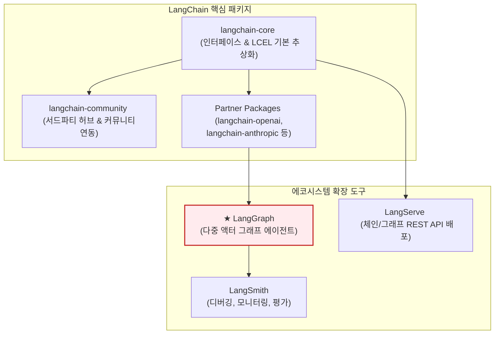
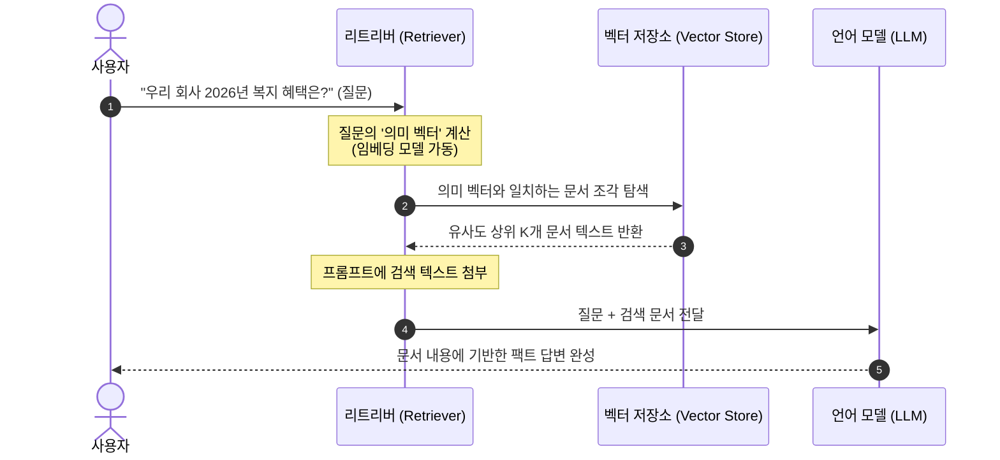

# Lesson 4.1: 핵심 LangChain 개념 (Core LangChain Concepts) 🦜

이 레슨에서는 LangGraph 에이전트 시스템의 기초 뼈대가 되는 **LangChain 프레임워크의 핵심 개념**과 **LCEL(LangChain Expression Language)**을 활용한 선언적 체인(Chain) 설계, 그리고 RAG의 기초 구성 요소를 학습하고 실제 작동하는 파이썬 코드를 한 줄씩 상세히 분석합니다.

---

## 1. LangChain 에코시스템 및 모듈식 아키텍처

LangChain은 LLM 기반의 애플리케이션을 유기적으로 조립하고 빠르게 개발할 수 있도록 설계된 **모듈식 소프트웨어 개발 키트(SDK)**입니다.

과거에는 모든 기능이 하나의 거대한 패키지에 포함되어 있어 배포 용량이 크고 서드파티 라이브러리 간 의존성 충돌 문제가 잦았습니다. 이를 해결하기 위해 현재 LangChain은 기능별로 패키지를 분리한 **모듈식 아키텍처**를 채택하고 있습니다.

### 📦 패키지별 역할과 의존성 구조

1. **`langchain-core` (추상화 및 기본 규격):**
   * **역할:** 모델, 프롬프트, 도구, 아웃풋 파서 등 프레임워크를 구성하는 모든 객체의 공통 인터페이스(규격)를 정의합니다. 컴포넌트들을 유기적으로 연결해 주는 선언적 조립 문법인 **LCEL(LangChain Expression Language)**의 실행 엔진이 포함되어 있습니다.
   * **특징:** 외부 라이브러리 의존성을 최소화하여 가볍고 독립적으로 작동하므로 배포 환경을 경량화하는 데 유리합니다.
2. **`langchain-community` (외부 연동 통합 모듈):**
   * **역할:** 수백 개의 서드파티 서비스 및 데이터베이스와 연결할 수 있는 통합 컴포넌트를 보관합니다.
   * **예시:** 특정 Vector DB(예: Pinecone, Chroma) 연동 모듈, Slack/Notion API 호출 도구 등 개발자들이 커뮤니티 전반에서 필요로 하는 연동 코드가 포함되어 있습니다.
3. **Partner Packages (공식 파트너 연동 모듈):**
   * **역할:** OpenAI(`langchain-openai`), Anthropic(`langchain-anthropic`) 등 주요 LLM 제공업체들과 협력하여 만든 공식 패키지입니다.
   * **특징:** 핵심 코어의 인터페이스 규격을 상속받아 개발되었으며, 각 AI 사의 최신 모델 API 사양이 변경되거나 새로운 기능이 출시되었을 때 가장 빠르게 업데이트되어 안정적인 성능을 냅니다.
4. **`langchain` (체인 및 에이전트 조립 패키지):**
   * **역할:** 개별 컴포넌트들을 조합하여 특정 비즈니스 문제를 해결할 수 있는 기성 체인(Chains)과 이전 버전의 자율 에이전트 클래스들을 정의합니다.

---

### 🚀 에코시스템의 확장 도구와 연계 시나리오



* **LangGraph (순환 그래프 기반 에이전트):**
  * 에이전트의 작동 흐름을 상태(State)와 루프(Cycles)가 있는 그래프 구조로 설계하도록 돕습니다. 여러 특화된 노드가 공동의 데이터를 공유하며 협업하는 다중 에이전트 워크플로우를 미세 제어하기 위해 필수적입니다.
* **LangServe (웹 서비스 API 배포):**
  * 구현한 LCEL 체인이나 LangGraph 그래프 객체를 단 몇 줄의 코드로 `FastAPI` 기반의 REST API 웹 서버로 구축해 줍니다. 클라이언트 애플리케이션과의 통신을 원활하게 돕습니다.
* **LangSmith (추적 및 실시간 모니터링):**
  * 전체 체인 및 에이전트의 세부 실행 단계를 실시간으로 추적(Tracing)합니다. 입력값, 모델이 거쳐 간 프롬프트, 도구의 반환값, API 소모 비용(토큰 수 및 요금), 레이턴시를 한눈에 모니터링하고 평가할 수 있습니다.

---

## 2. 모델 구분: 챗 모델 (Chat Models) vs LLM (Legacy)

LangChain은 텍스트 처리를 위한 언어 모델 인스턴스를 크게 두 가지 범주로 분류합니다. 실무 에이전트 개발에서는 구조화된 대화 관리가 가능한 **챗 모델(Chat Models)**을 주로 사용합니다.

### 텍스트 완료 모델 (Legacy LLMs)
* **개념:** 입력으로 하나의 긴 문자열(Prompt)을 받아 그 뒤에 올 단어들을 이어붙이는 전통적인 텍스트 생성 모델입니다.
* **작동:** `String -> String` 구조로 동작합니다.
* **한계:** 시스템의 기본 지침(System Prompt)과 사용자의 발언(User Message), 어시스턴트의 답변(AI Message)을 명확하게 구분하기 힘듭니다. 이로 인해 개발자가 직접 대화 이력 사이에 특수 태그(예: `[INST]`, `<|im_start|>`)를 삽입해야 하므로 포맷팅 에러가 자주 발생하고 관리가 어렵습니다.

### 챗 모델 (Chat Models) - 실무 권장
* **개념:** 입력으로 단순 텍스트가 아닌, 명확한 **역할(Role)**을 명시한 구조화된 메시지 객체들의 리스트(`List[BaseMessage]`)를 사용합니다.
* **작동:** `List[BaseMessage] -> AIMessage` 구조로 동작합니다.
* **장점:** 
  * 역할 구분이 엄격하여 시스템 지침의 무시 현상(프롬프트 인젝션 등)이 덜 발생합니다.
  * 이미지나 오디오 등 멀티모달(Multi-modality) 데이터를 표준화된 객체 포맷으로 쉽게 포장하여 입력할 수 있습니다.
  * 도구를 실행하기 위해 LLM이 내보내는 정형화된 JSON 데이터(`tool_calls`)가 `AIMessage` 객체의 메타데이터 속성으로 깔끔하게 담겨 나옵니다.

### 📁 챗 모델에서 사용되는 3대 메시지 유형
1. **`SystemMessage` (시스템 메시지):** 에이전트의 페르소나, 사용 가능한 도구 목록, 최종 답변 양식 등 시스템 전체의 작동 규칙과 지침을 주입합니다.
2. **`HumanMessage` (사용자 메시지):** 에이전트에게 전달하는 사용자의 실질적인 쿼리나 질문 텍스트입니다.
3. **`AIMessage` (어시스턴트 메시지):** 모델이 대화 흐름의 응답으로 내놓은 객체입니다. 일반 텍스트 답변뿐만 아니라, 특정 API를 실행하라는 구조적인 호출 인자(`tool_calls`) 정보가 탑재될 수 있습니다.

---

## 3. 프롬프트 템플릿 (Prompt Templates)

단순히 파이썬의 문자열 포맷팅(`f"..."`)을 사용하는 대신, LangChain의 프롬프트 템플릿은 입력 변수의 유효성을 사전에 검증하고, 모델이 필요로 하는 엄격한 객체(메시지 리스트 등)로 포맷팅해 주는 표준 도구입니다.

### ① 문자열 프롬프트 템플릿 (`PromptTemplate`)
* 단일 문자열 형식의 템플릿을 생성합니다. 텍스트 완성 방식 모델에 입력될 정적 문자열을 만들 때 주로 사용합니다.
* **작동 특징:** 주입될 변수 이름들을 내부 메타데이터(`input_variables`)로 자동 분석하여, 실행 시 필수 변수가 누락되었을 경우 즉각 에러를 발생시켜 안전성을 높입니다.
* **코드 예시:**
  ```python
  from langchain_core.prompts import PromptTemplate
  
  template = PromptTemplate.from_template("Tell me a joke about {topic}")
  # {topic} 변수를 검증 및 주입하여 최종 텍스트 완성
  formatted = template.format(topic="cats")
  ```

### ② 챗 프롬프트 템플릿 (`ChatPromptTemplate`)
* 챗 모델 전용 템플릿으로, 서로 다른 역할을 지닌 여러 메시지의 흐름을 리스트 형태로 포맷팅합니다. 에이전트 개발에서 가장 중요하게 사용되는 템플릿입니다.
* **작동 특징:** 
  * 시스템 메시지와 사용자 메시지 각각의 내부에 개별 변수 플레이스홀더를 심을 수 있습니다.
  * `MessagesPlaceholder`를 사용하면, 이전 대화 기록 전체(메시지 객체 배열)를 템플릿 중간의 특정 위치에 유동적으로 삽입할 수 있습니다.
* **코드 예시:**
  ```python
  from langchain_core.prompts import ChatPromptTemplate
  
  chat_template = ChatPromptTemplate.from_messages([
      # 시스템 지침 내에 {specialty} 변수를 동적으로 할당하여 페르소나 전환 가능
      ("system", "You are a helpful assistant specialized in {specialty}."),
      # 대화 기록 메시지 리스트가 동적으로 꽂히는 위치 선언
      # MessagesPlaceholder(variable_name="chat_history"),
      ("user", "Hello, help me with {question}")
  ])
  ```

---

## 4. LCEL (LangChain Expression Language) 🔗

LCEL은 복잡한 데이터 변환 및 전송 파이프라인을 **파이프 연산자(`|`)를 활용해 단 한 줄로 선언하는 문법**입니다. 파이썬의 클래스 연산자 재정의 기능을 활용하여 데이터 흐름을 직관적으로 조립해 줍니다.

### ① 왜 LCEL이 필요한가? (도전 과제)
기존 파이썬 코드 상에서 데이터를 주입하고 결과를 파싱하려면, 아래와 같이 수동으로 데이터를 전달하는 중첩된 함수들을 작성해야 했습니다.
```python
# 기존 방식: 각 단계의 함수 호출을 중첩해서 제어해야 함
formatted = prompt.format(destination="Paris", preferences="cafes")
response = model.invoke(formatted)
final_text = parser.invoke(response)
```
이 방식은 간단해 보이지만, 실제 서비스 단계에서 **"글자가 실시간으로 튀어나오는 스트리밍"**, **"수백 개의 호출을 동시에 처리하는 비동기/병렬화"**, **"API 오류 시 백업 모델로 자동 전환하는 예외 제어(Fallback)"** 등을 녹여내려면 수십 줄의 중복 에러 처리 코드가 발생합니다. LCEL은 파이프라인을 한 번만 연결해 두면 백엔드에서 이 복잡한 기능을 자동으로 보장합니다.

---

### ② 파이프(`|`) 기반 데이터 이동 흐름

```python
chain = prompt | model | parser
```
사용자가 `chain.invoke({"destination": "Paris", "preferences": "cafes"})`를 기동하는 순간의 데이터 흐름입니다.

```mermaid
graph LR
    Input["1. 입력 데이터 <br> (Dictionary 형식)"] -->|전달| Prompt["2. 프롬프트 템플릿 <br> (ChatPromptTemplate)"]
    Prompt -->|포맷팅 완료 메시지| LLM["3. 언어 모델 <br> (ChatOpenAI)"]
    LLM -->|원시 AI 응답 <br> (AIMessage)| Parser["4. 아웃풋 파서 <br> (StringOutputParser)"]
    Parser --> Output["5. 최종 가공 데이터 <br> (Clean String / JSON)"]

    style Prompt fill:#e8f5e9,stroke:#2e7d32
    style LLM fill:#e3f2fd,stroke:#1e88e5
    style Parser fill:#fff3e0,stroke:#ffb74d
```

1. **입력:** 사용자가 입력한 딕셔너리 정보가 가장 왼쪽에 연결된 `prompt`로 전달됩니다.
2. **프롬프트 템플릿:** 딕셔너리 데이터를 해석하여 플레이스홀더를 채우고, 규격화된 메시지 리스트 구조를 완성하여 `model`로 자동 전달합니다.
3. **언어 모델:** 메시지 리스트를 넘겨받아 연산을 마친 뒤 응답 메타데이터가 담긴 `AIMessage` 객체를 뱉어내고, 이를 지체 없이 `parser`로 투척합니다.
4. **파서:** `AIMessage`에서 껍데기를 모두 벗겨내고 순수 문자열(String)만 걸러내어 사용자에게 도출합니다.

---

### ③ LCEL이 보장하는 3대 강력한 혜택

* **일관된 인터페이스 (`Runnable` 프로토콜):**
  * 파이프라인으로 엮인 모든 객체는 크기나 위치에 상관없이 동기 호출(`invoke`), 실시간 중계(`stream`), 고속 병렬 처리(`batch`) 공통 명령어로 완벽히 일관되게 제어됩니다.
* **선언적 대체 통로 (Fallbacks):**
  * `chain = prompt | model.with_fallbacks([backup_model]) | parser` 와 같이 단 한 줄의 함수 호출로 기본 API가 다운될 시 대체 백업 모델이 즉시 기동되도록 예외 처리를 끝마칠 수 있습니다.
* **디버깅 가시성 (LangSmith 연동):**
  * 데이터가 표준 객체들을 통과하며 정형화된 경로로 흐르기 때문에, 복잡한 print문을 찍어보지 않아도 LangSmith에서 컴포넌트 단위로 변환 데이터를 추적하고 모니터링할 수 있습니다.

---

## 5. RAG (검색 증강 생성)의 3대 구성 요소 🔍

RAG는 LLM이 학습하지 못한 **최신 정보나 내부 사내 기밀 데이터를 외부 저장소에서 실시간으로 찾아와 프롬프트에 동적으로 첨부(Augmented)**하여 정확한 지식 답변을 유도하는 기법입니다.



### ① 임베딩 모델 (Embedding Models)
* **하는 일:** 인간이 읽는 텍스트(단어, 문장, 단락)를 컴퓨터가 다차원 기하학적 공간에 배치하고 크기를 비교할 수 있는 **수학적 벡터(실수 형태의 숫자 리스트)**로 번역합니다.
* **작동 원리:** 단순히 특정 키워드가 포함되었는지 확인하는 1차원적 기법이 아닙니다. 단어와 문맥의 의미론적(Semantic) 유사도를 보존하도록 변환하므로, 예를 들어 "애플(Apple)"이라는 입력이 들어왔을 때 과일 사과 외에도 "아이폰(iPhone)"이나 "IT 기업" 관련 문서들을 공간상에서 가깝게 배치하여 의미로 매칭되게 합니다.

### ② 벡터 저장소 (Vector Stores)
* **하는 일:** 텍스트를 임베딩 모델로 전처리해 얻은 다차원 벡터 데이터를 안전하게 저장하고, 대량의 데이터 중 질문과 가장 일치하는 벡터를 초고속으로 색인(Index)하는 전용 데이터베이스입니다.
* **작동 원리:** 관계형 DB(MySQL 등)는 텍스트의 정확한 철자 일치 검색에 유리하지만, 의미상의 연관성 검색은 불가능합니다. 벡터 저장소는 고차원 수학적 벡터 간의 기하학적 거리(예: 코사인 유사도, 유클리드 거리 등)를 정교하게 연산해 내는 알고리즘이 내장되어 있어, 수백만 건의 문서 중에서 1초 미만의 속도로 유사 정보를 탐색해 냅니다.

### ③ 리트리버 (Retrievers)
* **하는 일:** 사용자가 보낸 질문의 벡터 값을 입력받아, 벡터 저장소를 스캔하고 **질문에 대한 답이 있을 법한 상위 K개(예: 3~5개)의 가장 유력한 원문 문서 조각들을 찾아 건져 올리는 단일 창구(검색 인터페이스)**입니다.
* **작동 원리:** 최종 조회를 담당하는 추상화된 검색 엔진 역할을 수행합니다. 리트리버가 건져 올린 문서 원문들은 프롬프트의 배경 정보(Context) 영역에 동적으로 덧붙여진 뒤 LLM으로 전송되어, LLM이 거짓말(환각)을 하지 않고 실제로 검증된 팩트 데이터에만 입각하여 정교한 답변을 출력하는 핵심 재료가 됩니다.

---

## 🛠️ 실습: LCEL 기반 여행 플래너 (Trip Planner) 구현 코드 분석

여행 목적지(`destination`)와 관심사(`preferences`)를 인풋으로 받아 마크다운 형식으로 맞춤 일정을 생성하는 파이썬 코드 전체입니다.

```python
from langchain_openai import ChatOpenAI
from langchain_core.prompts import ChatPromptTemplate
from langchain_core.output_parsers import StringOutputParser
from IPython.display import display, Markdown

# 1. 챗 모델 초기화
# 비용 효율적이면서도 뛰어난 언어 능력을 지닌 gpt-4o 모델을 지정합니다.
model = ChatOpenAI(model="gpt-4o", temperature=0)

# 2. 챗 프롬프트 템플릿 설계
# 변수 {destination}과 {preferences}를 가질 플레이스홀더 템플릿을 생성합니다.
prompt = ChatPromptTemplate.from_messages([
    ("system", "You are an expert trip planner. Help me plan a trip to the destination, considering my preferences."),
    ("user", "What should I do in {destination}? My preferences: {preferences}")
])

# 3. 아웃풋 파서 초기화
# LLM이 출력한 AIMessage 객체에서 순수 텍스트(문자열)만 정제하여 꺼내는 역할을 합니다.
parser = StringOutputParser()

# 4. LCEL 파이프라인 조립
# 파이프 연산자(|)를 사용해 '입력 ➡️ 프롬프트 치환 ➡️ LLM 쿼리 ➡️ 문자열 정제' 흐름을 한 줄로 선언합니다.
chain = prompt | model | parser

# 5. 실행을 위한 헬퍼 함수 정의
def plan_trip(destination, preferences):
    # 인풋으로 들어갈 딕셔너리를 생성합니다.
    inputs = {
        "destination": destination,
        "preferences": preferences
    }
    # 체인을 호출(invoke)하여 실행 결과를 가져옵니다.
    result = chain.invoke(inputs)
    return result

# 6. 실행 및 마크다운 렌더링 테스트 (파리 편)
paris_plan = plan_trip("Paris", "museums, cafes, historical sites")
display(Markdown(paris_plan))

# 7. 동일 체인을 재사용하여 테스트 (도쿄 편)
tokyo_plan = plan_trip("Tokyo", "technology, culture, nightlife")
display(Markdown(tokyo_plan))
```

### 💡 파이썬 초보자를 위한 코드 팁:
* `chain = prompt | model | parser`: 이 방식은 각각의 함수 호출을 수동으로 중첩하는 `parser(model(prompt(inputs)))` 방식보다 가독성이 훨씬 뛰어나며, 내부적으로 동기/비동기 스트리밍이 병렬로 활성화되도록 LangChain 엔진이 동적 래핑해 줍니다.
* `chain.invoke(inputs)`: 체인 객체의 `invoke` 메서드는 준비된 JSON 딕셔너리를 전체 LCEL 라인에 주입하여 동기 방식으로 연산을 구동하고 최종 가공 데이터를 수집합니다.
