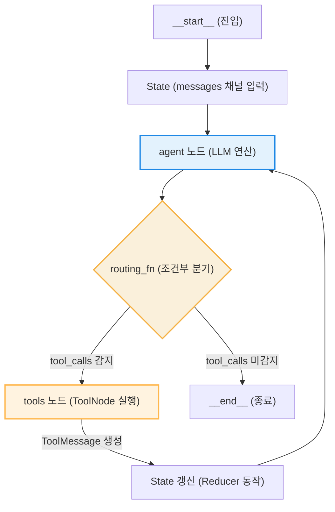

# Lesson 4.2: LangGraph의 프리빌트 ReAct 에이전트 (Prebuilt ReAct Agent in LangGraph) 🤖

이 레슨에서는 LangGraph에서 기본 제공하는 프리빌트(Pre-built) ReAct 에이전트를 사용하는 구조와 외부 검색 엔진 API(Tavily) 및 커스텀 도구(System Date 조회)를 통합하는 전체 아키텍처를 학습하고, 코드의 동작 메커니즘을 상세히 분석합니다.

---

## 1. LangGraph 프리빌트 ReAct 에이전트의 구조 및 이점

LangGraph는 개발자의 구현 리소스를 단축하고 표준화된 워크플로우를 보장하기 위해 기성품(Pre-built) 형태의 ReAct 에이전트 빌더를 제공합니다. `create_react_agent` 함수가 반환하는 객체의 내부 실체는 `CompiledStateGraph` 클래스의 인스턴스이며, 아래와 같은 명확한 상태 전이 및 루프 제어 장치를 갖추고 있습니다.

### ⚙️ 핵심 아키텍처 및 상태 제어 흐름

프리빌트 ReAct 에이전트는 **생각(Thought) ➡️ 행동(Action) ➡️ 관찰(Observation)** 루프를 순환 그래프 구조로 추상화한 결과물입니다.



1. **상태(State) 모델 및 리듀서(Reducer) 메커니즘**:
   * 프리빌트 에이전트는 메모리 내의 대화 기록을 추적하기 위해 `messages` 키를 채널로 가지는 상태 구조를 취합니다.
   * 메시지 채널에는 **리듀서(Reducer)** 함수가 기본 설정되어 있어, 에이전트 루프가 한 바퀴 돌 때마다 생성되는 새로운 메시지(`AIMessage`, `ToolMessage`)가 기존 리스트에 차례대로 추가(Append)됩니다. 이로 인해 과거의 실행 이력과 도구 응답값이 메모리에서 소실되지 않고 누적됩니다.
2. **`agent` 노드 (언어 모델 추론)**:
   * 입력 상태로 들어온 누적 메시지 리스트(`List[BaseMessage]`)를 언어 모델(LLM)에 전달합니다.
   * 언어 모델은 자신에게 주입된 도구 API 명세서(Schema)를 참조하여 현재 쿼리를 해결하기 위해 어떤 도구를 어떤 인수(Arguments)로 호출할지 결정합니다. 호출이 필요할 시 출력인 `AIMessage` 내의 `tool_calls` 필드에 구조화된 JSON 형태로 값을 저장하여 내보냅니다.
3. **조건부 분기 에지 (Routing Function)**:
   * `agent` 노드의 출력 데이터(`AIMessage`)를 무상태(Stateless) 라우터 함수가 검사합니다.
   * `tool_calls`가 감지되면 제어권을 `tools` 노드로 이송하고, `tool_calls`가 비어있으면 최종 답변이 도출된 것으로 판단하여 `__end__` 노드로 이송합니다.
4. **`tools` 노드 (도구 병렬 실행)**:
   * 언어 모델이 요청한 `tool_calls` 배열을 해석하여 실제 파이썬 도구 함수를 기동시킵니다.
   * 여러 개의 독립적인 도구 호출이 포함되어 있을 경우, 이를 파이썬 비동기 처리 또는 멀티스레딩 스레드 풀을 활용하여 **동시에 병렬 처리**합니다.
   * 실행 완료 후 반환값을 `ToolMessage` 형태로 가공하여 다시 그래프 상태에 누적시키고 제어권을 `agent` 노드로 반환합니다.

### 💡 주요 장점
* **자동화된 상태 동기화**: 매 턴마다 발생하는 메시지 병합, 모델 스키마와 도구 인자 결합 등의 저수준(Low-level) 데이터 처리를 프레임워크가 자동화해 줍니다.
* **영속성 및 대화 메모리 기본 지원**: `checkpointer` 매개변수를 통해 데이터베이스나 메모리 저장소를 그래프에 바인딩하는 것만으로, 스레드 ID 기반의 세션 관리와 이전 대화 복구 기능을 즉시 도입할 수 있습니다.

---

## 2. 외부 및 커스텀 도구(Tools)의 정의와 동작 원리

에이전트가 학습되지 않은 실시간 외부 데이터나 내부 시스템 상태에 액세스할 수 있도록 외부 API와 로컬 함수를 규격화하는 작업이 필요합니다. 

이해를 돕기 위해 **"특정 맛집의 오늘 예약 가능 여부 조회 및 예약 신청"**이라는 단일 시나리오를 바탕으로 도구의 상세 정의 및 바인딩 메커니즘을 설명합니다.

### 📋 통합 시나리오 예시 데이터 흐름

* **사용자 질문:** `"오늘 저녁 7시에 강남역 근처 삼겹살 맛집 중 예약할 수 있는 곳을 찾아서 예약해줘."`
* **동작에 필요한 도구 설계:**
  1. **시스템 날짜 조회 도구 (`get_current_date`)**: "오늘"이 구체적으로 몇 년 몇 월 몇 일인지 물리적 시간을 연산합니다.
  2. **외부 맛집 탐색 도구 (`tavily_search_tool`)**: 강남역 주변의 삼겹살 전문점 상호명과 정보를 수집합니다.
  3. **예약 실행 도구 (`create_reservation`)**: 특정 레스토랑의 특정 시간대 예약 API를 전송하여 예약을 확정합니다.

---

### ① Tavily 외부 웹 검색 도구 연동

```python
from langchain_community.tools.tavily_search import TavilySearchResults

# Tavily 웹 검색 도구 인스턴스를 생성하고 검색 한도를 설정합니다.
tavily_search_tool = TavilySearchResults(max_results=3)
```

* **동작 원리**: 
  * 사용자의 쿼리("강남역 삼겹살 맛집")를 바탕으로 의미론적 연관성이 높은 웹 문서들 중 상위 3개(`max_results=3`)의 본문 조각을 수집하여 하나의 텍스트 데이터로 반환합니다.
  * 검색 범위를 넘어서는 불필요하게 긴 문서가 모델 컨텍스트 창에 입력되는 것을 제한하여 토큰 비용을 최소화합니다.

### ② 시스템 현재 날짜 조회 커스텀 도구 정의

```python
from langchain_core.tools import tool
from datetime import datetime

@tool
def get_current_date() -> str:
    """Get the current date. This tool should be used first for any time-related queries."""
    return datetime.now().strftime("%B %d, %Y")
```

* **`@tool` 데코레이터와 독스트링(Docstring) 정보 주입**:
  * 파이썬의 표준 `datetime` 라이브러리를 활용해 현재 서버 시간을 반환하는 단순 함수이지만, `@tool` 데코레이터를 적용함으로써 LangChain의 표준 `BaseTool` 규격 인터페이스 객체로 래핑됩니다.
  * 모델이 사용자 질문에서 "오늘"이라는 텍스트를 인지했을 때, 이 도구의 독스트링(`This tool should be used first...`)을 파싱하여 **웹 검색을 하기 전에 기준 날짜를 먼저 구해야 한다는 추론 규칙**을 스스로 세우게 됩니다.

### ③ 예약 실행 커스텀 도구 정의

```python
@tool
def create_reservation(restaurant_name: str, reservation_time: str) -> str:
    """Create a reservation at the specified restaurant for the given time.
    
    Args:
        restaurant_name: The name of the restaurant to reserve.
        reservation_time: The time of the reservation (Format: YYYY-MM-DD HH:MM).
    """
    # 실제 백엔드 예약 API 시스템과 통신하여 예약을 등록하는 로직을 모사합니다.
    return f"Success: Reservation at {restaurant_name} for {reservation_time} has been confirmed."
```

* **매개변수 타입 힌트와 설명**:
  * 함수의 시그니처(`restaurant_name: str`, `reservation_time: str`)와 매개변수의 상세한 설명(Args 명세)은 모델에게 전송되는 JSON 스키마로 자동 변환됩니다.
  * 이를 통해 모델은 예약하려는 가게 이름(`restaurant_name`)과 표준 규격화된 날짜 시간 양식(`reservation_time`)을 준수하여 파라미터를 완성해 줍니다.

---

### 🔄 통합 시나리오 런타임 추적표 (Trace Table)

사용자의 쿼리가 파이프라인에 입력된 후 각 도구들이 연쇄적으로 물리 결합하여 동작하는 흐름을 보여줍니다.

| 턴(Turn) | 주체 | 동작 및 호출 API | 상태(State) 메시지 목록 변화 |
| :--- | :--- | :--- | :--- |
| **0** | 사용자 | `"오늘 저녁 7시 강남역 삼겹살 맛집 예약해줘"` 주입 | `[HumanMessage(content="오늘 저녁...")]` |
| **1** | 모델 (agent) | "오늘"의 날짜 획득을 위해 `get_current_date` 실행 결정 | `[HumanMessage, AIMessage(tool_calls=[{"name": "get_current_date"}])]` |
| **2** | 도구 (tools) | `get_current_date()` 실행 ➡️ `"November 16, 2026"` 획득 | `[..., AIMessage, ToolMessage(content="November 16, 2026", tool_call_id="...")]` |
| **3** | 모델 (agent) | 획득한 날짜(11월 16일)와 목적(저녁 7시)을 취합하여 맛집 리스트 검색 결정 | `[..., ToolMessage, AIMessage(tool_calls=[{"name": "tavily_search", "args": {"query": "Gangnam Station pork belly restaurant"}}])]` |
| **4** | 도구 (tools) | `tavily_search_tool` 실행 ➡️ 검색 본문(예: "맛있는 삼겹살집 A") 수집 | `[..., AIMessage, ToolMessage(content="검색 결과: 삼겹살집 A ...", tool_call_id="...")]` |
| **5** | 모델 (agent) | 검색된 가게 이름("삼겹살집 A")과 예약 시간("2026-11-16 19:00")으로 예약 도구 실행 결정 | `[..., ToolMessage, AIMessage(tool_calls=[{"name": "create_reservation", "args": {"restaurant_name": "삼겹살집 A", "reservation_time": "2026-11-16 19:00"}}])]` |
| **6** | 도구 (tools) | `create_reservation(...)` 실행 ➡️ 예약 성공 문자열 획득 | `[..., AIMessage, ToolMessage(content="Success: Reservation at 삼겹살집 A...", tool_call_id="...")]` |
| **7** | 모델 (agent) | 더 이상의 도구 실행이 불필요하므로 최종 마크다운 확인 결과 작성 | `[..., ToolMessage, AIMessage(content="강남역 삼겹살집 A에 오늘 19:00 예약이 완료되었습니다.")]` ➡️ **`__end__`로 종료** |

---

---

## 3. 프리빌트 에이전트 인스턴스 빌드 및 시각화

```python
from langgraph.prebuilt import create_react_agent

# 언어 모델(model)과 도구 목록(tools)을 결합하여 에이전트 그래프를 생성합니다.
tools = [tavily_search_tool, get_current_date]
agent_graph = create_react_agent(model, tools)
```

### 🔍 `create_react_agent` 파라미터 및 바인딩 구조
1. **`model`:** 이전 레슨에서 설정한 `ChatOpenAI(model="gpt-4o", temperature=0)` 객체입니다. 도구 호출 기능을 자체 지원하는 모델 규격이어야 합니다.
2. **`tools`:** 에이전트에게 할당할 도구 인스턴스들의 파이썬 리스트(`List[BaseTool]`)입니다. 내부적으로 `create_react_agent`는 이 리스트를 모델의 `bind_tools()` API로 전달하여, 모델이 어떤 파라미터 규격으로 출력을 설계해야 하는지 사전에 인지시킵니다.

### 📊 에이전트 노드 그래프 시각화

시각화 메서드 `agent_graph.get_graph().draw_mermaid_png()` 호출 시 반환되는 흐름도 구조는 다음과 같이 작동합니다.


* **진입로 (`START`):** 사용자가 주입한 대화 메시지가 최초 진입점으로 들어옵니다.
* **주요 노드 (`agent` & `tools`):** 사용자 요청에 대응하기 위해 모델이 판단한 동작을 `tools` 노드와 상호작용하며 순환합니다.
* **종료로 (`END`):** 모델이 최종 상태에서 추가 도구 호출 없이 문자열 응답만을 출력할 때 그래프 프로세스가 종료됩니다.

---

## 🛠️ 실습: 시나리오별 멀티스텝 추론 실행 흐름 추적

사용자 쿼리가 에이전트로 들어갔을 때의 내부 실행 흐름과 입력 바인딩 구조를 추적합니다.

### 📌 시나리오 A: "싱가포르 F1 레이스 최근 우승자 조회"
* **사용자 입력:** `"Who won the most recent F1 race in Singapore?"`

#### 1단계: 시간 기준점 파악 (State 1)
* **상태:** 에이전트는 '가장 최근(most recent)'이라는 상대적 시간을 해석하기 위해 시간 데이터가 선행되어야 함을 독스트링을 통해 인지합니다.
* **행동:** `get_current_date` 도구를 최우선으로 호출합니다.
* **관찰 (Observation):** `"November 16, 2026"` (시스템 날짜 반환)

#### 2단계: 검색 쿼리 변환 및 웹 검색 실행 (State 2)
* **상태:** 현재 시점(2026년 11월)을 기준으로 최근 개최된 싱가포르 그랑프리는 2026년 시즌 혹은 직전 시즌임을 식별합니다.
* **행동:** Tavily 웹 검색 도구에 보낼 쿼리를 `"Singapore Grand Prix 2026 winner"` 또는 `"Singapore Grand Prix 2025 winner"` 등으로 상세화하여 전송합니다.
* **관찰 (Observation):** F1 싱가포르 그랑프리 경기 결과 데이터를 수집합니다.

#### 3단계: 최종 가공 답변 생성 (State 3)
* **행동:** 검색 결과로부터 사실 정보(Fact)를 파싱하여 사용자에게 마크다운 형식의 최종 텍스트 답변을 구성한 뒤 `__end__`로 이동합니다.

---

### 📌 시나리오 B: "내일 도쿄 날씨 예보 조회"
* **사용자 입력:** `"What is the weather like in Tokyo tomorrow?"`

#### 1단계: 기준 날짜 계산 (State 1)
* **상태:** '내일(tomorrow)'을 특정하기 위해 기준일 정보가 필요합니다.
* **행동:** `get_current_date` 도구를 호출합니다.
* **관찰 (Observation):** `"November 16, 2026"`

#### 2단계: 일기 예보 검색 실행 (State 2)
* **상태:** 현재 날짜인 11월 16일의 다음 날인 '11월 17일'을 명확한 목적 날짜로 계산합니다.
* **행동:** Tavily 검색 도구에 `"Tokyo weather forecast November 17, 2026"` 쿼리를 전송합니다.
* **관찰 (Observation):** 2026년 11월 17일의 기온, 강수 확률, 구름 상태 등의 텍스트 조각을 반환받습니다.

#### 3단계: 가독성 있는 마크다운 응답 (State 3)
* **행동:** 정제된 기상 정보를 종합하여 사용자 브라우저 뷰어에 최적화된 형식으로 문장을 포맷팅해 반환하고 흐름을 종료합니다.
