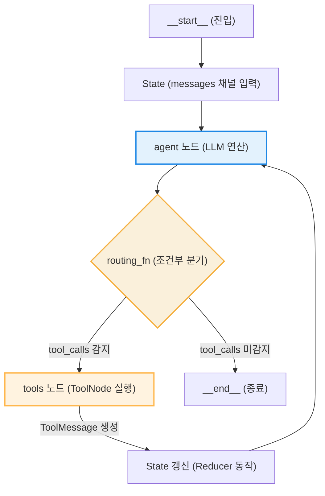
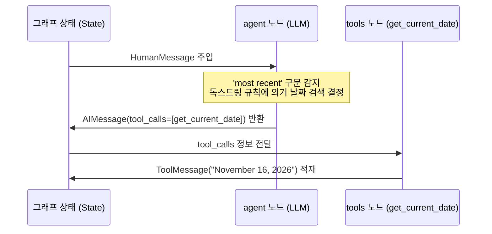

# Lesson 4.2: LangGraph의 프리빌트 ReAct 에이전트 (Prebuilt ReAct Agent in LangGraph) 🤖

이 레슨에서는 LangGraph에서 기본 제공하는 프리빌트(Pre-built) ReAct 에이전트를 사용하는 구조와 외부 검색 엔진 API(Tavily) 및 커스텀 도구(System Date 조회)를 통합하는 전체 아키텍처를 학습하고, 코드의 동작 메커니즘을 상세히 분석합니다.

---

## 1. LangGraph 프리빌트 ReAct 에이전트의 구조 및 이점

LangGraph는 개발자의 구현 리소스를 단축하고 표준화된 워크플로우를 보장하기 위해 기성품(Pre-built) 형태의 ReAct 에이전트 빌더를 제공합니다. `create_react_agent` 함수가 반환하는 객체의 내부 실체는 `CompiledStateGraph` 클래스의 인스턴스이며, 아래와 같은 명확한 상태 전이 및 루프 제어 장치를 갖추고 있습니다.

### ⚙️ 핵심 아키텍처 및 상태 제어 흐름

프리빌트 ReAct 에이전트는 **생각(Thought) ➡️ 행동(Action) ➡️ 관찰(Observation)** 루프를 순환 그래프 구조로 추상화한 결과물입니다.



1. **상태(State) 모델 및 리듀서(Reducer) 메커니즘**:
   * 프리빌트 에이전트는 메모리 내의 대화 기록을 추적하기 위해 `messages` 키를 채널로 가지는 상태 구조를 취합니다.
   * 메시지 채널에는 **리듀서(Reducer)** 함수가 기본 설정되어 있어, 에이전트 루프가 한 바퀴 돌 때마다 생성되는 새로운 메시지(`AIMessage`, `ToolMessage`)가 기존 리스트에 차례대로 추가(Append)됩니다. 이로 인해 과거의 실행 이력과 도구 응답값이 메모리에서 소실되지 않고 누적됩니다.
2. **`agent` 노드 (언어 모델 추론)**:
   * 입력 상태로 들어온 누적 메시지 리스트(`List[BaseMessage]`)를 언어 모델(LLM)에 전달합니다.
   * 언어 모델은 자신에게 주입된 도구 API 명세서(Schema)를 참조하여 현재 쿼리를 해결하기 위해 어떤 도구를 어떤 인수(Arguments)로 호출할지 결정합니다. 호출이 필요할 시 출력인 `AIMessage` 내의 `tool_calls` 필드에 구조화된 JSON 형태로 값을 저장하여 내보냅니다.
3. **조건부 분기 에지 (Routing Function)**:
   * `agent` 노드의 출력 데이터(`AIMessage`)를 무상태(Stateless) 라우터 함수가 검사합니다.
   * `tool_calls`가 감지되면 제어권을 `tools` 노드로 이송하고, `tool_calls`가 비어있으면 최종 답변이 도출된 것으로 판단하여 `__end__` 노드로 이송합니다.
4. **`tools` 노드 (도구 병렬 실행)**:
   * 언어 모델이 요청한 `tool_calls` 배열을 해석하여 실제 파이썬 도구 함수를 기동시킵니다.
   * 여러 개의 독립적인 도구 호출이 포함되어 있을 경우, 이를 파이썬 비동기 처리 또는 멀티스레딩 스레드 풀을 활용하여 **동시에 병렬 처리**합니다.
   * 실행 완료 후 반환값을 `ToolMessage` 형태로 가공하여 다시 그래프 상태에 누적시키고 제어권을 `agent` 노드로 반환합니다.

### 💡 주요 장점
* **자동화된 상태 동기화**: 매 턴마다 발생하는 메시지 병합, 모델 스키마와 도구 인자 결합 등의 저수준(Low-level) 데이터 처리를 프레임워크가 자동화해 줍니다.
* **영속성 및 대화 메모리 기본 지원**: `checkpointer` 매개변수를 통해 데이터베이스나 메모리 저장소를 그래프에 바인딩하는 것만으로, 스레드 ID 기반의 세션 관리와 이전 대화 복구 기능을 즉시 도입할 수 있습니다.

---

## 2. 외부 및 커스텀 도구(Tools)의 정의와 동작 원리

에이전트가 학습되지 않은 실시간 외부 데이터나 내부 시스템 상태에 액세스할 수 있도록 외부 API와 로컬 함수를 규격화하는 작업이 필요합니다. 

이해를 돕기 위해 **"특정 맛집의 오늘 예약 가능 여부 조회 및 예약 신청"**이라는 단일 시나리오를 바탕으로 도구의 상세 정의 및 바인딩 메커니즘을 설명합니다.

### 📋 통합 시나리오 예시 데이터 흐름

* **사용자 질문:** `"오늘 저녁 7시에 강남역 근처 삼겹살 맛집 중 예약할 수 있는 곳을 찾아서 예약해줘."`
* **동작에 필요한 도구 설계:**
  1. **시스템 날짜 조회 도구 (`get_current_date`)**: "오늘"이 구체적으로 몇 년 몇 월 몇 일인지 물리적 시간을 연산합니다.
  2. **외부 맛집 탐색 도구 (`tavily_search_tool`)**: 강남역 주변의 삼겹살 전문점 상호명과 정보를 수집합니다.
  3. **예약 실행 도구 (`create_reservation`)**: 특정 레스토랑의 특정 시간대 예약 API를 전송하여 예약을 확정합니다.

---

### ① Tavily 외부 웹 검색 도구 연동

```python
from langchain_community.tools.tavily_search import TavilySearchResults

# Tavily 웹 검색 도구 인스턴스를 생성하고 검색 한도를 설정합니다.
tavily_search_tool = TavilySearchResults(max_results=3)
```

* **동작 원리**: 
  * 사용자의 쿼리("강남역 삼겹살 맛집")를 바탕으로 의미론적 연관성이 높은 웹 문서들 중 상위 3개(`max_results=3`)의 본문 조각을 수집하여 하나의 텍스트 데이터로 반환합니다.
  * 검색 범위를 넘어서는 불필요하게 긴 문서가 모델 컨텍스트 창에 입력되는 것을 제한하여 토큰 비용을 최소화합니다.

### ② 시스템 현재 날짜 조회 커스텀 도구 정의

```python
from langchain_core.tools import tool
from datetime import datetime

@tool
def get_current_date() -> str:
    """Get the current date. This tool should be used first for any time-related queries."""
    return datetime.now().strftime("%B %d, %Y")
```

* **`@tool` 데코레이터와 독스트링(Docstring) 정보 주입**:
  * 파이썬의 표준 `datetime` 라이브러리를 활용해 현재 서버 시간을 반환하는 단순 함수이지만, `@tool` 데코레이터를 적용함으로써 LangChain의 표준 `BaseTool` 규격 인터페이스 객체로 래핑됩니다.
  * 모델이 사용자 질문에서 "오늘"이라는 텍스트를 인지했을 때, 이 도구의 독스트링(`This tool should be used first...`)을 파싱하여 **웹 검색을 하기 전에 기준 날짜를 먼저 구해야 한다는 추론 규칙**을 스스로 세우게 됩니다.

### ③ 예약 실행 커스텀 도구 정의

```python
@tool
def create_reservation(restaurant_name: str, reservation_time: str) -> str:
    """Create a reservation at the specified restaurant for the given time.
    
    Args:
        restaurant_name: The name of the restaurant to reserve.
        reservation_time: The time of the reservation (Format: YYYY-MM-DD HH:MM).
    """
    # 실제 백엔드 예약 API 시스템과 통신하여 예약을 등록하는 로직을 모사합니다.
    return f"Success: Reservation at {restaurant_name} for {reservation_time} has been confirmed."
```

* **매개변수 타입 힌트와 설명**:
  * 함수의 시그니처(`restaurant_name: str`, `reservation_time: str`)와 매개변수의 상세한 설명(Args 명세)은 모델에게 전송되는 JSON 스키마로 자동 변환됩니다.
  * 이를 통해 모델은 예약하려는 가게 이름(`restaurant_name`)과 표준 규격화된 날짜 시간 양식(`reservation_time`)을 준수하여 파라미터를 완성해 줍니다.

---

### 🔄 통합 시나리오 런타임 추적표 (Trace Table)

사용자의 쿼리가 파이프라인에 입력된 후 각 도구들이 연쇄적으로 물리 결합하여 동작하는 흐름을 보여줍니다.

| 턴(Turn) | 주체 | 동작 및 호출 API | 상태(State) 메시지 목록 변화 |
| :--- | :--- | :--- | :--- |
| **0** | 사용자 | `"오늘 저녁 7시 강남역 삼겹살 맛집 예약해줘"` 주입 | `[HumanMessage(content="오늘 저녁...")]` |
| **1** | 모델 (agent) | "오늘"의 날짜 획득을 위해 `get_current_date` 실행 결정 | `[HumanMessage, AIMessage(tool_calls=[{"name": "get_current_date"}])]` |
| **2** | 도구 (tools) | `get_current_date()` 실행 ➡️ `"November 16, 2026"` 획득 | `[..., AIMessage, ToolMessage(content="November 16, 2026", tool_call_id="...")]` |
| **3** | 모델 (agent) | 획득한 날짜(11월 16일)와 목적(저녁 7시)을 취합하여 맛집 리스트 검색 결정 | `[..., ToolMessage, AIMessage(tool_calls=[{"name": "tavily_search", "args": {"query": "Gangnam Station pork belly restaurant"}}])]` |
| **4** | 도구 (tools) | `tavily_search_tool` 실행 ➡️ 검색 본문(예: "맛있는 삼겹살집 A") 수집 | `[..., AIMessage, ToolMessage(content="검색 결과: 삼겹살집 A ...", tool_call_id="...")]` |
| **5** | 모델 (agent) | 검색된 가게 이름("삼겹살집 A")과 예약 시간("2026-11-16 19:00")으로 예약 도구 실행 결정 | `[..., ToolMessage, AIMessage(tool_calls=[{"name": "create_reservation", "args": {"restaurant_name": "삼겹살집 A", "reservation_time": "2026-11-16 19:00"}}])]` |
| **6** | 도구 (tools) | `create_reservation(...)` 실행 ➡️ 예약 성공 문자열 획득 | `[..., AIMessage, ToolMessage(content="Success: Reservation at 삼겹살집 A...", tool_call_id="...")]` |
| **7** | 모델 (agent) | 더 이상의 도구 실행이 불필요하므로 최종 마크다운 확인 결과 작성 | `[..., ToolMessage, AIMessage(content="강남역 삼겹살집 A에 오늘 19:00 예약이 완료되었습니다.")]` ➡️ **`__end__`로 종료** |

---

---

## 3. 프리빌트 에이전트 인스턴스 빌드 및 시각화

이 단계에서는 선언한 언어 모델과 도구들을 실제로 바인딩하여 실행 가능한 그래프 인스턴스를 빌드하고, 시각적 컴포넌트의 흐름을 분석합니다.

```python
from langgraph.prebuilt import create_react_agent

# 1. 도구 목록을 파이썬 리스트로 결합합니다.
tools = [tavily_search_tool, get_current_date, create_reservation]

# 2. 프리빌트 ReAct 에이전트 그래프를 생성(컴파일)합니다.
agent_graph = create_react_agent(model, tools)
```

---

### 🔍 `create_react_agent` 내부 빌드 메커니즘

1. **도구 스키마 자동 주입 (`model.bind_tools(tools)`)**:
   * `create_react_agent` 함수가 호출되면 내부적으로 `model` 객체에 대해 `bind_tools(tools)` 메서드를 자동 실행합니다.
   * 이를 통해 `@tool`로 정의된 파이썬 함수들의 시그니처와 독스트링이 자동으로 OpenAPI 호환 JSON 스키마로 변환되어 모델의 시스템 인스트럭션 하단에 투입됩니다. 모델은 이 스키마를 통해 호출 가능한 도구 목록과 각 도구의 인자 규격을 명확히 인지하게 됩니다.
2. **`CompiledStateGraph` 구조 생성**:
   * 함수 실행 결과 반환되는 `agent_graph`는 단순한 스크립트 체인이 아닌, 컴파일이 완료된 `CompiledStateGraph` 객체입니다.
   * 이 객체는 그래프의 데이터 저장소 역할을 하는 `State` 스키마(메시지 리스트), 메시지를 모델에 전달하는 `agent` 노드, 그리고 `ToolNode` 클래스로 감싸진 `tools` 노드를 내장하고 런타임 엔진에 등록합니다.

---

### 📊 그래프 노드 시각화 및 맛집 예약 시나리오 매핑

LangGraph에서 제공하는 `agent_graph.get_graph().draw_mermaid_png()` 호출 시 렌더링되는 시각 자료와, 이것이 **맛집 예약 시나리오(강남역 삼겹살 예약)** 하에서 작동하는 실제 제어 상태를 매핑하여 분석합니다.


#### ➊ `__start__` (시작점) ➡️ `State` 진입
* **시각화 내 의미**: 외부에서 데이터 입력을 받아 그래프의 상태(State) 채널에 쓰기(Write) 작업을 수행하는 초입 게이트웨이입니다.
* **시나리오 매핑**: 사용자가 작성한 텍스트 데이터(`"오늘 저녁 7시 강남역 삼겹살 맛집 예약해줘"`)가 `HumanMessage` 객체에 실려 상태 메시지 배열의 첫 번째 요소로 인젝션됩니다.

#### ➋ `agent` (에이전트 노드) ➡️ LLM 연산 구동
* **시각화 내 의미**: 현재 상태에 보관된 모든 메시지를 모델에 대입하여 추론 연산을 지시하는 중앙 노드입니다.
* **시나리오 매핑**: 
  * **1차 진입 시**: 시스템 시간을 확보하기 위해 `get_current_date`를 호출하라는 `tool_calls` 정보를 생성합니다.
  * **2차 진입 시**: 전달받은 날짜 정보를 기반으로 맛집 리스트를 웹 검색하라는 `tavily_search` 호출 지시를 내립니다.
  * **3차 진입 시**: 검색된 결과를 확인하고 특정 가게("삼겹살집 A")를 대상지로 지정하여 `create_reservation` 도구를 호출할 인자값(`reservation_time` 등)을 완성합니다.

#### ➌ `tools` (도구 실행 노드) ➡️ 물리 함수 실행 및 반환
* **시각화 내 의미**: 모델로부터 `tool_calls` 명령을 받아 실제 코드를 구동하고 결과를 돌려주는 `ToolNode` 인스턴스 영역입니다.
* **시나리오 매핑**: 
  * 모델의 호출 명력에 따라 `get_current_date()`, `tavily_search_tool`, `create_reservation()` 함수가 각각 차례대로 기동되며, 기동 후 반환된 데이터(현재 날짜 문자열, 검색 문서 묶음, 예약 확정 성공 로그)를 `ToolMessage` 객체로 감싸 다시 상태 데이터베이스로 밀어 올립니다.

#### ➍ `agent` ➡️ `tools` 분기점 (조건부 에지)
* **시각화 내 의미**: 모델의 결과물 내 `tool_calls` 배열 존재 여부를 체크하여 다음 경로를 결정하는 스위치 제어 로직입니다.
* **시나리오 매핑**: 모델의 응답에 실행할 도구가 등록되어 있다면 제어권을 계속 `tools` 노드로 이송(루프 생성)하고, 예약이 성공적으로 체결되어 더 이상 호출할 도구가 없는 상태(`tool_calls`가 빈 배열)라면 흐름을 `__end__` 방향으로 전환합니다.

#### ➎ `__end__` (종료점) ➡️ 최종 응답 도출
* **시각화 내 의미**: 그래프의 모든 순환 고리를 끊고 최종 상태에 저장된 결과물을 외부 클라이언트에 반환하며 프로세스를 해제하는 종착지입니다.
* **시나리오 매핑**: 최종적으로 생성된 텍스트(`"강남역 삼겹살집 A에 오늘 19:00 예약이 완료되었습니다."`)를 최종 사용자의 화면에 렌더링하고 메모리를 클리어합니다.

---

## 🛠️ 실습: 시나리오별 멀티스텝 추론 실행 흐름 추적

사용자 쿼리가 에이전트에 입력되었을 때, LangGraph의 상태(State) 객체가 어떻게 변경되고 각 컴포넌트가 어떤 JSON 규격의 인자를 주고받는지 단계별로 정밀 추적합니다.

---

### 📌 시나리오 A: "싱가포르 F1 레이스 최근 우승자 조회"

* **사용자 입력 (원시 쿼리):** `"Who won the most recent F1 race in Singapore?"`
* **기준 서버 시점:** `2026-11-16`

#### 1단계: 초기 진입 및 시간 기준점 파악 (`State 1` ➡️ `State 2`)



* **상태 (State) 메시지 목록:**
  ```python
  [
      HumanMessage(content="Who won the most recent F1 race in Singapore?")
  ]
  ```
* **`agent` 노드 처리**: 
  * 모델은 입력 쿼리 내의 `'most recent'`(가장 최근의)라는 표현이 상대적 시점을 지칭하므로, 절대적인 기준 시간 정보가 없으면 검색 결과를 신뢰할 수 없다고 판단합니다.
  * `get_current_date` 도구의 스키마 명세에 명시된 독스트링 규칙에 의거하여 이 도구를 가장 먼저 실행하기로 결정합니다.
* **모델 출력 (`AIMessage`):**
  ```json
  {
    "content": "",
    "tool_calls": [
      {
        "name": "get_current_date",
        "args": {},
        "id": "call_abc123"
      }
    ]
  }
  ```
* **`tools` 노드 처리**: `get_current_date` 함수가 구동되어 시스템 날짜인 `"November 16, 2026"`을 반환합니다.
* **상태 업데이트 결과 (리듀서 동작):**
  ```python
  [
      HumanMessage(content="Who won the most recent F1 race in Singapore?"),
      AIMessage(content="", tool_calls=[{"name": "get_current_date", "id": "call_abc123"}]),
      ToolMessage(content="November 16, 2026", tool_call_id="call_abc123")
  ]
  ```

---

#### 2단계: 기준 날짜 기반의 타겟 정보 검색 (`State 2` ➡️ `State 3`)

* **`agent` 노드 처리**:
  * 입력된 전체 메시지 히스토리를 대입받아 추론을 시작합니다.
  * 상태에 추가된 `ToolMessage`의 날짜 `"November 16, 2026"` 정보를 파악하고, '최근 싱가포르 그랑프리'가 **2026년 시즌** 경기 정보임을 식별합니다.
  * 검색 최적화를 위해 쿼리를 정형화하여 `tavily_search_tool`을 호출합니다.
* **모델 출력 (`AIMessage`):**
  ```json
  {
    "content": "",
    "tool_calls": [
      {
        "name": "tavily_search_tool",
        "args": {
          "query": "Singapore Grand Prix 2026 winner"
        },
        "id": "call_def456"
      }
    ]
  }
  ```
* **`tools` 노드 처리**: Tavily API를 사용하여 웹 문서 조각을 수집합니다.
* **상태 업데이트 결과 (리듀서 동작):**
  ```python
  [
      # ... (이전 메시지 생략) ...
      AIMessage(content="", tool_calls=[{"name": "tavily_search_tool", "id": "call_def456"}]),
      ToolMessage(content="[검색 결과 본문] Lando Norris won the 2026 Singapore Grand Prix...", tool_call_id="call_def456")
  ]
  ```

---

#### 3단계: 최종 팩트 기반 응답 생성 (`State 3` ➡️ `__end__`)

* **`agent` 노드 처리**:
  * 상태 데이터에 기록된 Tavily 검색 결과를 바탕으로 답변을 완성합니다.
  * `tool_calls` 필드가 없는 순수 텍스트 답변을 출력합니다.
* **모델 출력 (`AIMessage`):**
  ```python
  AIMessage(content="2026년 싱가포르 그랑프리의 우승자는 랜도 노리스(Lando Norris)입니다.")
  ```
* **결과**: `tool_calls`가 존재하지 않으므로 조건부 에지는 최종 답변을 전달하고 `__end__` 노드로 흐름을 이송해 프로세스를 마감합니다.

---

### 📌 시나리오 B: "내일 도쿄의 날씨 예보 조회"

* **사용자 입력 (원시 쿼리):** `"What is the weather like in Tokyo tomorrow?"`
* **기준 서버 시점:** `2026-11-16`

#### 1단계: 날짜 기준 계산을 위한 도구 기동 (`State 1` ➡️ `State 2`)

* **상태 (State) 메시지 목록:**
  ```python
  [
      HumanMessage(content="What is the weather like in Tokyo tomorrow?")
  ]
  ```
* **`agent` 노드 처리**:
  * `'tomorrow'`(내일)라는 표현을 처리하려면 우선 오늘 날짜를 확인해야 한다고 인식합니다.
  * 시간 관련 추론을 선점하기 위해 `get_current_date` 도구를 지정하여 호출 명령을 생성합니다.
* **모델 출력 (`AIMessage`):**
  ```json
  {
    "content": "",
    "tool_calls": [
      {
        "name": "get_current_date",
        "args": {},
        "id": "call_xyz789"
      }
    ]
  }
  ```
* **`tools` 노드 처리**: 로컬 날짜 계산 함수가 `"November 16, 2026"` 문자열을 반환합니다.
* **상태 업데이트 결과:**
  ```python
  [
      HumanMessage(content="What is the weather like in Tokyo tomorrow?"),
      AIMessage(content="", tool_calls=[{"name": "get_current_date", "id": "call_xyz789"}]),
      ToolMessage(content="November 16, 2026", tool_call_id="call_xyz789")
  ]
  ```

---

#### 2단계: 내일 날짜 연산 및 특정 날씨 검색 (`State 2` ➡️ `State 3`)

* **`agent` 노드 처리**:
  * 시스템 기준일(11월 16일) 데이터를 바탕으로 '내일'이 **2026년 11월 17일**임을 수치 계산합니다.
  * 위치("Tokyo")와 날짜("November 17, 2026") 정보를 결합하여 검색 쿼리를 조합합니다.
* **모델 출력 (`AIMessage`):**
  ```json
  {
    "content": "",
    "tool_calls": [
      {
        "name": "tavily_search_tool",
        "args": {
          "query": "Tokyo weather forecast November 17, 2026"
        },
        "id": "call_qwe987"
      }
    ]
  }
  ```
* **`tools` 노드 처리**: Tavily 웹 검색 엔진에 쿼리를 송신하고, 해당 날짜의 도쿄 일기 예보(온도, 강수량, 기압 데이터 등) 본문을 검색하여 수집합니다.
* **상태 업데이트 결과:**
  ```python
  [
      # ... (이전 메시지 생략) ...
      AIMessage(content="", tool_calls=[{"name": "tavily_search_tool", "id": "call_qwe987"}]),
      ToolMessage(content="[검색 결과 본문] The weather in Tokyo on November 17, 2026 is forecast to be mostly cloudy with a high of 18 degrees...", tool_call_id="call_qwe987")
  ]
  ```

---

#### 3단계: 일기 예보 데이터 정형화 및 출력 (`State 3` ➡️ `__end__`)

* **`agent` 노드 처리**:
  * 최종 검색된 기상 정보를 기반으로 사용자가 읽기 적합한 한글 문장 양식으로 요약 정리합니다.
* **모델 출력 (`AIMessage`):**
  ```python
  AIMessage(content="2026년 11월 17일 도쿄의 날씨는 대체로 흐릴 것으로 예상되며, 최고 기온은 18도 안팎입니다.")
  ```
* **결과**: 추가적인 `tool_calls` 데이터가 존재하지 않으므로 조건부 라우터 에지가 작동을 종료하고 `__end__` 상태로 상태 기계를 종료합니다.

---
