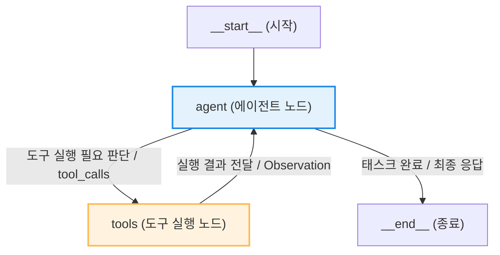

# Lesson 4.2: LangGraph의 프리빌트 ReAct 에이전트 (Prebuilt ReAct Agent in LangGraph) 🤖

이 레슨에서는 LangGraph에서 기본 제공하는 프리빌트(Pre-built) ReAct 에이전트를 사용하는 구조와 외부 검색 엔진 API(Tavily) 및 커스텀 도구(System Date 조회)를 통합하는 전체 아키텍처를 학습하고, 코드의 동작 메커니즘을 상세히 분석합니다.

---

## 1. LangGraph 프리빌트 ReAct 에이전트의 구조 및 이점

LangGraph는 개발자의 구현 리소스를 단축하고 표준화된 워크플로우를 보장하기 위해 기성품(Pre-built) 형태의 ReAct 에이전트 빌더를 제공합니다. 

### ⚙️ 핵심 아키텍처 및 제어 흐름

프리빌트 ReAct 에이전트는 **생각(Thought) ➡️ 행동(Action) ➡️ 관찰(Observation)** 루프를 순환 그래프 구조로 추상화한 결과물입니다.



1. **`agent` 노드:** 입력 메시지와 이전 대화 상태(State)를 참조하여, 사용자의 요구사항을 해결하기 위해 도구 호출이 필요한지 여부를 언어 모델(LLM)을 통해 추론합니다.
2. **조건부 에지(Conditional Edge):** 모델의 출력에 `tool_calls` 필드가 포함되어 있으면 `tools` 노드로 실행 흐름을 분기하고, 그렇지 않으면 최종 답변을 내보내며 `__end__` 노드로 흐름을 이송합니다.
3. **`tools` 노드:** 요청된 도구들을 병렬 또는 직렬로 실행하고 그 관찰 결과(Observation)를 다시 에이전트의 입력 상태에 추가하여 `agent` 노드로 제어권을 복귀시킵니다.

### 💡 주요 장점
* **신속한 아키텍처 구축:** 루프 분기 제어, 에지 조건 판단 등의 복잡한 노드 그래프 수동 설정을 생략하고 핵심 비즈니스 로직(도구 설계 및 프롬프트 튜닝)에 집중할 수 있습니다.
* **높은 이식성 및 확장성:** 프리빌트 에이전트 객체 자체가 하나의 독립적인 그래프이므로, 복잡한 다중 에이전트(Multi-agent) 시스템 하위의 구성 노드로 쉽게 통합하여 재사용할 수 있습니다.

---

## 2. 외부 및 커스텀 도구(Tools)의 정의와 동작 원리

에이전트가 학습 데이터 외에 실시간 지식과 시스템 내부 리소스에 접근할 수 있도록 두 가지 물리 도구를 구성합니다.

### ① Tavily 외부 웹 검색 도구 연동
```python
from langchain_community.tools.tavily_search import TavilySearchResults

# Tavily 웹 검색 도구 인스턴스를 생성하고 검색 한도를 설정합니다.
tavily_search_tool = TavilySearchResults(max_results=5)
```
* **동작 원리:** `langchain-community` 패키지에 탑재된 `TavilySearchResults`는 에이전트의 쿼리를 최적화하여 Tavily 웹 검색 엔진에 전송하고, 의미론적으로 연관성이 높은 결과 본문을 수집하여 반환합니다.
* **매개변수 `max_results=5`:** 에이전트가 탐색 과정에서 수용할 최대 검색 웹 페이지 조각 수를 5개로 제한합니다. 이 매개변수는 무분별하게 큰 문서가 컨텍스트 창에 입력되어 토큰 비용이 낭비되거나 컨텍스트 정보가 희석되는 현상을 방지합니다.

### ② 시스템 현재 날짜 조회 커스텀 도구 정의
```python
from langchain_core.tools import tool
from datetime import datetime

@tool
def get_current_date() -> str:
    """Get the current date. This tool should be used first for any time-related queries."""
    return datetime.now().strftime("%B %d, %Y")
```
* **`@tool` 데코레이터:** 일반 파이썬 함수를 LangChain 인터페이스 규격(`BaseTool`)을 충족하는 도구 객체로 래핑합니다. 이 데코레이터는 함수의 시그니처와 독스트링을 파싱하여 스키마를 동적으로 구성합니다.
* **독스트링(Docstring) 정보 주입:** 
  * `"""Get the current date. This tool should be used first for any time-related queries."""`
  * **핵심 메커니즘:** LLM은 도구를 선택할 때 이 독스트링 문장을 분석합니다. 독스트링 내에 "시간 관련 쿼리가 들어오면 이 도구를 가장 먼저 호출해야 한다"는 명시적 실행 지침을 선언함으로써, 모델이 검색(Tavily) 전 날짜 기준점을 먼저 계산하도록 행동을 유도합니다.

---

## 3. 프리빌트 에이전트 인스턴스 빌드 및 시각화

```python
from langgraph.prebuilt import create_react_agent

# 언어 모델(model)과 도구 목록(tools)을 결합하여 에이전트 그래프를 생성합니다.
tools = [tavily_search_tool, get_current_date]
agent_graph = create_react_agent(model, tools)
```

### 🔍 `create_react_agent` 파라미터 및 바인딩 구조
1. **`model`:** 이전 레슨에서 설정한 `ChatOpenAI(model="gpt-4o", temperature=0)` 객체입니다. 도구 호출 기능을 자체 지원하는 모델 규격이어야 합니다.
2. **`tools`:** 에이전트에게 할당할 도구 인스턴스들의 파이썬 리스트(`List[BaseTool]`)입니다. 내부적으로 `create_react_agent`는 이 리스트를 모델의 `bind_tools()` API로 전달하여, 모델이 어떤 파라미터 규격으로 출력을 설계해야 하는지 사전에 인지시킵니다.

### 📊 에이전트 노드 그래프 시각화

시각화 메서드 `agent_graph.get_graph().draw_mermaid_png()` 호출 시 반환되는 흐름도 구조는 다음과 같이 작동합니다.


* **진입로 (`START`):** 사용자가 주입한 대화 메시지가 최초 진입점으로 들어옵니다.
* **주요 노드 (`agent` & `tools`):** 사용자 요청에 대응하기 위해 모델이 판단한 동작을 `tools` 노드와 상호작용하며 순환합니다.
* **종료로 (`END`):** 모델이 최종 상태에서 추가 도구 호출 없이 문자열 응답만을 출력할 때 그래프 프로세스가 종료됩니다.

---

## 🛠️ 실습: 시나리오별 멀티스텝 추론 실행 흐름 추적

사용자 쿼리가 에이전트로 들어갔을 때의 내부 실행 흐름과 입력 바인딩 구조를 추적합니다.

### 📌 시나리오 A: "싱가포르 F1 레이스 최근 우승자 조회"
* **사용자 입력:** `"Who won the most recent F1 race in Singapore?"`

#### 1단계: 시간 기준점 파악 (State 1)
* **상태:** 에이전트는 '가장 최근(most recent)'이라는 상대적 시간을 해석하기 위해 시간 데이터가 선행되어야 함을 독스트링을 통해 인지합니다.
* **행동:** `get_current_date` 도구를 최우선으로 호출합니다.
* **관찰 (Observation):** `"November 16, 2026"` (시스템 날짜 반환)

#### 2단계: 검색 쿼리 변환 및 웹 검색 실행 (State 2)
* **상태:** 현재 시점(2026년 11월)을 기준으로 최근 개최된 싱가포르 그랑프리는 2026년 시즌 혹은 직전 시즌임을 식별합니다.
* **행동:** Tavily 웹 검색 도구에 보낼 쿼리를 `"Singapore Grand Prix 2026 winner"` 또는 `"Singapore Grand Prix 2025 winner"` 등으로 상세화하여 전송합니다.
* **관찰 (Observation):** F1 싱가포르 그랑프리 경기 결과 데이터를 수집합니다.

#### 3단계: 최종 가공 답변 생성 (State 3)
* **행동:** 검색 결과로부터 사실 정보(Fact)를 파싱하여 사용자에게 마크다운 형식의 최종 텍스트 답변을 구성한 뒤 `__end__`로 이동합니다.

---

### 📌 시나리오 B: "내일 도쿄 날씨 예보 조회"
* **사용자 입력:** `"What is the weather like in Tokyo tomorrow?"`

#### 1단계: 기준 날짜 계산 (State 1)
* **상태:** '내일(tomorrow)'을 특정하기 위해 기준일 정보가 필요합니다.
* **행동:** `get_current_date` 도구를 호출합니다.
* **관찰 (Observation):** `"November 16, 2026"`

#### 2단계: 일기 예보 검색 실행 (State 2)
* **상태:** 현재 날짜인 11월 16일의 다음 날인 '11월 17일'을 명확한 목적 날짜로 계산합니다.
* **행동:** Tavily 검색 도구에 `"Tokyo weather forecast November 17, 2026"` 쿼리를 전송합니다.
* **관찰 (Observation):** 2026년 11월 17일의 기온, 강수 확률, 구름 상태 등의 텍스트 조각을 반환받습니다.

#### 3단계: 가독성 있는 마크다운 응답 (State 3)
* **행동:** 정제된 기상 정보를 종합하여 사용자 브라우저 뷰어에 최적화된 형식으로 문장을 포맷팅해 반환하고 흐름을 종료합니다.
