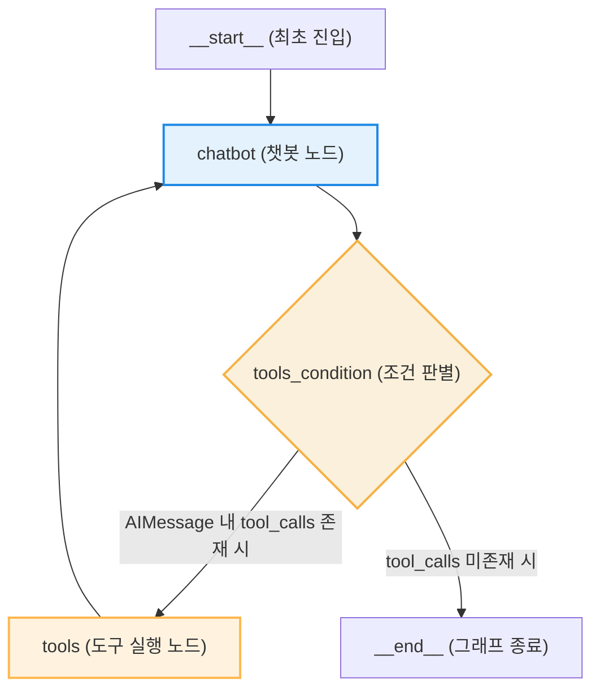

# Lesson 4.3: LangGraph에서 바닥부터 챗봇 에이전트 만들기 (Creating a Chatbot Agent from Scratch in LangGraph) 🤖

이 레슨에서는 프리빌트 컴포넌트를 사용하지 않고, LangGraph의 핵심 API들을 활용해 메시지 흐름 제어, 도구 연동, 세션 메모리가 작동하는 챗봇 시스템을 처음부터 구현하는 과정을 소스코드 라인 단위로 면밀히 분석합니다.

---

## 1. 그래프 빌드에 필요한 라이브러리 임포트

```python
from langgraph.graph import StateGraph
from langgraph.prebuilt import ToolNode, tools_condition
from langchain_openai import ChatOpenAI
from langchain_community.tools.tavily_search import TavilySearchResults
from langchain_core.tools import tool
from datetime import datetime
```

### 🔍 핵심 라이브러리 객체의 역할
1. **`StateGraph`**: 노드(실행 함수)와 에지(실행 경로)를 배치하여 순환 구조의 제어 그래프를 설계하는 도구입니다.
2. **`ToolNode`**: 언어 모델이 결정한 도구 호출 정보(`tool_calls`)를 전달받아, 실제 바인딩된 파이썬 함수들을 구동하고 결과를 반환하는 그래프 전용 노드 클래스입니다.
3. **`tools_condition`**: 모델 응답 내에 도구 실행 요청이 있는지를 감지하여 다음 경로를 결정하는 조건부 에지(Conditional Edge) 함수입니다.

---

## 2. 언어 모델 및 도구 바인딩 설정

```python
# 언어 모델 인스턴스화
model = ChatOpenAI(model="gpt-4o", temperature=0)

# 도구 정의
tavily_search_tool = TavilySearchResults(max_results=5)

@tool
def get_current_date() -> str:
    """Get the current date. This tool should be used first for any time-related queries."""
    return datetime.now().strftime("%B %d, %Y")

tools = [tavily_search_tool, get_current_date]

# 모델과 도구 사양의 물리적 결합
model_with_tools = model.bind_tools(tools)
```

### 🔍 코드 세부 동작 원리

* **`tavily_search_tool`**: 의미론적 웹 검색 API로, 모델이 수집할 수 있는 검색 결과 개수 한도를 `max_results=5`로 통제합니다.
* **`get_current_date` (독스트링 규칙과 커스텀 도구의 실체)**:
  * **GPT 내장 여부**: 이 도구는 GPT 모델에 원래부터 내장되어 있던 기능이 아닙니다. 파이썬 표준 라이브러리인 `datetime`을 이용하여 개발자가 직접 작성한 **파이썬 커스텀 함수**입니다.
  * **독스트링 (`This tool should be used first...`)**: 함수 선언부 하단에 적힌 큰따옴표 3개 안의 문자열(Docstring)은 우리가 직접 타이핑해 넣은 설명문입니다. 모델(GPT)에 도구 목록을 전달할 때 이 설명문도 함께 제공되는데, 모델이 이 텍스트를 읽고 "시간에 관련된 질문이 들어오면 이 도구를 최우선으로 실행해야 하는구나"라고 파악하여 스스로 도구 호출을 판단하게 됩니다.
* **`model.bind_tools(tools)` (도구 호출 판단 방식)**:
  * **스스로 아는가?**: 그렇습니다. 언어 모델은 기본적으로 외부 도구가 무엇인지 모릅니다. 이 코드의 역할은 언어 모델에게 우리가 만든 도구 목록(`tools`)의 이름과 상세 스펙(사용법 및 입력 인자 형식)을 인식시키는 작업입니다.
  * 이 연산을 거치면 모델은 사용자의 메시지가 유입되었을 때, 자신이 인지한 도구 명세서들과 대조하여 "지금 대답은 이 도구를 실행(JSON 형태의 `tool_calls` 반환)하여 해결해야겠다" 혹은 "도구 없이 직접 일반 텍스트 답변을 작성해야겠다"를 **스스로 식별하고 결정**할 수 있게 됩니다.

---

## 3. 전역 상태(State) 데이터 구조 정의

```python
from typing import Annotated
from typing_extensions import TypedDict
from langgraph.graph.message import add_messages

class State(TypedDict):
    messages: Annotated[list, add_messages]
```

### 🔍 데이터 흐름 및 상태 갱신 규칙 상세 설명

이 클래스는 그래프의 여러 노드(컴포넌트)들이 작동하면서 서로 공유하고 전달할 **전역 상태 데이터의 구조(State)**를 정의합니다.

1. **`TypedDict` 기반의 데이터 형식 명세**: 
   * 에이전트 그래프가 실행되는 동안 들고 다니며 참조할 데이터 항목을 정의하는 과정입니다.
   * 이 에이전트에서는 오직 대화 기록 목록인 `messages`라는 단 하나의 키(Key)와 메시지 리스트 값(Value)만 다루겠다고 데이터의 규격을 제한해 둔 것입니다. 즉, 상태 안에는 다른 불필요한 정보 없이 오직 대화 텍스트 리스트만 존재합니다.
2. **`Annotated`와 `add_messages` 동작**:
   * 파이썬의 기본 딕셔너리는 특정 키에 새 값을 대입하면 기존 데이터가 완전히 덮어씌워집니다.
   * 하지만 이 구조에서는 `add_messages`라는 데이터 병합 규칙을 지정하여, 노드가 실행 결과로 새로운 메시지를 출력해 반환할 때마다 기존의 메시지 리스트 끝에 새 메시지를 **순차적으로 덧붙여(Append) 저장**하게 됩니다. 이로 인해 대화 흐름이 덮어씌워지지 않고 히스토리 전체가 계속 누적될 수 있습니다.

---

## 4. 노드(Nodes) 구현 및 그래프 조립

컴포넌트들을 연결하여 실제 동작 가능한 순환 제어 지도 구조를 구축합니다.

```python
# 1. chatbot 노드로 등록할 함수를 정의합니다.
def chatbot(state: State):
    # 전역 상태에 누적되어 온 대화 기록 리스트(state["messages"])를 
    # 도구가 결합된 모델(model_with_tools)에 대입하여 API 연산을 실행합니다.
    response = model_with_tools.invoke(state["messages"])
    
    # 반환받은 결과(AIMessage)를 리스트에 담아 리턴합니다.
    # 리턴된 딕셔너리는 add_messages 규칙에 의해 기존 상태 리스트 뒤에 추가됩니다.
    return {"messages": [response]}

# 2. 상태 스키마를 지정하여 그래프 빌더를 생성합니다.
builder = StateGraph(State)

# 3. 노드를 등록합니다.
builder.add_node("chatbot", chatbot)
builder.add_node("tools", ToolNode(tools))

# 4. 에지를 설정하여 노드 간 실행 경로를 이어줍니다.
# 'chatbot' 노드가 완료되면, tools_condition의 검사 결과에 따라 
# 'tools' 노드 또는 종료('__end__')로 제어 흐름이 분기됩니다.
builder.add_conditional_edges("chatbot", tools_condition)

# 'tools' 노드에서 도구 실행이 완료되면 다시 'chatbot' 노드로 되돌아가는 외길 에지입니다.
builder.add_edge("tools", "chatbot")

# 5. 그래프 실행 시 최초로 작동할 시작점을 지정합니다.
builder.set_entry_point("chatbot")

# 6. 컴파일을 수행하여 실행 가능한 그래프 인스턴스를 빌드합니다.
chatbot_graph = builder.compile()
```

### 🔍 컴파일된 그래프의 노드/에지 구조도



* **조건부 분기 메커니즘**: `tools_condition`은 `chatbot` 노드가 내뱉은 최신 메시지(`AIMessage`)를 실시간 스캔합니다. 만약 모델이 도구를 호출하겠다고 결정하여 `tool_calls` 값이 들어있는 경우 물리적인 실행 노드인 `tools`로 제어를 넘기고, 답변 작성을 완료하여 `tool_calls`가 비어있다면 `__end__` 방향으로 넘겨 실행을 차단 및 정지합니다.

---

## 5. 메모리 세션 기능 통합 및 스레드 제어

컴파일된 에이전트 객체는 단발성 실행 구조를 가지기 때문에, 한번 실행(`invoke`)이 종료되면 프로그램 메모리상에 올라가 있던 상태 데이터(대화 내역)가 완전히 파괴되어 다음 실행 시 이전 정보를 기억하지 못합니다. 

이 문제를 해결하기 위해 **`MemorySaver`** 체크포인터를 그래프 컴파일 시점에 결합하여 대화 내역을 세션별로 영구 기록하고 복원하는 흐름을 통합 예시와 함께 확인합니다.

```python
from langgraph.checkpoint.memory import MemorySaver

# 1. 메모리 저장소 객체를 생성합니다.
memory = MemorySaver()

# 2. 컴파일 단계에서 체크포인터 매개변수로 지정합니다.
chatbot_graph_with_memory = builder.compile(checkpointer=memory)
```

---

### 📝 단일 시나리오로 보는 메모리 저장 및 복원 흐름 (예시: "미나")

사용자가 이름을 알려주는 첫 번째 대화와 이름을 다시 물어보는 두 번째 대화가 일어날 때, 백엔드 데이터와 상태 객체가 어떻게 갱신되는지 추적합니다.

#### ➊ 첫 번째 실행: 이름 입력 (`thread_id="room_101"`)

```python
# 1. 대화방 식별 정보(컨피그)를 설정합니다.
config = {"configurable": {"thread_id": "room_101"}}

# 2. 첫 번째 질문을 기동합니다.
chatbot_graph_with_memory.invoke(
    {"messages": [("user", "안녕, 내 이름은 미나야.")]}, 
    config=config
)
```

* **데이터 제어 단계**:
  1. **초기 입력**: 상태(`State`)의 `messages` 키값에 `[HumanMessage(content="안녕, 내 이름은 미나야.")]`가 담겨 작동을 시작합니다.
  2. **챗봇 출력**: 모델이 이를 분석하여 `AIMessage(content="반가워요, 미나님!")`을 출력합니다.
  3. **상태 누적**: 리듀서 규칙에 의해 상태의 메시지 목록은 `[HumanMessage("안녕, 내 이름은 미나야."), AIMessage("반가워요, 미나님!")]`이 됩니다.
  4. **영속 저장**: 실행이 종료되는 순간, `MemorySaver`는 이 최종 상태 메시지 리스트를 `"room_101"`이라는 식별자 키와 매핑하여 메모리 데이터베이스에 백업 저장합니다. 저장 후 활성화된 상태는 소멸합니다.

---

#### ➋ 두 번째 실행: 이름 기억 여부 질문 (`thread_id="room_101"`)

```python
# 동일한 세션 식별자를 사용하여 두 번째 질문을 기동합니다.
response = chatbot_graph_with_memory.invoke(
    {"messages": [("user", "내 이름이 뭐였지?")]}, 
    config=config
)
# 모델 최종 출력: "미나님의 이름은 미나입니다."
```

* **데이터 제어 단계**:
  1. **이전 기록 자동 복원**: 에이전트는 동작을 시작하자마자 입력된 `config`의 `"room_101"` 키값을 기준으로 `MemorySaver` 저장소를 탐색합니다.
  2. **상태 데이터 병합**: 저장되어 있던 2개의 메시지 이력(`"안녕, 내 이름은 미나야."`, `"반가워요, 미나님!"`)을 찾아내어, 새로 유입된 질문인 `HumanMessage(content="내 이름이 뭐였지?")`의 맨 앞에 갖다 붙입니다.
  3. **모델 연산 실행**: 모델은 아래와 같이 완벽히 복원된 3개의 메시지 흐름을 보고 추론하게 됩니다.
     ```python
     [
         HumanMessage(content="안녕, 내 이름은 미나야."),
         AIMessage(content="반가워요, 미나님!"),
         HumanMessage(content="내 이름이 뭐였지?")
     ]
     ```
  4. **결과 도출 및 재저장**: 대화 히스토리를 확인한 모델이 정확한 이름("미나")을 찾아 답변을 출력하고, 완성된 4개의 메시지 리스트를 다시 `"room_101"` 키 아래에 덮어씌워 갱신 보존합니다.

---

#### ➌ 세션 격리 확인: 다른 대화 세션 진입 (`thread_id="room_999"`)

```python
# 방 번호 식별자를 "room_999"로 다르게 변경하여 동일한 질문을 전송합니다.
config_other = {"configurable": {"thread_id": "room_999"}}

response_other = chatbot_graph_with_memory.invoke(
    {"messages": [("user", "내 이름이 뭐였지?")]}, 
    config=config_other
)
# 모델 최종 출력: "죄송하지만 아직 이름을 알려주지 않으셔서 알 수 없습니다."
```

* **데이터 제어 단계**:
  1. **기록 탐색 실패**: 에이전가 `"room_999"` 키로 저장소를 탐색하지만 기존에 저장된 데이터가 존재하지 않습니다.
  2. **무상태 실행**: 복구된 기록 없이 오직 신규 쿼리인 `[HumanMessage(content="내 이름이 뭐였지?")]` 하나만 상태에 담긴 채 모델에 주입됩니다.
  3. **결과**: 과거 정보를 읽지 못하므로 모델은 이름을 알 수 없다는 고립된 응답을 출력하게 되며, 이로써 사용자 간 대화 기록이 논리적으로 철저히 차단됨이 입증됩니다.
