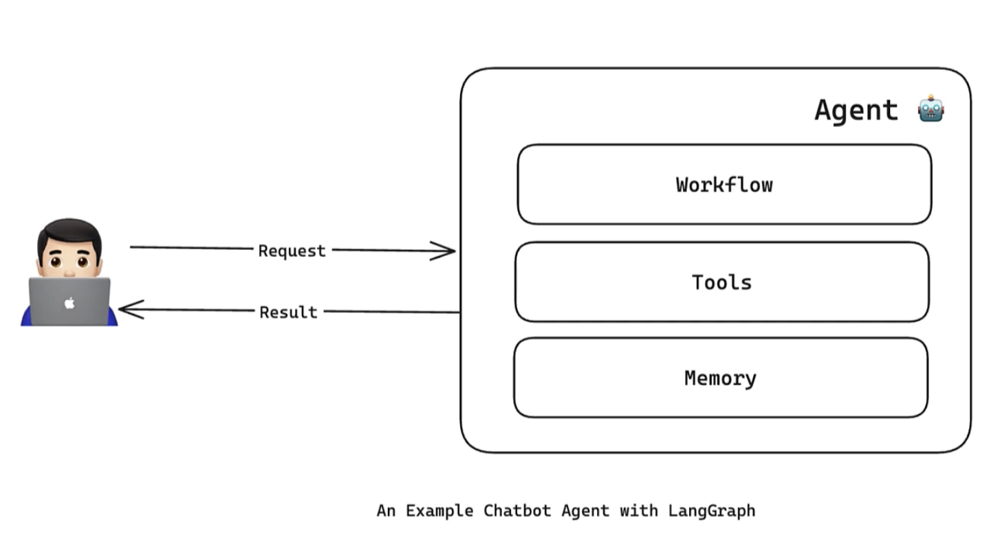
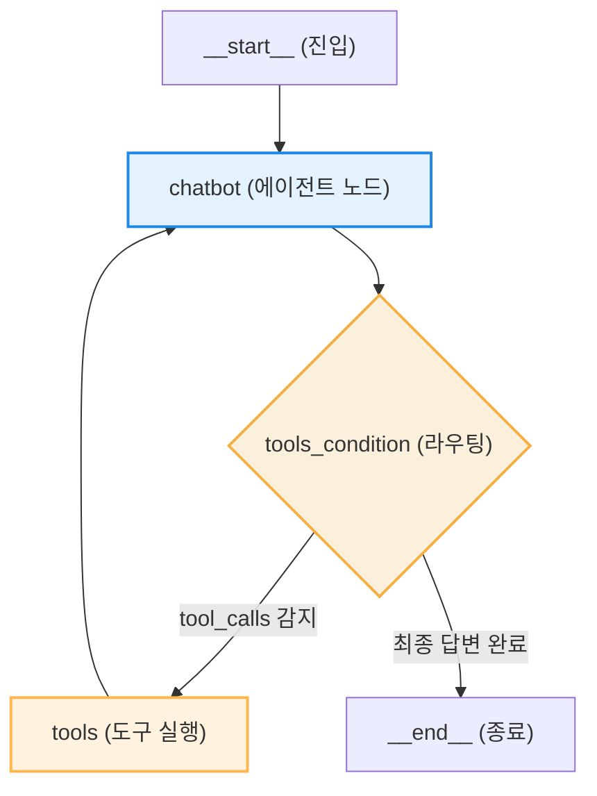

# Lesson 4.3: LangGraph에서 바닥부터 챗봇 에이전트 만들기 (Creating a Chatbot Agent from Scratch in LangGraph) 🤖

이 레슨에서는 프리빌트 컴포넌트를 사용하지 않고, LangGraph의 저수준(Low-level) API(`StateGraph`, `ToolNode`, `tools_condition`)를 사용하여 다단계 추론 루프와 메모리 기능이 작동하는 고객 지원 챗봇 에이전트를 처음부터 직접 구축하는 전 과정을 학습합니다.

---

## 1. 챗봇 에이전트의 내부 아키텍처

우리가 구현할 고객 지원 챗봇 에이전트의 전체 아키텍처 경계와 내부 구성 요소는 아래와 같이 상호 조율하도록 설계되었습니다.



* **코어 워크플로우 (Core Workflow):** 사용자의 입력과 상태를 분석하여 응답을 생성하거나 도구 호출 여부를 결정하는 중앙 그래프 루프입니다.
* **도구 연동 (Tools Integration):** 실시간 외부 지식을 탐색(Tavily)하고 시스템 상태를 확인(시스템 날짜 조회)하는 외부 컴포넌트 레이어입니다.
* **대화 저장 메모리 (Memory):** 이전 턴의 대화 기록을 유지하고 세션을 관리하는 체크포인터 메모리 레이어입니다.

---

## 2. 의존 모듈 정의 및 외부 도구 준비

```python
from langgraph.graph import StateGraph
from langgraph.prebuilt import ToolNode, tools_condition
from langchain_openai import ChatOpenAI
from langchain_community.tools.tavily_search import TavilySearchResults
from langchain_core.tools import tool
from datetime import datetime

# 1. 언어 모델을 선언합니다.
model = ChatOpenAI(model="gpt-4o", temperature=0)

# 2. 도구 컴포넌트를 정의합니다.
tavily_search_tool = TavilySearchResults(max_results=5)

@tool
def get_current_date() -> str:
    """Get the current date. This tool should be used first for any time-related queries."""
    return datetime.now().strftime("%B %d, %Y")

tools = [tavily_search_tool, get_current_date]

# 3. 모델에 도구 목록을 바인딩합니다.
model_with_tools = model.bind_tools(tools)
```

### 🔍 코드 상세 분석
* **`StateGraph`**: 노드(Nodes)와 에지(Edges)를 유연하게 연결하고, 각 노드가 상태를 공유할 수 있도록 지원하는 핵심 그래프 빌더 클래스입니다.
* **`ToolNode`**: 사용자가 정의한 도구 리스트(`List[BaseTool]`)를 바탕으로, 모델이 요청한 `tool_calls` 정보를 받아 실제 파이썬 함수를 호출하고 그 결과를 반환하는 그래프 전용 노드 객체입니다.
* **`tools_condition`**: 모델의 출력을 분석하여 도구를 호출해야 할 상태이면 `"tools"` 노드로 흐름을 넘기고, 그렇지 않으면 `"__end__"` 노드로 흐름을 넘기는 라우팅용 프리빌트 조건부 에지 함수입니다.
* **`model.bind_tools(tools)` (도구 스캔 및 바인딩)**:
  * **원리**: LLM 객체에 도구 리스트를 전달하여, 모델이 실행 가능한 API 사양(JSON Schema)을 내부 시스템 지침으로 탑재하게 합니다. 모델은 이 스키마에 맞춰 인자값을 주입한 `tool_calls` 객체를 정확하게 조립할 수 있게 됩니다.

---

## 3. 그래프 상태(State) 및 리듀서(Reducer) 정의

```python
from typing import Annotated
from typing_extensions import TypedDict
from langgraph.graph.message import add_messages

# 그래프의 메모리 스키마를 정의합니다.
class State(TypedDict):
    messages: Annotated[list, add_messages]
```

### 🔍 코드 상세 분석
* **`TypedDict`**: 파이썬의 표준 딕셔너리에 키 이름과 값의 자료형을 강제하는 타입 힌트 클래스입니다.
* **`Annotated`**: 변수의 자료형 구조에 부가적인 메타데이터(Reducer 규칙)를 첨부할 수 있게 합니다.
* **`add_messages` (누적 리듀서 함수)**:
  * **핵심 동작**: 새로운 노드가 `messages` 키로 새로운 메시지(예: `AIMessage`, `ToolMessage`)를 반환할 때, 기존 메시지 배열을 덮어쓰지 않고 새로운 요소를 기존 배열에 안전하게 추가(Append)해 줍니다. 
  * 이 규칙 덕분에 순환 루프가 지속되어도 이전 대화 이력과 도구 관찰값이 상태에 영구적으로 중첩 누적됩니다.

---

## 4. 그래프 노드 및 흐름 조립

```python
# 1. 챗봇 연산을 담당하는 노드 함수를 정의합니다.
def chatbot(state: State):
    # 현재 상태에 보관된 전체 메시지 리스트를 전달받아 모델을 실행합니다.
    return {"messages": [model_with_tools.invoke(state["messages"])]}

# 2. 그래프 구조를 정의하고 노드를 추가합니다.
builder = StateGraph(State)
builder.add_node("chatbot", chatbot)

# 3. 프리빌트 ToolNode를 그래프 노드로 등록합니다.
tool_node = ToolNode(tools)
builder.add_node("tools", tool_node)

# 4. 흐름 제어를 위한 에지를 추가합니다.
# chatbot 노드에서 나가는 조건부 에지를 설정합니다.
builder.add_conditional_edges("chatbot", tools_condition)

# tools 노드에서 다시 chatbot 노드로 복귀하는 순환 에지를 설정합니다.
builder.add_edge("tools", "chatbot")

# 5. 그래프의 최초 기동 노드를 지정합니다.
builder.set_entry_point("chatbot")

# 6. 최종 컴파일을 기동합니다.
chatbot_graph = builder.compile()
```

### 🔍 코드 상세 분석
* **`chatbot(state: State)` 노드 함수**:
  * **입력**: `State` 딕셔너리에서 `messages` 리스트 전체를 받습니다.
  * **동작**: `model_with_tools.invoke(...)`를 기동하여 LLM 연산을 호출합니다.
  * **출력**: 모델이 반환한 메시지(`AIMessage`)를 리스트 형태로 감싸 `{"messages": [...]}` 포맷으로 리턴합니다.
* **`builder.add_conditional_edges("chatbot", tools_condition)`**:
  * `chatbot` 노드의 연산이 끝나는 시점에 `tools_condition` 라우터 함수를 호출합니다. 모델 출력에 `tool_calls`가 담겨 있다면 `"tools"` 노드로, 그렇지 않다면 `"__end__"` 노드로 실시간 분기시킵니다.
* **`builder.add_edge("tools", "chatbot")`**:
  * 도구의 연산이 끝난 후, 그 결과를 들고 에이전트(`chatbot` 노드)로 다시 돌아가 다음 동작을 생각하도록 루프를 구성합니다.

---

### 📊 컴파일된 챗봇 그래프 시각화

시각화 함수 `chatbot_graph.get_graph().draw_mermaid_png()`의 결과는 다음과 같은 순환 경로 구조를 보여줍니다.



---

## 5. 메모리 세션 관리 (Checkpointer) 적용

체크포인팅 기능이 추가되지 않은 에이전트는 하나의 호출(`invoke`) 주기가 끝나면 상태 객체가 메모리에서 완전 소실되므로 다음 호출 시 직전 정보를 전혀 인지하지 못합니다. 

`MemorySaver` 객체를 바인딩하여 세션 단위의 영속 대화 메모리(Thread Isolation)를 구현합니다.

### 💾 영속 체크포인터 기반 컴파일
```python
from langgraph.checkpoint.memory import MemorySaver

# 1. 인메모리 대화 저장 메모리를 생성합니다.
memory = MemorySaver()

# 2. 컴파일 단계에서 메모리 객체를 체크포인터로 주입합니다.
chatbot_graph_with_memory = builder.compile(checkpointer=memory)
```

---

### 🔄 스레드 격리(Thread Isolation) 기반 멀티 세션 추적

에이전트는 각 대화 세션을 구분하기 위해 설정 정보의 `thread_id` 속성을 참조합니다.

```python
# 사용자 1용 세션 설정 객체 생성
config_user_1 = {"configurable": {"thread_id": "user_1"}}

# 1차 대화: 사용자 1의 이름 정보 주입
chatbot_graph_with_memory.invoke(
    {"messages": [("user", "Hello, my name is Alice.")]}, 
    config=config_user_1
)

# 2차 대화: 사용자 1이 이름을 물어봤을 때의 상태 추적
response_user_1 = chatbot_graph_with_memory.invoke(
    {"messages": [("user", "Do you remember my name?")]}, 
    config=config_user_1
)
# 출력 결과: "Yes, your name is Alice." (메모리 성공적으로 작동)
```

```python
# 사용자 2용 세션 설정 객체 생성 (격리된 대화 세션)
config_user_2 = {"configurable": {"thread_id": "user_2"}}

# 사용자 2의 동일 질의 동작 추적
response_user_2 = chatbot_graph_with_memory.invoke(
    {"messages": [("user", "Do you remember my name?")]}, 
    config=config_user_2
)
# 출력 결과: "I don't have access to your personal information. Could you please tell me your name?" (메모리가 철저히 분리됨)
```

#### ⚙️ 스레드 격리 동작 원리
* `MemorySaver`는 `thread_id`를 기본 키(Primary Key)로 설정하여 전체 그래프의 상태 히스토리(State History)를 인메모리 키-값 구조로 정밀하게 격리 및 인덱싱합니다.
* 사용자가 특정 `thread_id`가 담긴 `config`를 인자로 주입하여 호출하면, 에이전트는 해당 ID로 라벨링되어 저장된 마지막 상태 스냅샷을 우선적으로 추출하고, 그 뒤에 새로운 사용자 메시지를 이어붙여 대화를 재기동합니다. 이 원리를 통해 다수의 사용자가 동시에 서비스를 이용하더라도 상호 간 대화 기록이 간섭되지 않는 멀티 테넌시(Multi-tenancy) 구조를 구현할 수 있습니다.
