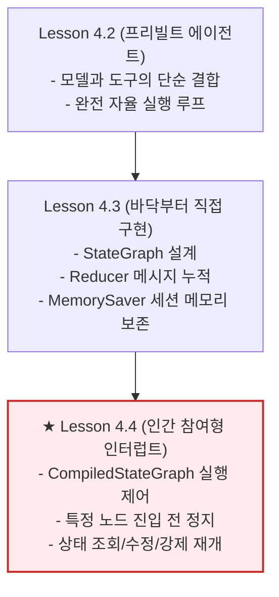
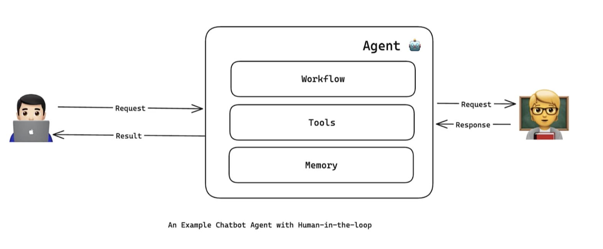
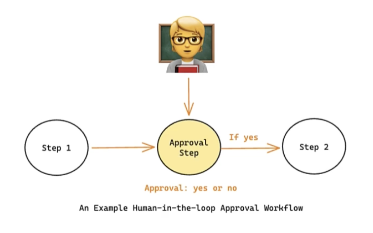
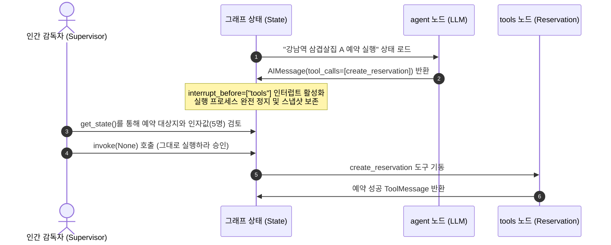
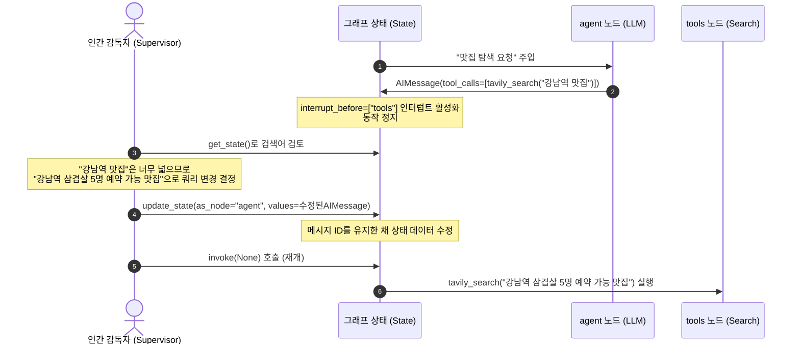
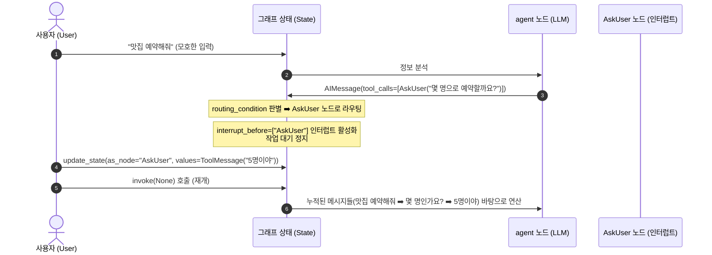

# Lesson 4.4: 에이전트 시스템에 인간의 감독 추가하기 (Adding Human Oversight to Agentic Systems) 👥

이 레슨에서는 자율적으로 동작하던 에이전트 그래프의 실행을 가로채고 제어하는 **인간 참여형(Human-in-the-loop)** 아키텍처를 학습합니다. 상태 인터럽트(State Interrupt) 메커니즘을 컴파일 옵션과 체크포인터를 활용해 구현하고, 승인(Approval), 편집(Edit), 입력 대기(Wait-for-input) 3대 패턴의 동작 원리를 정밀 분석합니다.

---

## 1. 에이전트 설계의 아키텍처적 발전 및 연계성

### 🔄 이전 레슨과의 연계 및 기술적 발전 흐름



* **자율 루프에서 통제 루프로의 발전**:
  * **이전 단계 (Lesson 4.2 & 4.3)**: 사용자의 질문이 주입되면 에이전트는 사전에 정의된 노드들(`agent` ➡️ `tools` ➡️ `agent`)을 따라 최종 답변이 도출될 때까지 중간 검증 없이 백엔드에서 완전 자율적으로 질의를 처리했습니다.
  * **현재 단계 (Lesson 4.4)**: 중요한 행동(예: 결제 처리, 외부 API 호출, 민감 데이터 수정)을 기동하기 직전 상태에서 에이전트의 실행 프로세스를 물리적으로 일시 정지(**Interrupt**)하는 가로채기 레이어를 결합합니다.
* **인간 감독자(Human Supervisor)의 아키텍처적 위치**:
  * 에이전트는 컴파일 옵션(`interrupt_before`)과 체크포인터(`MemorySaver`)의 조합을 기반으로 작동을 정지한 채, 메모리 상태 스냅샷을 보존하고 대기 상태를 유지합니다. 인간 감독자는 이 스냅샷 상태를 조회하여 실행 흐름에 직접 개입할 수 있습니다.



---

## 2. 3대 인간 참여형(Human-in-the-loop) 패턴과 공통 시나리오 매핑

이해를 돕기 위해 **"강남역 맛집 정보를 탐색하고 5명 자리를 예약하는 시스템"**이라는 단일 시나리오를 적용하여 세 가지 흐름 제어 패턴이 어떻게 동작하는지 분석합니다.

* **기본 도구 구성**:
  1. `tavily_search_tool`: 맛집 정보를 인터넷에서 검색하는 도구
  2. `create_reservation`: 실제 예약 트랜잭션을 실행하는 도구 (민감한 쓰기 연산)
  3. `AskUser`: 유저에게 특정 데이터(인원, 위치 등)의 상세 보완을 요청하는 명확화 도구

---

### ① 승인 (Approval) 패턴

에이전트가 중대한 행동을 취하기 직전에 실행을 일시정지하고 인간 감독자로부터 진행 여부를 확약받는 흐름입니다.



#### 🔄 런타임 제어 흐름 시퀀스



* **동작 원리**: 
  * 에이전트가 예약을 체결하는 민감한 외부 API를 기동하려 할 때, `interrupt_before=["tools"]` 설정에 걸려 `tools` 노드로 진입하기 전 상태 스키마를 보존하고 대기합니다.
  * 인간 감독자는 호출 인자를 조회하고 문제가 없음을 확인한 뒤, 실행 인자로 `None`을 주입하여 에이전트에게 **재개 명령**을 하달합니다. 에이전트는 가로채기 되었던 `tools` 노드 지점부터 연산을 재개하여 실제 예약을 실행합니다.

---

### ② 편집 (Edit) 패턴

단순히 동작을 승인하는 것을 넘어, 에이전트가 계산해낸 입력 인자나 쿼리의 값을 인간이 중간에서 직접 수정하여 상태를 갱신하는 패턴입니다.

#### 🔄 런타임 제어 흐름 시퀀스



* **동작 원리**:
  * 에이전트가 작성한 검색 쿼리(`"강남역 맛집"`)가 너무 광범위하다고 판단되면, 감독자는 대기 중인 `AIMessage`의 `tool_calls` 내부 인수(`arguments["query"]`)를 직접 변경합니다.
  * **핵심 메커니즘**: 이때 수정 메시지의 고유 식별자(`id`)는 기존 에이전트 메시지의 ID와 반드시 동일하게 매칭하여 상태를 갱신(`update_state`)해야 합니다. 이를 통해 그래프 엔진은 이전 메시지를 덮어쓰고 수정본을 정합성 있게 받아들여 기동하게 됩니다.

---

### ③ 입력 대기 (Wait-for-input) 패턴

사용자가 입력한 요구사항이 모호할 때 에이전트가 질문을 명확히 하고자 프로세스를 끊고 사용자의 대답이 올 때까지 기동을 보류하는 패턴입니다.

#### 🔄 런타임 제어 흐름 시퀀스



* **동작 원리**:
  * 에이전트가 사용자를 위해 `AskUser` 클래스 명세(Pydantic 모델)를 도구로 기동합니다.
  * `routing_condition` 함수는 최신 메시지가 `AskUser` 도구 호출일 때 `AskUser` 노드로 분기시킵니다.
  * 그래프 컴파일 옵션에 `interrupt_before=["AskUser"]`를 지정해 둠으로써 질문 전송 전 정지합니다. 사용자가 `"5명이야"`라는 추가 입력을 보내면, 이 결과를 `ToolMessage` 객체 형태로 래핑하여 상태를 인젝션(`update_state`)한 후 프로세스를 재개시켜 완결합니다.

---

## 3. 에이전트 구현 코드 세부 분석

### ① 승인 및 편집 패턴 코드 구현
```python
# 가로채기(Interrupt) 지점을 지정하여 그래프 컴파일
# tools 노드가 물리 함수를 호출하기 직전에 일시정지하도록 설정합니다.
app = builder.compile(checkpointer=memory, interrupt_before=["tools"])
```
* **`interrupt_before=["tools"]`**: 
  * 이 컴파일 설정에 의해, `chatbot` 노드의 연산이 끝나고 `tools_condition`이 `"tools"` 노드로 흐름을 넘기려고 결정하는 즉시 실행 스레드를 중단하고 제어권을 바깥(호출 스크립트)으로 반환합니다.

```python
# 정지된 상태 정보 조회
snapshot = app.get_state(config)
print(snapshot.next)  # 출력 결과: ('tools',) ➡️ 다음 진행할 노드가 tools 노드임을 지시
print(snapshot.values["messages"][-1].tool_calls)  # 대기 중인 도구 인자 조회

# 수정된 메시지로 상태 업데이트 (편집 패턴)
from langchain_core.messages import AIMessage

# 기존 도구 호출 메시지의 ID와 동일한 식별자로 가공된 메시지를 생성합니다.
new_message = AIMessage(
    content="",
    tool_calls=[{
        "name": "tavily_search_tool",
        "args": {"query": "수정된 검색 쿼리"},
        "id": snapshot.values["messages"][-1].tool_calls[0]["id"] # 기존 ID 유지
    }],
    id=snapshot.values["messages"][-1].id # 기존 메시지 ID 유지
)

# 상태 데이터 갱신
app.update_state(config, {"messages": [new_message]}, as_node="chatbot")

# 실행 강제 재개 (인수를 None으로 전달)
app.invoke(None, config)
```

---

### ② 입력 대기 패턴의 조건부 라우터 함수 구현
```python
from pydantic import BaseModel

# 사용자가 명확한 답변을 기재할 수 있도록 규격화한 스키마 정의
class AskUser(BaseModel):
    question: str

def routing_condition(state: State):
    # 최신 메시지를 확인합니다.
    last_message = state["messages"][-1]
    
    # 도구 호출이 없는 경우 실행을 완전 마감합니다.
    if not last_message.tool_calls:
        return "__end__"
    
    # 호출 대상 도구가 'AskUser'인 경우 이 노드로 제어를 이송해 정지되도록 유도합니다.
    if last_message.tool_calls[0]["name"] == "AskUser":
        return "AskUser"
    
    # 일반적인 외부 도구 호출인 경우 tools 노드로 이송합니다.
    return "tools"
```
* **동작 원리**:
  * Pydantic의 `BaseModel`로 정의한 `AskUser` 객체는 LLM 입장에서 질문을 되묻기 위한 도구 스키마로 인식됩니다.
  * `routing_condition` 함수는 최신 메시지의 `tool_calls` 속성을 파싱하여, 호출할 도구 명이 `"AskUser"`인 경우 `"AskUser"` 노드를 반환해 컴파일 옵션에 선언된 `interrupt_before=["AskUser"]` 정지점과 반응하게 연쇄 구조화되어 있습니다.
