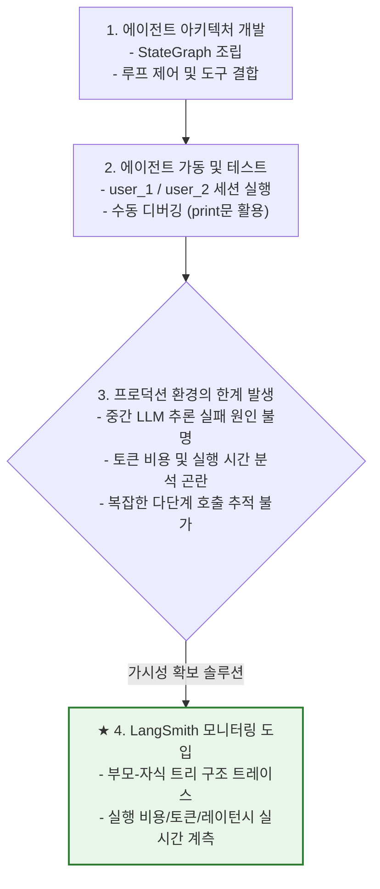
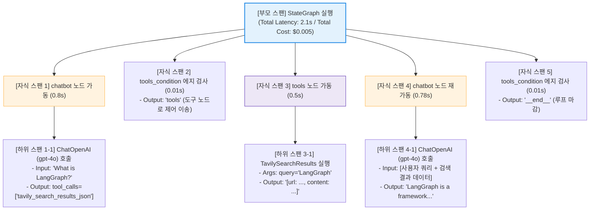

# Lesson 4.5: LangSmith를 사용해 에이전트 모니터링하기 (Monitoring Agents Using LangSmith) 📊

이 레슨에서는 LangGraph 에이전트 개발 및 운영 과정에서 필수적인 모니터링 플랫폼인 **LangSmith**의 연동 원리를 파악하고, 에이전트의 내부 데이터 흐름, LLM 호출 비용, 사용 토큰 수, 그리고 레이턴시(Latency)를 실시간 대시보드 상에서 분석하는 방법을 학습합니다.

---

## 1. 에이전트 모니터링의 아키텍처적 연계 및 필요성

### 🔄 이전 단계(Lesson 4.3 & 4.4)와의 연계성



* **자율/통제 루프의 시각화 한계**:
  * 이전 레슨에서 빌드한 챗봇 에이전트는 루프가 여러 차례 돌거나 도구 실행이 거듭될 때, 각 단계의 입력값과 모델의 반환값 데이터를 단순 `print()` 문이나 디버거 로그로 확인하는 데 한계가 있었습니다.
  * 특히 "모델이 어떤 스키마 정보와 이력을 보고 이 도구를 선택했는지", "특정 도구 실행 시 걸린 시간(Latency)은 얼마이며 비용은 얼마인지"를 파악하기 위해서는 전용 트레킹 플랫폼이 필요합니다.
* **LangSmith의 기술적 기여**:
  * LangSmith는 에이전트 내부에서 기동되는 모든 연산 단위를 계층 구조의 트레이스(Trace) 스팬으로 자동 수집하여, 개발자에게 완벽한 작동 가시성(Visibility)과 실시간 디버깅 환경을 제공합니다.

---

## 2. 통합 예시를 통한 LangSmith 트레이스 트리(Trace Tree) 시각화

사용자가 **`"What is LangGraph?"`**라는 질문을 챗봇에 입력하여 웹 검색을 수행한 뒤 최종 응답을 얻기까지, LangSmith 대시보드에 적재되는 로그의 **계층적 부모-자식 스팬(Parent-Child Span) 구조**를 보여줍니다.



* **부모-자식 트리 관계의 의의**:
  * 최상위 부모 스팬은 에이전트의 전체 수명 주기를 측정합니다.
  * 그 아래의 자식 스팬과 하위 스팬들은 각 컴포넌트별 소모 시간 및 모델 호출 토큰 단위를 개별 기록합니다. 이를 통해 병목 현상(시간이 가장 오래 걸린 구간)이나 비정상 작동 구간을 즉각 탐지할 수 있습니다.

---

## 3. 실습 환경 세팅 및 단계적 연동 가이드

LangSmith 대시보드를 프로젝트와 연동하기 위한 설정 단계를 명시합니다.

### [1단계] LangSmith API 키 발급
1. LangSmith 공식 웹사이트에 접속하여 로그인합니다.
2. 우측 하단의 **Settings** ➡️ **API Keys** 메뉴로 이동합니다.
3. **Create API Key**를 클릭하여 새로운 키를 생성하고 값을 안전한 장소에 복사합니다.

### [2단계] 로컬 프로젝트 환경 변수 (`.env`) 설정
개발 워크스페이스 루트 경로에 위치한 `.env` 파일에 아래와 같이 4가지 환경 변수를 기재하여 저장합니다.
```env
LANGCHAIN_TRACING_V2=true
LANGCHAIN_ENDPOINT="https://api.smith.langchain.com"
LANGCHAIN_API_KEY="lsv2_pt_..." # [1단계]에서 발급받은 API 키
LANGCHAIN_PROJECT="demo"       # LangSmith 내 대시보드 프로젝트 이름 지정
```

---

## 4. 실습 코드 소스 분석

실제 모니터링이 활성화되어 로그를 전송하는 소스코드의 구성 요소를 분석합니다.

* **실습 노트북**: [lesson_3_building_chatbot_agent_in_langgraph.ipynb](file:///Users/shinwookkang/Desktop/AI_Agent/Module%204:%20Building%20Agents%20with%20LangGraph/code/lesson_3_building_chatbot_agent_in_langgraph.ipynb)

---

### ① 환경 변수 로드 단계 (노트북 라인: 29 ~ 48)

```python
from langchain_openai import ChatOpenAI
from langchain_community.tools import TavilySearchResults
from langchain_core.tools import tool
from langgraph.graph import StateGraph
from langgraph.graph.message import add_messages
from langgraph.prebuilt import ToolNode, tools_condition

from datetime import datetime
from typing import Annotated
from typing_extensions import TypedDict

# .env 파일 로딩 및 프로세스 환경 변수 매핑
from dotenv import load_dotenv
_ = load_dotenv()
```
* **🔍 코드의 의미**: 
  * `load_dotenv()` 함수는 로컬 디렉토리의 `.env` 파일에 기록된 키값들을 스캔하여 파이썬 런타임의 `os.environ` 환경 변수 테이블에 주입합니다.
  * **핵심 메커니즘**: LangChain과 LangGraph 프레임워크의 내부 코어 엔진은 실행 시점에 환경 변수 `LANGCHAIN_TRACING_V2`가 `"true"`로 채워져 있는지를 실시간 모니터링합니다. 이 조건이 충족되면, 소스코드 단에 별도의 로그 연동 모듈을 삽입하지 않아도 **모든 그래프 실행 데이터가 비동기 백그라운드 스레드를 통해 LangSmith 트레이스 서버로 자동 업로드**됩니다.

---

### ② 에이전트 기동 및 자동 트레이싱 트리거 단계 (노트북 라인: 462 ~ 466)

```python
# Query that triggers the Tavily search tool
process_query("What is LangGraph?")
```
* **🔍 코드의 의미**:
  * 이 셀을 구동하면 에이전트의 전체 루프 연산이 작동하기 시작합니다.
  * 백엔드에서는 `graph.stream()` 또는 `graph.invoke()`가 호출될 때 주입된 `LANGCHAIN_PROJECT="demo"` 설정과 동기화되어 LangSmith 웹 UI상에 `"demo"`라는 새로운 모니터링 프로젝트를 실시간 개설하고, 이 쿼리에 대한 트레이스 타임라인을 트리 구조로 구성하여 계측을 시작합니다.
