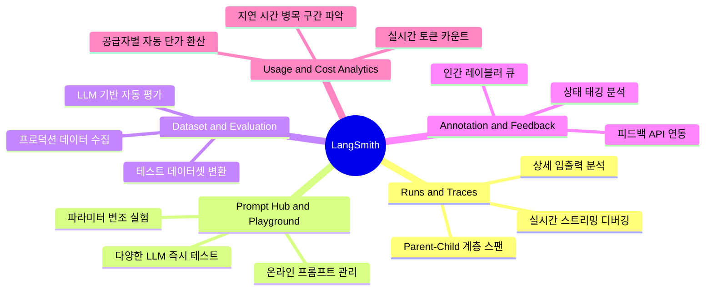

# Lesson 4.5: LangSmith를 사용해 에이전트 모니터링하기 (Monitoring Agents Using LangSmith) 📊

이 문서는 LangGraph 에이전트 개발 및 운영에서 중추적인 역할을 담당하는 LLM 애플리케이션 라이프사이클 관리 플랫폼인 **LangSmith**의 고밀도 지침서입니다. 에이전트 내부 상태의 작동 원리부터 비용 측정, 데이터셋 승격, 그리고 실제 코드 연동에 이르기까지 정확하고 세부적인 세부 원리를 다룹니다.

---

## 1. LangSmith의 본질과 에이전트 모니터링의 아키텍처적 연계

### 🔄 모니터링 필요성의 기술적 배경
이전 레슨(Lesson 4.3 & 4.4)에서 우리는 자율적으로 루프를 도는 챗봇과 인간 개입(Approval, Edit, Wait-for-input)이 포함된 에이전트를 직접 구축했습니다. 그러나 에이전트 시스템이 고도화될수록 다음과 같은 병목 및 불투명성 문제가 발생합니다.

1. **상태 추적의 난해함**: LLM이 여러 차례 생각(CoT)하고 도구를 조합하여 답변을 도출할 때, 매 실행 단위마다 매개변수와 상태 변수가 어떻게 변경되었는지 콘솔 출력(`print()`)만으로 추적하기란 불가능에 가깝습니다.
2. **도구 선택 원인 미비**: LLM이 특정 타이밍에 왜 Tavily 검색 도구를 호출했는지, 혹은 왜 사용자에게 승인을 요청했는지의 맥락을 분석해야 합니다.
3. **비용 및 지연 속도(Latency)의 불특정성**: 루프가 돌아가면서 발생한 API 토큰 수와 응답 지연 속도를 파악하여 효율성을 개선해야 합니다.

**LangSmith**는 이러한 한계를 해소하기 위해 LangChain/LangGraph 코어에 내장된 이벤트 리스너와 결합하여 **에이전트 내부의 마이크로 수준 실행 데이터를 실시간으로 로깅하고 모니터링**하는 종합 엔지니어링 대시보드입니다.

---

## 2. LangSmith 5대 핵심 기능 지침서 (Core Components Guide)

LangSmith는 단순한 로그 수집기가 아닙니다. 개발부터 프로덕션 모니터링까지 전 주기에서 다음 5가지 핵심 컴포넌트를 사용합니다.



### ① Runs & Traces (실행 추적)
* **정의**: LangChain/LangGraph 컴포넌트가 호출될 때 생성되는 하나의 실행 단위를 **Run**이라 하며, 이 Run들이 부모-자식 트리 구조로 엮인 전체 실행 단위를 **Trace**라고 합니다.
* **작동 원리**: 에이전트에 입력이 들어오면 최상위 Trace(Parent Run)가 생성되고, 그 하위의 노드 진입, LLM 호출, 도구 실행 등이 하위 스팬(Child Run)으로 연속 기록됩니다. 각 Run은 고유한 `Run ID`를 가지며 실행 시간, 입출력 값, 메타데이터를 저장합니다.

### ② Prompt Hub & Prompt Playground
* **정의**: 코드 수정 없이 프롬프트를 원격 관리하고, 대시보드 내에서 다양한 모델(GPT, Claude 등)을 대상으로 즉석 추론 실험을 수행하는 기능입니다.
* **연동성**: 대시보드의 특정 Trace 로그에서 "Playground로 보내기(Play in Playground)" 버튼을 클릭하면, 당시 주입되었던 시스템 프롬프트와 변수들이 그대로 복사되어 모델 파라미터(온도, 탑-p 등)를 조절하며 즉석 디버깅이 가능합니다.

### ③ Dataset & Evaluation (데이터셋 및 자동 평가)
* **정의**: 실제 사용자의 로그 중 디버깅이 필요한 오답 사례나 중요 대화 세션을 원클릭으로 테스트 데이터셋(Dataset)으로 승격시키고, 이를 기준으로 에이전트의 품질을 자동 평가(Evaluation)하는 파이프라인입니다.
* **자동 평가기(Evaluators)**:
  * **LLM-as-a-judge**: 평가지표(정확성, 무해성, 일관성 등)를 명시한 프롬프트로 심사위원 역할을 수행하는 LLM이 테스트 결과를 채점합니다.
  * **QA Evaluator / Semantic Similarity**: 정답지(Ground Truth)와의 시맨틱 유사도를 계산해 점수를 매깁니다.

### ④ Annotation Queues & Feedback (피드백 수집)
* **정의**: 프로덕션 배포 후 사용자 화면에서 수집된 "좋아요/싫어요" 등의 클릭 데이터(Feedback API)를 수집하여 특정 Run에 꼬리표로 부착합니다.
* **어노테이션 큐**: 수동 검증이 필요한 트레이스들을 특정 큐(Queue)로 인입시켜, 전문 레이블러가 직접 품질 태그를 달거나 시스템 수정용 학습 예시로 정제할 수 있습니다.

### ⑤ Usage & Cost Metrics (비용 및 자원 계측)
* **정의**: 호출된 LLM API의 토큰 단위를 실시간 집계하고, 설정된 공급자별(OpenAI, Anthropic 등) 단가표를 매칭하여 추론 비용을 실시간 달러($) 단위로 표기합니다. 
* **모니터링**: 쿼리 하나당 소모되는 평균 비용과 레이턴시 그래프를 일/주/월 단위로 확인하여 성능 고도화 시 의사결정 데이터로 사용합니다.

---

## 3. LangGraph 연동 시나리오 및 트레이스 트리 흐름도

사용자가 **`"What is LangGraph?"`**라는 메시지를 전송하고 챗봇 에이전트가 작동할 때 발생하는 LangSmith의 내부 계층형 트리 작동 흐름입니다.

```
[Parent Run] StateGraph.invoke() ───────────────────────────── (Total Duration: 2.1s, Cost: $0.0053)
  │
  ├── [Child Run 1] Node: "chatbot" (Duration: 0.8s)
  │     └─ [Grandchild Run 1-1] ChatOpenAI.invoke() ─────────── (Prompt Tokens: 850, Completion Tokens: 45)
  │          - 입력: "What is LangGraph?"
  │          - 출력: tool_calls=[{"name": "tavily_search_results_json", "args": {"query": "LangGraph"}}]
  │
  ├── [Child Run 2] Conditional Edge: "tools_condition" ────── (Evaluated Output: "tools")
  │
  ├── [Child Run 3] Node: "tools" (Duration: 0.5s)
  │     └─ [Grandchild Run 3-1] TavilySearchResults.invoke() ── (Web Search API Call)
  │          - 입력: {"query": "LangGraph"}
  │          - 출력: [{"url": "...", "content": "LangGraph is a stateful multi-actor framework..."}]
  │
  ├── [Child Run 4] Node: "chatbot" (Duration: 0.78s)
  │     └─ [Grandchild Run 4-1] ChatOpenAI.invoke() ─────────── (Prompt Tokens: 1200, Completion Tokens: 120)
  │          - 입력: [대화 이력 + Tavily 검색 결과]
  │          - 출력: "LangGraph is a low-level framework designed for..."
  │
  └── [Child Run 5] Conditional Edge: "tools_condition" ────── (Evaluated Output: "__end__")
```

### 💡 트리거 및 매핑 원리
* **Run Tree 생성**: 최상위 그래프 클래스의 호출과 동시에 하나의 고유 고리(`Trace ID`)가 생성되어 하위 컴포넌트의 모든 Context에 전파됩니다.
* **컨텍스트 자동 전달(Context Propagation)**: LangChain의 내부 콜백 매니저가 스레드 로컬(Thread-local) 또는 비동기 컨텍스트(Asyncio Task Context)를 감지하여 하위 노드와 도구들이 호출될 때 부모 Run ID를 자동으로 동기화합니다.

---

## 4. 💡 [초보자 필독] 직관적 이해를 돕는 3대 핵심 보충 설명

처음 모니터링을 접하는 개발자들이 혼동하기 쉬운 내부 동작의 개념적 차이를 규정합니다.

### 🔍 차이점 1: API 도구 호출의 `Call ID` vs LangSmith의 `Run ID`
* **API 레벨 `Call ID` (예: `call_AEVJx...`)**:
  * **정의**: OpenAI와 같은 LLM 제공업체가 "내가 도구를 호출하겠으니 결과값을 제출할 때 이 식별자에 바인딩해서 돌려달라"고 발행한 모델 인터페이스 규격용 ID입니다. 
  * **역할**: LLM과 Tool Node 간의 실질적인 데이터 흐름을 정합하기 위한 용도로 사용됩니다.
* **LangSmith 레벨 `Run ID` (UUID 규격)**:
  * **정의**: LangSmith 로깅 에이전트가 "현재 에이전트 내에서 노드 진입, 계산, 외부 API 전송" 등 개별 컴포넌트의 작동 시작부터 끝까지 계측하기 위해 독자적으로 매겨 추적하는 고유 로깅 태그입니다.
  * **정리**: `Call ID`는 에이전트 시스템 내부의 도구 연동 규격이며, `Run ID`는 LangSmith 분석 화면에서 각 스팬의 디버그 라인을 구별하는 인덱스 태그입니다.

### 🔍 차이점 2: 환경 변수 등록만으로 원격 전송이 이루어지는 원리 (Callback Mechanism)
개발자가 코드에 별도의 전송 함수(`send_to_langsmith()`)를 명시하지 않고 `.env` 설정만 해도 작동하는 이유는 **콜백 매니저(Callback Manager) 패턴** 덕분입니다.
1. **이벤트 구독**: LangChain/LangGraph 내부 핵심 컴포넌트들은 `on_llm_start`, `on_tool_end`, `on_chain_error` 같은 라이프사이클 이벤트 훅을 가지고 있습니다.
2. **트리거 감지**: 패키지가 로드될 때 시스템 환경 변수 `LANGCHAIN_TRACING_V2=true`가 설정되어 있으면, 프레임워크는 내부 콜백 리스너인 `LangSmithTracer` 객체를 기동합니다.
3. **비동기 패킷 발송**: 컴포넌트가 작동하기 시작하면 이 리스너가 각 라이프사이클 이벤트 훅을 낚아채서 입출력 데이터를 JSON 형태로 캡슐화한 뒤, 백그라운드 스레드를 통해 `LANGCHAIN_ENDPOINT`로 비동기 HTTP POST API 요청을 보냅니다. 따라서 메인 프로세스의 답변 속도를 지연시키지 않고 로그를 실시간 업로드할 수 있습니다.

### 🔍 차이점 3: LangGraph 세션(`thread_id`) vs LangSmith `Trace` 생명주기 매핑
두 개념은 지속 범위와 목작에 차이가 존재합니다.
* **LangGraph `thread_id` (예: `"user_1"`)**:
  * **지속성**: 반영구적입니다. 체크포인터(MemorySaver 등) 디바이스에 대화 메시지 상태를 계속 누적시키므로, 다음 날 사용자가 질문해도 동일한 `thread_id`를 입력하면 과거 내역을 기억합니다.
* **LangSmith `Trace` (단일 트레이스 트리)**:
  * **지속성**: 일회성입니다. 단 한 번의 `graph.invoke()` 또는 `graph.stream()`이 실행되어 완료될 때까지만 작동하고 소멸합니다.
* **관계**: 따라서 사용자가 한 세션(`thread_id="user_1"`)에서 5차례 질문을 던져 대화를 이어나갔다면, LangGraph 내부 상태 메모리는 1개 세션으로 유지되지만, LangSmith 모니터링 페이지에는 **5개의 서로 다른 단일 Trace 이력**이 독립된 행으로 생성되어 각각 분석할 수 있게 됩니다.

---

## 5. LangSmith 전용 환경 변수 상세 가이드

LangSmith 연동은 어플리케이션 내의 명시적인 코드 호출 대신, 프레임워크가 런타임 시 시스템 환경 변수를 동적으로 가로채는 방식으로 연동됩니다.

| 환경 변수명 | 권장 설정값 | 상세 기술 설명 |
| :--- | :--- | :--- |
| **`LANGCHAIN_TRACING_V2`** | `true` | LangSmith v2 버전의 비동기 추적 추적 로깅 기능을 활성화합니다. |
| **`LANGCHAIN_ENDPOINT`** | `"https://api.smith.langchain.com"` | 추적 원격 로그 데이터를 전송할 서버 주소입니다. (기본값) |
| **`LANGCHAIN_API_KEY`** | `"lsv2_pt_..."` | 발급받은 고유 인증 API 키로, 프로젝트 식별 및 쓰기 권한을 부여합니다. |
| **`LANGCHAIN_PROJECT`** | `"demo"` | 연동할 프로젝트 식별자입니다. 미설정 시 `"default"` 프로젝트로 로깅됩니다. |
| **`LANGCHAIN_CALLBACKS_BACKGROUND`** | `true` | 추적 로그를 백그라운드 스레드에서 비동기로 전송하도록 지시하여 메인 LLM 연산 레이턴시에 미치는 악영향을 원천 방지합니다. |

---

## 6. 실습 소스코드 정밀 분석 및 매핑

이 모니터링 체계가 작동하는 실제 실습 코드는 다음과 같습니다.

* **실습 노트북**: [lesson_3_building_chatbot_agent_in_langgraph.ipynb](file:///Users/shinwookkang/Desktop/AI_Agent/Module%204:%20Building%20Agents%20with%20LangGraph/code/lesson_3_building_chatbot_agent_in_langgraph.ipynb)

### ① 라이브러리 및 환경 변수 동기화 (라인 29 ~ 48)
```python
from langchain_openai import ChatOpenAI
from langchain_community.tools import TavilySearchResults
from langchain_core.tools import tool
from langgraph.graph import StateGraph
from langgraph.graph.message import add_messages
from langgraph.prebuilt import ToolNode, tools_condition

from datetime import datetime
from typing import Annotated
from typing_extensions import TypedDict

# .env 로드 구문
from dotenv import load_dotenv
_ = load_dotenv()
```
* **🔍 코드 해설**:
  * `from dotenv import load_dotenv`와 `_ = load_dotenv()`는 로컬 경로의 `.env` 파일에 기록된 모든 텍스트 정보를 로드하여 시스템 프로세스의 환경 변수 딕셔너리(`os.environ`)에 밀어 넣습니다.
  * **동작 메커니즘**: `ChatOpenAI(model="gpt-4o")` 객체나 `StateGraph(State)` 객체가 빌드되고 실행될 때, 백그라운드 엔진인 `LangChain BaseCallbackManager`가 시작 루틴에서 `os.environ.get("LANGCHAIN_TRACING_V2")` 값이 `"true"`인지를 먼저 탐지합니다. 이 값이 확인되면 즉시 데이터 수집 및 암호화 모듈을 백그라운드에서 가동합니다.

### ② 대화 세션 및 쿼리 실행 단계 (라인 313 ~ 318, 462 ~ 466)
```python
def process_query(query, config=None):
    inputs = {"messages": [("user", query)]}
    message = process_stream(graph.stream(inputs, config, stream_mode="values"))
    render_markdown(f"## Answer:\n{message.content}")

# 실행부
process_query("What is LangGraph?")
```
* **🔍 코드 해설**:
  * `graph.stream(...)` 메서드가 실행되는 순간, `Trace ID`가 발행됩니다.
  * `graph`에 등록되어 있던 `chatbot` 노드와 `tools` 노드가 실행될 때마다 수집 데이터가 실시간으로 LangSmith의 API 서버 엔드포인트로 패킷 전송됩니다.
  * LangSmith 대시보드 화면상에서 이 실행을 클릭하면 입력 텍스트, 바인딩된 TavilySearchResults 스키마 정보, LLM이 응답한 원시 JSON 토큰 정보까지 모두 한 화면에서 검증할 수 있게 됩니다.

---

## 7. 핵심 요약 정리 (Cheat Sheet)

1. **로그 자동 수집**: LangSmith는 코드에 별도의 로깅 전송 코드를 적지 않아도 `.env` 내의 `LANGCHAIN_TRACING_V2=true` 및 `LANGCHAIN_API_KEY` 설정만으로 모든 내부 계층 구조를 자동 추적합니다.
2. **트레이스 트리 구조**: 최상위 실행(Parent Run) 아래에 각 노드의 진입점(Child Run)과 내부 모델 호출(Grandchild Run)이 계층적으로 기록되어 병목 위치와 토큰 소모 지점을 즉각 식별할 수 있습니다.
3. **확장 가능 파이프라인**: 
   * 단 한 번의 클릭으로 로깅된 대화를 테스트 목적의 **Dataset**으로 등록할 수 있습니다.
   * 저장된 Trace를 **Playground**로 넘겨 원격에서 프롬프트를 교정하고 재생성 결과를 검증할 수 있습니다.
   * **LLM 평가기(Evaluator)**를 설정하여 데이터셋에 대한 에이전트의 완성도 점수를 일괄 채점할 수 있습니다.
4. **비용 통제**: 공급자별(OpenAI, Anthropic 등) 단가표 매칭을 통해 실행 단가와 지연 시간의 실시간 추이를 제공하므로 최적화 의사결정이 용이해집니다.
5. **독립적 수명주기**: LangGraph의 `thread_id` 세션과 LangSmith의 `Trace` 이력은 1:N 관계를 가지며, 챗봇 대화가 연속적으로 기억되더라도 개별 모니터링 로그는 단일 대화 단위로 독립 적재됩니다.
