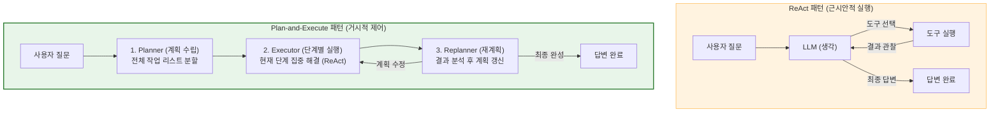
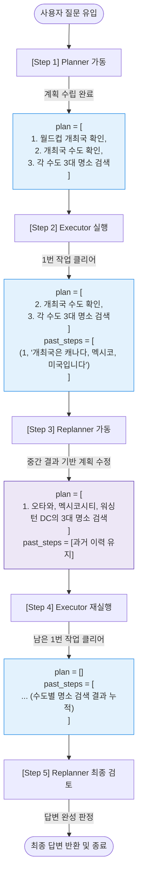

# Lesson 4.6: 계획 및 실행 시스템 설계 (Designing a Plan-and-Execute System) 📋

이 문서는 단순한 1단계 추론 루프인 ReAct 패턴을 넘어, 복잡한 과제를 해결하기 위해 거시적으로 계획을 수립하고 이를 동적으로 갱신하며 실행하는 **계획 및 실행(Plan-and-Execute)** 에이전트 시스템에 대한 종합 기술 지침서입니다.

---

## 1. ReAct 패턴과의 비교 및 아키텍처적 진화

### 🔄 ReAct(Lesson 4.2) vs Plan-and-Execute(Lesson 4.6)



* **ReAct 패턴의 한계 (Lesson 4.2 복습)**:
  * ReAct 에이전트는 매 단계마다 "생각(Thought)하고 행동(Action)하고 관찰(Observation)"합니다. 
  * 목표가 복잡하고 하위 태스크가 많을 경우, 에이전트가 앞서 수행한 작업을 망각하거나, 동일한 도구를 중복 호출하는 비효율적인 루프(무한 루프)에 빠지기 쉽습니다. 또한 매 연산마다 전체 프롬프트를 재평가하므로 API 비용이 급증합니다.
* **Plan-and-Execute 패턴의 진화**:
  * **목표 세분화**: 사용자의 최종 목표를 이루기 위한 하위 실행 계획 목록(`plan`)을 먼저 명시적으로 설계합니다.
  * **역할 분담과 모델 최적화**: 
    * **Planner/Replanner (대형 모델 사용)**: 정교하고 넓은 시야가 필요한 계획 수립 및 재계획 과정에는 성능이 우수한 모델(예: GPT-4o)을 배치합니다.
    * **Executor (소형 모델 사용)**: 이미 계획된 명확한 1개 단계만 빠르게 도구로 실행하면 되므로 가볍고 저렴한 모델(예: gpt-4o-mini)을 배치해 자원 효율성을 최대화합니다.

---

## 2. 통합 예시를 통한 동적 순환 흐름 분석

사용자가 **`"다음 FIFA 월드컵은 어느 나라에서 개최되나요? 그리고 그 나라 수도의 3대 관광 명소는 무엇인가요?"`**라는 고난도 복합 질문을 던졌을 때, 시스템 상태(`State`)의 변화와 루프 가동 과정입니다.



---

## 3. Plan-and-Execute 핵심 코드 세부 지침

### ① 상태 관리 정의 (`State` 딕셔너리)
```python
import operator
from typing import Annotated, Tuple
from typing_extensions import TypedDict

class State(TypedDict):
    input: str                         # 사용자 질문 원본
    plan: list[str]                     # 앞으로 수행해야 할 남은 하위 계획 목록 (리스트)
    past_steps: Annotated[list[tuple], operator.add]  # 실행 완료한 태스크와 결과 이력 누적
    response: str                      # 최종 완성된 답변 (비어있지 않으면 종료)
```
* **🔍 기술 해설**: 
  * `plan`은 실행자가 단계를 끝낼 때마다 앞부분을 잘라내는 슬라이싱(`plan[1:]`)을 거칩니다.
  * `past_steps`에 달린 `Annotated[..., operator.add]` 리듀서는 새로운 실행 노드의 결과 데이터가 들어올 때, 기존 리스트를 덮어쓰지 않고 뒤에 안전하게 차곡차곡 이어 붙이도록(Append) 지시합니다.

---

### ② 계획 수립용 Pydantic 모델 및 LCEL 체인 (`Planner`)
```python
from langchain_core.prompts import ChatPromptTemplate
from pydantic import BaseModel, Field

# 1. 출력 규격 정의
class Plan(BaseModel):
    steps: list[str] = Field(description="목표를 달성하기 위한 단계들의 리스트")

# 2. 프롬프트 작성
planner_prompt = ChatPromptTemplate.from_messages([
    ("system", "당신은 주어진 질문을 해결하기 위한 계획 수립 전문가입니다. 단계를 쪼개어 나열하세요."),
    ("user", "질문: {input}")
])

# 3. 구조화된 출력(Structured Output)이 결합된 체인 빌드
planner = planner_prompt | llm.with_structured_output(Plan)
```
* **🔍 기술 해설**: 
  * `llm.with_structured_output(Plan)`은 LLM의 반환값을 JSON 스키마 기반으로 검증하여 `Plan` 객체 타입으로 강제 변환합니다. 이를 통해 신뢰할 수 없는 원시 텍스트 대신 깔끔한 파이썬 `list` 형태의 하위 작업들을 수집합니다.

---

### ③ 의사결정 Pydantic 모델 및 재계획 체인 (`Replanner`)
```python
from typing import Union

# 최종 응답 완료 규격
class Response(BaseModel):
    response: str

# 계획 수정 또는 추가 규격
class Act(BaseModel):
    action: Union[Response, Plan]

replanner_prompt = ChatPromptTemplate.from_messages([
    ("system", "완료된 단계와 결과를 바탕으로 원래 계획을 업데이트하거나 최종 답변을 작성하세요."),
    ("user", "목표: {input}\n원래 계획: {plan}\n지나온 단계: {past_steps}")
])

replanner = replanner_prompt | llm.with_structured_output(Act)
```
* **🔍 기술 해설**:
  * Pydantic의 `Union[Response, Plan]` 구조는 강력한 동적 라우팅 기준이 됩니다.
  * 모델이 판단하기에 정보가 충분하다면 `Response` 타입의 객체를 반환하고, 정보가 부족해 후속 태스크를 더 해야 한다면 수정된 `Plan` 타입 객체를 반환하도록 구조를 강제합니다.

---

### ④ 조건부 라우터 함수 (`routing_condition`)
```python
def routing_condition(state: State):
    # 최종 답변이 명시되어 있다면 루프를 정지하고 END로 라우팅
    if state.get("response"):
        return "END"
    # 남은 계획 리스트가 비어있지 않다면 실행자 노드로 이동
    elif state.get("plan"):
        return "executor"
    # 계획은 다 썼는데 아직 response가 없다면 재계획 노드로 송출
    else:
        return "replanner"
```

---

## 4. 실습 환경 세팅 및 실행 가이드

1. **필수 패키지 설치**:
   ```bash
   pip install langgraph langchain-openai langchain-community pydantic dotenv
   ```
2. **API 키 설정 (`.env`)**:
   프로젝트 루트 폴더에 `.env` 파일을 생성하고 아래 키를 입력합니다.
   ```env
   OPENAI_API_KEY="your_openai_api_key"
   TAVILY_API_KEY="your_tavily_api_key"  # 웹 검색 실행을 위해 필수
   ```
3. **노트북 위치 안내**:
   * **관련 개념 코드 파일**: [lesson_4_c_human_in_the_loop_wait_for_input.ipynb](file:///Users/shinwookkang/Desktop/AI_Agent/Module%204:%20Building%20Agents%20with%20LangGraph/code/lesson_4_c_human_in_the_loop_wait_for_input.ipynb)
   * **주의**: 현재 로컬 워크스페이스에 있는 `lesson_4_c_...` 파일은 인간 참여형(Human-in-the-loop: Wait for Input) 기능을 담은 파일입니다. 본 과정의 **Plan-and-Execute** 실습 코드는 이 아키텍처를 기반으로 확장하는 다른 예제 파일에서 파생되므로, 실행 시 노드들의 상태 정의(`.with_structured_output()`)와 `Act` Pydantic 결합 부분을 위 상세 코드를 참고하여 빌드하셔야 합니다.

---

## 5. 핵심 요약 정리 (Cheat Sheet)

| 핵심 항목 | 핵심 기술 내용 | 비고 |
| :--- | :--- | :--- |
| **패턴 핵심** | 플래너(계획 수립) ➡️ 실행자(도구 사용) ➡️ 리플래너(동적 계획 수정) 순환 루프 | ReAct의 무한 루프 한계 극복 |
| **모델 최적화** | 계획 단계(GPT-4o 등 대형 모델) / 실행 단계(gpt-4o-mini 등 소형 모델) 이중 구성 | 비용 및 지연 속도 대폭 개선 |
| **상태 누적** | `Annotated[list, operator.add]`를 적용해 과거 단계 결과의 자동 Append 수행 | 상태 유실 방지 |
| **제어 분기** | `Union[Response, Plan]` 아웃풋 규격으로 답변 완성 시 즉시 탈출 조건 만족 | 라우팅 기준 명확화 |
