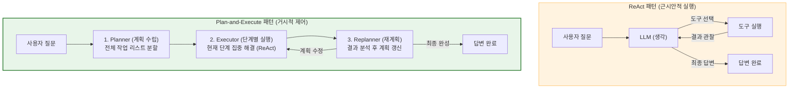
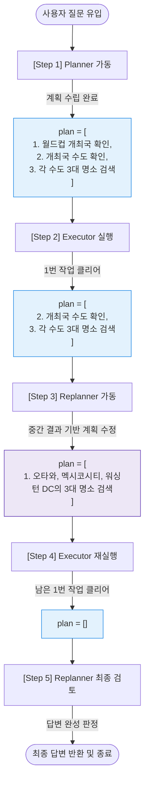

# Lesson 4.6: 계획 및 실행 시스템 설계 (Designing a Plan-and-Execute System) 📋

이 문서는 단순한 1단계 추론 루프인 ReAct 패턴을 넘어, 복잡한 과제를 해결하기 위해 거시적으로 계획을 수립하고 이를 동적으로 갱신하며 실행하는 **계획 및 실행(Plan-and-Execute)** 에이전트 시스템에 대한 종합 기술 지침서입니다.

---

## 1. ReAct 패턴과의 비교 및 아키텍처적 진화

### 🔄 ReAct(Lesson 4.2) vs Plan-and-Execute(Lesson 4.6)



* **ReAct 패턴의 한계 (Lesson 4.2 복습)**:
  * ReAct 에이전트는 매 단계마다 "생각(Thought)하고 행동(Action)하고 관찰(Observation)"합니다. 
  * 목표가 복잡하고 하위 태스크가 많을 경우, 에이전트가 앞서 수행한 작업을 망각하거나, 동일한 도구를 중복 호출하는 비효율적인 루프(무한 루프)에 빠지기 쉽습니다. 또한 매 연산마다 전체 프롬프트를 재평가하므로 API 비용이 급증합니다.
* **Plan-and-Execute 패턴의 진화**:
  * **목표 세분화**: 사용자의 최종 목표를 이루기 위한 하위 실행 계획 목록(`plan`)을 먼저 명시적으로 설계합니다.
  * **역할 분담과 모델 최적화**: 
    * **Planner/Replanner (대형 모델 사용)**: 정교하고 넓은 시야가 필요한 계획 수립 및 재계획 과정에는 성능이 우수한 모델(예: GPT-4o)을 배치합니다.
    * **Executor (소형 모델 사용)**: 이미 계획된 명확한 1개 단계만 빠르게 도구로 실행하면 되므로 가볍고 저렴한 모델(예: gpt-4o-mini)을 배치해 자원 효율성을 최대화합니다.

---

## 2. 통합 예시를 통한 동적 순환 흐름 분석 및 상세 해설

사용자가 **`"다음 FIFA 월드컵은 어느 나라에서 개최되나요? 그리고 그 나라 수도의 3대 관광 명소는 무엇인가요?"`**라는 고난도 복합 질문을 던졌을 때, 플래너 ➡️ 실행자 ➡️ 재계획자 노드가 순환하며 상태(`State`)를 갱신해 나가는 전 과정을 단계별로 풀어서 설명합니다.



### 📍 [1단계] 플래너(Planner)의 초기 계획 수립
* **에이전트의 판단**: "두 가지 정보(월드컵 개최국 확인, 개최국 수도의 관광 명소 검색)가 복합된 질문이군. 순차적으로 해결하기 위한 초기 로드맵을 작성하겠다."
* **상태의 변화 (State)**:
  * `plan`: `["다음 월드컵 개최국 확인하기", "그 개최국들의 수도 확인하기", "각 수도의 3대 관광 명소 검색하기"]` (총 3단계의 하위 태스크 리스트 생성)
  * `past_steps`: `[]` (아직 실행된 단계가 없으므로 비어 있음)

### 📍 [2단계] 실행자(Executor)의 1차 실행 (첫 번째 태스크 해결)
* **에이전트의 판단**: `plan` 목록의 가장 첫 번째 작업인 `"다음 월드컵 개최국 확인하기"`를 가져와 Tavily Search 도구를 기동합니다.
* **실행 과정**: 웹에서 최신 자료를 검색하여 "2026 FIFA 월드컵은 캐나다, 멕시코, 미국에서 공동 개최됩니다"라는 정보를 수집합니다.
* **상태의 변화 (State)**:
  * `plan`: `["그 개최국들의 수도 확인하기", "각 수도의 3대 관광 명소 검색하기"]` (이미 실행한 첫 단계를 슬라이싱 `plan[1:]` 처리하여 제거)
  * `past_steps`: `[("다음 월드컵 개최국 확인하기", "개최국은 캐나다, 멕시코, 미국입니다.")]` (첫 번째 단계의 결과가 누적됨)

### 📍 [3단계] 재계획자(Replanner)의 1차 검토 및 계획 수정
* **에이전트의 판단**: "개최국이 캐나다, 멕시코, 미국 3개국이라는 중간 정보가 확보되었군. 그렇다면 기존 계획 중 '그 개최국들의 수도 확인하기' 단계는 내 내부 지식(캐나다 = 오타와, 멕시코 = 멕시코시티, 미국 = 워싱턴 DC)으로 즉각 해결할 수 있어. 따라서 남은 계획을 이 3개 수도의 명소를 각각 검색하는 작업으로 구체화해서 다시 덮어써야겠다."
* **상태의 변화 (State)**:
  * `plan`: `["오타와의 3대 관광 명소 검색하기", "멕시코시티의 3대 관광 명소 검색하기", "워싱턴 DC의 3대 관광 명소 검색하기"]` (기존의 추상적인 계획을 구체화된 3개의 태스크로 갱신하여 덮어씀)
  * `past_steps`: 이전 이력 유지

### 📍 [4단계] 실행자(Executor)의 2차 실행 (구체화된 첫 태스크 해결)
* **에이전트의 판단**: 현재 `plan` 리스트의 첫 번째 작업인 `"오타와의 3대 관광 명소 검색하기"`를 가져와 검색 도구를 기동합니다.
* **실행 과정**: 캐나다 오타와의 국회의사당, 리도 운하, 국립미술관 정보를 웹 검색으로 수집합니다.
* **상태의 변화 (State)**:
  * `plan`: `["멕시코시티의 3대 관광 명소 검색하기", "워싱턴 DC의 3대 관광 명소 검색하기"]` (수행 완료한 오타와 태스크 제거)
  * `past_steps`: `[("다음 월드컵 개최국 확인하기", "개최국은 캐나다, 멕시코, 미국입니다."), ("오타와의 3대 명소 검색", "오타와 명소는 국회의사당, 리도 운하... 입니다.")]` (오타와 결과 추가 누적)

### 📍 [5단계] 실행자(Executor)의 3~4차 실행 (남은 수도들 검색)
* **실행 과정**: 루프를 돌며 `"멕시코시티의 3대 관광 명소 검색하기"`와 `"워싱턴 DC의 3대 관광 명소 검색하기"`를 순차적으로 실행하여 각 도시의 명소 정보를 웹 검색으로 획득합니다.
* **상태의 변화 (State)**:
  * `plan`: `[]` (모든 계획 리스트 실행 완료)
  * `past_steps`: `[..., (각 도시별 명소 검색 결과가 전부 누적됨)]`

### 📍 [6단계] 재계획자(Replanner)의 최종 판단 및 답변 작성
* **에이전트의 판단**: "남은 계획이 존재하지 않고(`plan=[]`), 3개 수도의 3대 명소 정보가 `past_steps`에 완벽히 수집 완료되었다. 더 이상 웹 검색이나 계획 수정은 필요 없다. 수집된 결과들을 종합하여 사용자에게 최종적인 아름다운 답변을 작성해 제공하자."
* **상태의 변화 (State)**:
  * `response`: `"다음 FIFA 월드컵은 캐나다, 멕시코, 미국에서 공동 개최됩니다. 각국 수도의 3대 관광 명소는 다음과 같습니다: 1. 오타와(국회의사당, 리도 운하...), 2. 멕시코시티(소칼로 광장...), 3. 워싱턴 DC(내셔널 몰...)"` (최종 완성 텍스트 주입)

### 📍 [7단계] 조건부 에지 라우터 통과 후 최종 완료
* **제어 흐름**: 라우터 (`routing_condition`)가 상태 딕셔너리에서 `response` 속성에 값이 존재함을 확인하고 그래프를 `END`로 분기시킵니다.
* **최종 완료**: 전체 에이전트 루프가 완전히 종료되고 사용자에게 답변이 송출됩니다.

---

## 3. Plan-and-Execute 핵심 코드 세부 지침

처음 파이썬 코드를 보는 사람도 직관적으로 각 파트의 기획 원리를 이해할 수 있도록 쉽게 풀어 설명합니다.

### ① 상태 관리 정의 (`State` 딕셔너리)
```python
import operator
from typing import Annotated, Tuple
from typing_extensions import TypedDict

class State(TypedDict):
    input: str                         # 사용자 질문 원본
    plan: list[str]                     # 앞으로 수행해야 할 남은 하위 계획 목록 (리스트)
    past_steps: Annotated[list[tuple], operator.add]  # 실행 완료한 태스크와 결과 이력 누적
    response: str                      # 최종 완성된 답변 (비어있지 않으면 종료)
```
* **💡 직관적 이해 방법**: 
  * 이 클래스는 에이전트가 들고 다닐 **'회의 기록용 수첩'**입니다. 
  * `input`은 **의뢰 내용**, `plan`은 화이트보드에 쓰인 **'오늘의 할 일 목록(To-do List)'**입니다. 실행자는 하나의 단계를 끝낼 때마다 이 리스트에서 첫 항목을 지워나갑니다.
  * `past_steps`에 적힌 `Annotated[list[tuple], operator.add]`가 매우 중요합니다. 파이썬 기본 리스트는 값을 전달받으면 기존 값을 덮어써서 예전 데이터가 날아가지만, `operator.add`를 붙여주면 LangGraph는 **"이전 회의록 뒤에 새 실행 결과를 덧붙여서 보관하라"**고 인식하여 검색 결과 이력이 안전하게 보존됩니다.

---

### ② 계획 수립용 Pydantic 모델 및 LCEL 체인 (`Planner`)
```python
from langchain_core.prompts import ChatPromptTemplate
from pydantic import BaseModel, Field

class Plan(BaseModel):
    steps: list[str] = Field(description="목표를 달성하기 위한 단계들의 리스트")

planner_prompt = ChatPromptTemplate.from_messages([
    ("system", "당신은 주어진 질문을 해결하기 위한 계획 수립 전문가입니다. 단계를 쪼개어 나열하세요."),
    ("user", "질문: {input}")
])

planner = planner_prompt | llm.with_structured_output(Plan)
```
* **💡 직관적 이해 방법**:
  * LLM에게 그냥 질문을 던지면 줄글 형태의 긴 텍스트로 답합니다. 그렇게 되면 컴퓨터가 "1단계 작업"만 따로 떼어서 실습하기가 불가능합니다.
  * `llm.with_structured_output(Plan)`은 LLM에게 **"답변을 리스트 양식(`['태스크1', '태스크2']`)에 맞춰서만 제출해라"** 하고 포맷 통제 규격을 씌운 것입니다. 덕분에 컴퓨터는 완벽한 리스트 구조를 즉각 반환받아 `plan` 상태값으로 삼게 됩니다.

---

### ③ 의사결정 Pydantic 모델 및 재계획 체인 (`Replanner`)
```python
from typing import Union

class Response(BaseModel):
    response: str  # 최종 답변 완료 정보

class Act(BaseModel):
    action: Union[Response, Plan]  # 최종 답변 혹은 수정된 계획 중 택일

replanner_prompt = ChatPromptTemplate.from_messages([
    ("system", "당신은 완료된 단계와 결과를 바탕으로 계획을 업데이트하는 계획 시스템입니다."),
    ("user", "목표: {input}\n원래 계획: {plan}\n지나온 단계: {past_steps}")
])

replanner = replanner_prompt | llm.with_structured_output(Act)
```
* **💡 직관적 이해 방법**:
  * 리플래너는 매 순간 원래 목표, 남은 계획, 여태껏 찾아낸 결과를 모두 가져와 중간 결산을 봅니다.
  * 여기서 핵심은 `action: Union[Response, Plan]` 입니다. LLM에게 **"최종 보고서(`Response`)를 써서 종결 지을지, 아니면 일거리를 다시 갱신(`Plan`)할지"** 양자택일(Union) 선택지를 쥐여준 것입니다.
  * 정보가 부족하면 다음 작업을 위한 `Plan`을 골라 후속 루프를 돌리고, 조사가 끝나면 `Response`를 골라 프로세스를 종결합니다.

---

### ④ 조건부 라우터 함수 (`routing_condition`)
```python
def routing_condition(state: State):
    if state.get("response"):
        return "END"
    elif state.get("plan"):
        return "executor"
    else:
        return "replanner"
```
* **💡 직관적 이해 방법**:
  * 수첩 상태에 따라 다음에 어느 부서로 일을 넘길지 결정하는 **'신호등'** 코드입니다.
  * `state["response"]`가 채워져 있다면 ➡️ 최종 보고서가 나온 것이므로 즉시 루프 탈출 및 퇴근(`END`).
  * `state["plan"]` 리스트에 할 일이 남아 있다면 ➡️ 그 일을 처리하기 위해 실행 부서(`executor`) 노드로 제어 이동.
  * 계획은 전부 비었는데(`plan`이 없음) 아직 최종 보고서(`response`)도 없다면 ➡️ 결산을 보러 재계획 부서(`replanner`) 노드로 제어 이동.

---

## 4. 실습 환경 세팅 및 실행 가이드

1. **필수 패키지 설치**:
   ```bash
   pip install langgraph langchain-openai langchain-community pydantic dotenv
   ```
2. **API 키 설정 (`.env`)**:
   프로젝트 루트 폴더에 `.env` 파일을 생성하고 아래 키를 입력합니다.
   ```env
   OPENAI_API_KEY="your_openai_api_key"
   TAVILY_API_KEY="your_tavily_api_key"  # 웹 검색 실행을 위해 필수
   ```

---

## 5. 실습 소스코드 정밀 분석 및 매핑

새롭게 등록된 실제 실습 노트북 코드의 구성 요소를 라인별로 분석하여 매핑합니다.

* **실습 노트북**: [code/lesson_6_plan_and_execute_system.ipynb](file:///Users/shinwookkang/Desktop/AI_Agent/Module%204:%20Building%20Agents%20with%20LangGraph/code/lesson_6_plan_and_execute_system.ipynb)

### ① 라이브러리 및 모델/도구 셋업 (라인 32 ~ 97)
* **환경 변수 로드 (라인 52 ~ 55)**:
  `load_dotenv()`를 호출하여 `.env` 내의 OpenAI 및 Tavily API 키를 파이썬 런타임에 동기화합니다.
* **LLM 선언 (라인 71 ~ 75)**:
  ```python
  llm = ChatOpenAI(model="gpt-4o-mini", temperature=0)
  ```
  계획 수립과 실행 제어를 위해 일관성 있는 구조화 출력을 생성하도록 `temperature=0`으로 고정합니다.
* **Tavily 도구 바인딩 (라인 90 ~ 95)**:
  `max_results=3`으로 설정하여 각 도시 검색 시 상위 3개의 검색 결과를 수집하도록 정의합니다.

### ② 수첩 상태 정의 `State` (라인 111 ~ 117)
```python
class State(TypedDict):
    input: str
    plan: List[str]
    past_steps: Annotated[List[Tuple[str, str]], operator.add]  # 실행 완료한 (작업, 결과) 리스트
    response: str
```
* **🔍 코드 해설**:
  * `past_steps`는 튜플들의 리스트(`List[Tuple[str, str]]`) 형태로 정의되어 있습니다. 
  * `operator.add`에 의해 새로운 노드가 가동하여 결과를 반환할 때마다 `[(현재단계, 검색결과)]`를 기존 회의록 뒤에 이어서 결합시킵니다.

### ③ Planner & Replanner LCEL 체인 (라인 127 ~ 184)
* **Planner 정의 (라인 132 ~ 146)**:
  ```python
  class Plan(BaseModel):
      steps: List[str] = Field(description="A list of steps to achieve the objective.")
  # planner = planner_prompt | llm.with_structured_output(Plan)
  ```
  사용자가 던진 `input` 쿼리를 하위 작업 리스트인 `Plan` 모델 규격으로 100% 강제 변환합니다.
* **Replanner 정의 (라인 162 ~ 183)**:
  ```python
  class Act(BaseModel):
      action: Union[Response, Plan] = Field(description="The action to perform next.")
  # replanner = replanner_prompt | llm.with_structured_output(Act)
  ```
  현재까지 완수한 `past_steps`를 분석하여, 작업을 끝마쳐도 된다면 `Response` 객체로 분기하고, 추가 계획이 더 필요하다면 새로운 `Plan`을 생성해 루프를 지속시킵니다.

### ④ 그래프 컴포넌트 노드 및 라우터 정의 (라인 228 ~ 294)
* **planning_node (라인 232 ~ 238)**:
  `planner.invoke`를 실행하여 초기 계획을 작성하고, 리스트 형식의 단계를 반환해 `plan` 속성에 할당합니다.
* **execution_node (라인 241 ~ 255)**:
  ```python
  current_step = state["plan"][0]
  agent_response = execution_agent.invoke({"messages": [("user", agent_input)]})
  result = agent_response["messages"][-1].content
  return {
      "past_steps": [(current_step, result)],
      "plan": state["plan"][1:] # 이미 수행한 첫 번째 단계를 제거하는 슬라이싱
  }
  ```
  계획의 0번째 단계를 가져와 `create_react_agent`를 통해 도구(Tavily)로 실행을 수행하고, 결과를 `past_steps`에 누적함과 동시에 `plan[1:]`로 작업 목록에서 제거합니다.
* **replanning_node (라인 257 ~ 267)**:
  `replanner.invoke(state)`를 호출하여 판단 결과가 `Response` 규격이면 `response`에 답을 할당하고, 수정된 계획(`Plan`)이면 `plan`에 새로운 단계를 덮어씌웁니다.
* **should_continue 조건부 분기 (라인 270 ~ 286)**:
  상태값의 `response` 유무와 `plan` 리스트 잔여 여부를 검사해 다음 진행 경로(`executor`, `replanner`, `END`)를 라우팅합니다.

### ⑤ 테스트 가동부 (라인 422 ~ 434)
```python
user_query = "Which country will host the next FIFA World Cup, and what are the top three tourist attractions in its capital city?"
inputs = {"input": user_query}
events = graph.stream(inputs, config)
```
* **🔍 코드 해설**:
  * 복잡한 질문이 주입되어 `graph.stream`이 실행될 때 각 노드의 `print` 로그가 터미널에 실시간 출력되며, 최종 답변인 `response`가 완성되면 출력 세션에 마크다운 형태로 렌더링되게 설계되어 있습니다.

---

## 6. 핵심 요약 정리 (Cheat Sheet)

| 핵심 항목 | 핵심 기술 내용 | 비고 |
| :--- | :--- | :--- |
| **패턴 핵심** | 플래너(계획 수립) ➡️ 실행자(도구 사용) ➡️ 리플래너(동적 계획 수정) 순환 루프 | ReAct의 무한 루프 한계 극복 |
| **모델 최적화** | 계획 단계(GPT-4o 등 대형 모델) / 실행 단계(gpt-4o-mini 등 소형 모델) 이중 구성 | 비용 및 지연 속도 대폭 개선 |
| **상태 누적** | `Annotated[list, operator.add]`를 적용해 과거 단계 결과의 자동 Append 수행 | 상태 유실 방지 |
| **제어 분기** | `Union[Response, Plan]` 아웃풋 규격으로 답변 완성 시 즉시 탈출 조건 만족 | 라우팅 기준 명확화 |
| **독립적 수명주기** | LangGraph의 `thread_id` 세션과 LangSmith의 `Trace` 이력은 1:N 관계를 가짐 | 개별 모니터링 로그 독립 적재 |
