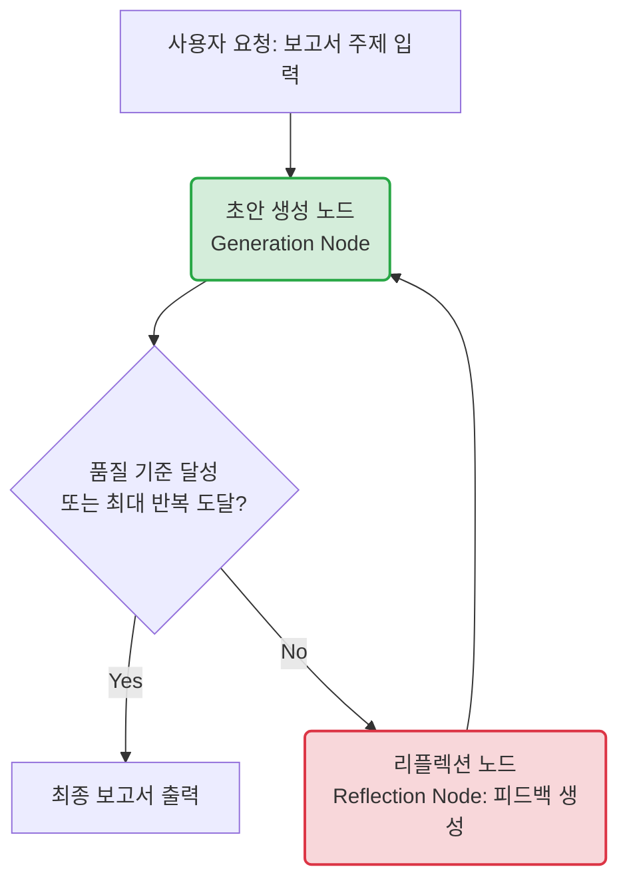
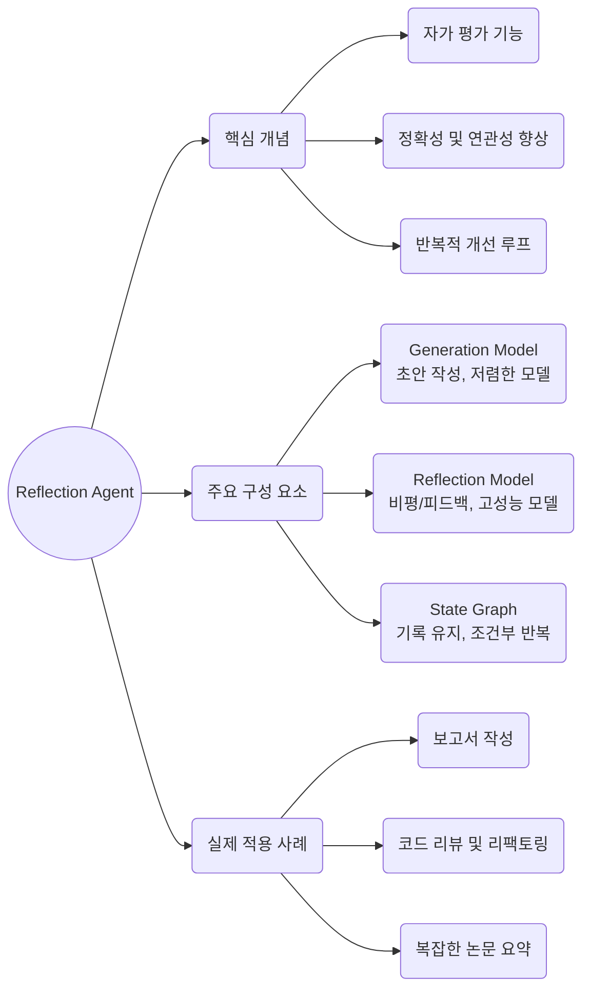

# Lesson 4.7: 리플렉션 에이전트 (Reflection Agent) - 보고서 작성 및 비평 루프

## 1. 개요 및 이전 레슨(Plan-and-Execute)과의 연결성

이전 레슨인 **Lesson 4.6 (Plan-and-Execute 시스템)** 에서는 복잡한 문제를 해결하기 위해 에이전트가 "전체적인 계획을 먼저 세우고, 단계별로 실행하며, 필요에 따라 계획을 수정"하는 거시적인 로드맵 작성 및 실행 방법에 대해 배웠습니다. 

이번 **Lesson 4.7 (리플렉션 에이전트)** 에서는 그보다 미시적인 관점에서, **에이전트가 생성한 결과물의 '품질'을 극대화**하는 방법에 집중합니다. 
Plan-and-Execute가 "어떤 순서로 일을 할 것인가"에 대한 방법론이라면, Reflection은 **"내가 방금 한 일이 제대로 된 것인가? 더 개선할 부분은 없는가?"** 를 스스로 묻고 수정하는(자기 성찰 및 비평) 과정입니다. 
실제 어플리케이션에서는 Plan-and-Execute의 각 세부 실행 단계 내부에 Reflection 루프를 삽입하여, 각 단계의 출력물 품질을 높이는 형태로 결합하여 사용할 수 있습니다.

---

## 2. 전체 흐름 시각화 (동적 순환 흐름 분석)

### 2.1 리플렉션 에이전트의 3단계 핵심 프로세스
1. **생성 (Generation)**: 초기 프롬프트나 사용자의 요청을 바탕으로 초안(Draft)을 작성합니다.
2. **리플렉션 (Reflection/Critique)**: 별도의 리뷰어(또는 같은 모델의 다른 프롬프트)가 초안을 검토하고, 정확성, 구조, 깊이, 스타일 등을 비평하여 피드백을 생성합니다.
3. **수정 및 반복 (Revision & Loop)**: 피드백을 바탕으로 초안을 수정합니다. 이 과정은 정해진 횟수에 도달하거나 목표 품질을 달성할 때까지 반복됩니다.

### 2.2 플로우 차트 (Mermaid)



### 2.3 핵심 구조도 (Graph)
> (일부 뷰어에서 Mindmap 렌더링 오류가 발생할 수 있어 안정적인 형태의 계층 구조도로 대체하였습니다.)



---

## 3. 통합 예시를 통한 동적 순환 흐름 분석

실제 코드의 예시인 **"현대 헬스케어에 미치는 인공지능의 영향 (The Impact of Artificial Intelligence on Modern Healthcare)"** 보고서 작성을 기준으로, 각각의 단계가 어떻게 흘러가는지 이해하기 쉽게 설명해 드립니다.

- **Step 1: 1차 초안 생성 (Generation 노드)**
  - **상황**: 사용자가 "헬스케어와 AI에 대한 보고서를 써줘"라고 요청합니다.
  - **동작**: 빠르고 저렴한 모델(`gpt-4o-mini`)이 시스템 프롬프트("당신은 전문 보고서 작성자입니다")에 따라 초안을 작성합니다.
  - **결과물**: "AI는 의료 영상 판독에 도움을 주고 치료를 돕습니다..." 수준의 구조는 잡혀있지만 비교적 평범하고 일반적인 초안이 생성됩니다.

- **Step 2: 1차 비평 (Reflection 노드)**
  - **상황**: 완성된 1차 초안을 리뷰어 모델(`gpt-4o`)에게 보냅니다. 이때 AI가 작성한 초안을 마치 '사용자가 쓴 글'인 것처럼 역할을 바꿔서 전달합니다.
  - **동작**: 고성능 모델이 "당신은 전문 리뷰어입니다"라는 지시에 따라 초안의 부족한 점을 날카롭게 지적합니다.
  - **결과물 (피드백)**: "내용은 좋지만 구체적인 사례나 통계 수치가 부족합니다. 웨어러블 기기에 대한 내용이 더 들어가면 좋겠습니다. 도전 과제에 대한 해결책도 제시해주세요."

- **Step 3: 2차 수정본 생성 (Generation 노드)**
  - **상황**: 에이전트(`gpt-4o-mini`)는 이전의 초안과 방금 받은 '리뷰어의 피드백'을 함께 읽습니다.
  - **동작**: 피드백의 지적 사항을 반영하여 내용을 보강합니다.
  - **결과물**: "Nature지에 따르면 AI가 94.6% 정확도로 유방암을 발견했습니다... 웨어러블 기기인 애플워치는 심박수 이상을 감지합니다..." 와 같이 구체적인 사례와 수치가 추가된 훨씬 발전된 보고서가 나옵니다.

- **Step 4: 2차 비평 (Reflection 노드)**
  - **상황**: 2차 수정본을 다시 리뷰어 모델에게 보냅니다.
  - **동작**: 리뷰어가 수정된 보고서를 읽고 여전히 부족한 부분이 있는지 확인합니다.
  - **결과물 (피드백)**: "수치가 들어가서 훨씬 좋아졌습니다. 추가로, 독자들의 이해를 돕기 위해 결론 부분에 실천 가능한 '단기/장기 권고안(Recommendations)'을 나누어 제시하면 완벽하겠습니다."

- **Step 5: 최종 보고서 생성 (Generation 노드)**
  - **상황**: 에이전트가 마지막 피드백을 반영합니다.
  - **결과물**: 결론 부분에 실행 가능한 단기적 행동 지침과 장기적 비전이 추가된 고품질의 **최종 완성본**이 출력됩니다.

- **Step 6: 조건부 종료 (Conditional Edge)**
  - **상황**: 시스템에 설정해 둔 '메시지 길이 제한(예: 6개)'에 도달했는지 확인합니다.
  - **동작**: (사용자 요청 -> 1차 초안 -> 1차 비평 -> 2차 초안 -> 2차 비평 -> 최종본)으로 설정한 반복 횟수가 꽉 찼으므로 루프를 종료(`END`)합니다.

이처럼 리플렉션 시스템은 인간이 중간에 개입하여 "이거 고쳐와"라고 말하지 않아도, **AI 스스로 초안을 쓰고, 스스로 비평하고, 스스로 수정하는 과정을 반복**하여 결과물의 품질을 극한으로 끌어올립니다.

---

## 4. 실습 코드 상세 가이드 (`lesson_7_reflection_report_writing_system.ipynb`)

이번 실습에서는 사용자가 주제를 주면 **보고서 초안을 작성하고, 스스로 피드백을 생성하여, 더 나은 보고서로 발전시키는 과정을 LangGraph로 구현**합니다.

> **실습 파일 위치**: `Module 4: Building Agents with LangGraph/code/lesson_7_reflection_report_writing_system.ipynb`

### 4.1 LLM 모델 이원화 전략 (Line 64 ~ 68)
효율성과 비용을 고려하여 두 가지 다른 모델을 사용합니다.
```python
# Report Generation Model (초안 생성 - 비용이 저렴하고 빠른 모델)
generation_llm = ChatOpenAI(model="gpt-4o-mini", temperature=0.7, max_tokens=1500)

# Reflection Model (비평 및 피드백 - 성능이 뛰어나고 정확도 높은 모델)
reflection_llm = ChatOpenAI(model="gpt-4o", temperature=0, max_tokens=1000)
```

### 4.2 프롬프트 체인 구성 (Line 85 ~ 129)
**초안 생성 체인 (`generate_report`)**
```python
generation_prompt = ChatPromptTemplate.from_messages([
    ("system", "You are a professional report writer... Generate a detailed report..."),
    MessagesPlaceholder(variable_name="messages"),
])
generate_report = generation_prompt | generation_llm
```

**리플렉션 체인 (`reflect_on_report`)**
```python
reflection_prompt = ChatPromptTemplate.from_messages([
    ("system", "You are an expert reviewer tasked with critiquing... Provide constructive feedback..."),
    MessagesPlaceholder(variable_name="messages"),
])
reflect_on_report = reflection_prompt | reflection_llm
```

### 4.3 상태(State) 정의 (Line 146 ~ 147)
```python
class State(TypedDict):
    messages: Annotated[list, add_messages]
```
- 이전 Lesson들과 마찬가지로, `messages` 리스트에 대화 기록(초안, 피드백, 수정본 등)을 계속 누적하여 상태를 유지합니다.

### 4.4 노드(Node) 및 그래프 구성 (Line 164 ~ 201)
이 코드가 리플렉션 패턴의 핵심입니다.

**노드(Node) 구성**
```python
async def generation_node(state: State) -> State:
    return {"messages": [await generate_report.ainvoke(state["messages"])]}

async def reflection_node(state: State) -> State:
    # 💡 메시지 역할 반전(Swap): AI의 보고서를 HumanMessage로 변경하여 리뷰어에게 전달
    cls_map = {"ai": HumanMessage, "human": AIMessage}
    translated = [state["messages"][0]] + [
        cls_map[msg.type](content=msg.content) for msg in state["messages"][1:]
    ]
    res = await reflect_on_report.ainvoke(translated)
    
    # 리뷰어의 비평 결과를 HumanMessage(인간의 피드백)로 상태에 반환
    return {"messages": [HumanMessage(content=res.content)]}
```

**그래프 엣지 및 조건부 루프 제어**
```python
def should_continue(state: State):
    # 안전 장치: 반복 횟수를 제한하여 무한 루프 방지
    if len(state["messages"]) > 6: 
        return END
    return "reflect"

builder.add_conditional_edges("generate", should_continue)
builder.add_edge("reflect", "generate")
```

### 4.5 실행 및 결과 확인 (Line 244 ~ )
- 사용자 토픽: `"The Impact of Artificial Intelligence on Modern Healthcare"`
- 출력을 보면, **[초기 보고서] -> [피드백(Reflection)] -> [수정된 보고서] -> [피드백] -> [최종 보고서]** 순으로 내용이 점점 더 구체화되고(수치/통계 추가, 사례 언급 등), 구조가 개선되는 것을 확인할 수 있습니다.

---

## 5. 복잡한 부분 보충 설명

### 💡 왜 `reflection_node`에서 메시지 역할을 반전(Swap)시키나요?
일반적으로 LLM은 "Human(사용자)"이 묻고, "AI"가 답하는 구조에 익숙하게 학습되어 있습니다.
우리가 원하는 것은 **AI가 방금 자신이 쓴 글(AIMessage)을 보고 비평하는 것**입니다. 이를 위해 기존의 `AIMessage`를 `HumanMessage`로 둔갑시켜서 리뷰어 모델(gpt-4o)에게 전달합니다. 그러면 리뷰어 모델은 "아, 사용자가 이런 보고서를 써왔구나. 내가 이걸 비평해줘야지" 라고 인식하게 되어 훨씬 더 자연스럽고 엄격한 피드백을 생성할 수 있습니다. 

### 💡 조건부 엣지의 `len(state["messages"]) > 6`의 의미는?
메시지 배열은 다음과 같이 쌓입니다.
1. 사용자: "AI 헬스케어 보고서 써줘" (길이 1)
2. AI: 초안 보고서 (길이 2)
3. AI(리뷰어): 피드백 (길이 3)
4. AI: 2차 보고서 (길이 4)
5. AI(리뷰어): 피드백 (길이 5)
6. AI: 최종 보고서 (길이 6)
이후 길이가 6을 초과하면 더 이상 리플렉션 루프를 돌지 않고 종료하겠다는 안전장치(Safety Valve)입니다. 실무에서는 토큰 제한과 비용을 고려하여 적절한 반복 횟수를 설정하는 것이 중요합니다.

---

## 6. 요약 (트랜스크립트 기반)

강의 영상에서 강조한 바와 같이, 리플렉션 레이어를 추가하는 것은 단순히 코드를 복잡하게 만드는 것이 아닙니다. 
1. **성능 향상**: 빠르고 저렴한 모델로 초안을 잡고, 고성능 모델로 리뷰함으로써 비용 효율적으로 고품질의 결과물을 얻을 수 있습니다.
2. **환각(Hallucination) 감소**: 스스로 팩트 체크를 하고 논리적 비약을 수정하는 과정을 통해 신뢰성을 높입니다.
3. **자율성 강화**: 인간의 개입(Human-in-the-loop) 없이도 에이전트 스스로 결과물을 다듬을 수 있는 능력을 부여합니다.

이 패턴은 문서 작성뿐만 아니라, 복잡한 코딩, 번역, 기획 등 다양한 분야에 응용될 수 있는 매우 강력한 아키텍처입니다.

---

## 7. 실무적 활용 방안 (Practical Use Cases)

리플렉션 에이전트 아키텍처는 사람의 즉각적인 개입 없이도 AI 스스로 결과물 품질을 높일 수 있으므로, 실무에서 다음과 같이 광범위하게 활용할 수 있습니다.

1. **자동화된 코드 리뷰 및 리팩토링 파이프라인**
   - **Generation**: 주니어 수준(빠른 모델)으로 작성된 초기 코드 구현.
   - **Reflection**: 시니어 수준의 리뷰어 모델이 보안 취약점, 클린 코드 원칙, 최적화 측면에서 코드를 비평.
   - **효과**: 개발팀이 직접 PR(Pull Request)을 리뷰하기 전에 AI가 1차, 2차 코드 개선을 완료하여 리뷰 시간을 획기적으로 단축.

2. **고객 대응용 맞춤형 이메일 및 제안서 작성**
   - **Generation**: 고객의 요구사항을 바탕으로 영업 제안서 초안 작성.
   - **Reflection**: '브랜드 톤앤매너', '협상 전략', '법적 컴플라이언스' 관점에서 초안을 평가.
   - **효과**: 영업 사원이 직접 긴 제안서를 작성하는 시간을 줄이고, 회사의 공식 문서 품질 기준을 자동으로 만족하는 고도화된 템플릿 확보.

3. **복잡한 데이터 분석 및 인사이트 도출**
   - **Generation**: DB에서 추출한 Raw Data를 바탕으로 1차 분석 보고서 작성.
   - **Reflection**: "결론에 논리적 비약은 없는지?", "데이터의 출처와 수치가 정확히 매칭되었는지?"를 팩트체크하고 비평.
   - **효과**: 환각(Hallucination) 오류가 치명적인 금융, 의료 분야의 리포팅 작업에서 신뢰성 높은 결과물 자동 산출.

4. **번역 품질 검수 (Self-Correction Translation)**
   - **Generation**: 원문을 목표 언어로 1차 기계 번역.
   - **Reflection**: 원어민 관점에서 문맥, 뉘앙스, 문화적 적합성을 리뷰.
   - **효과**: 단순한 직역을 넘어, 실제 사람이 읽기 편한 자연스러운 의역 결과물을 얻을 수 있음.

리플렉션의 본질은 **"역할의 분리"**에 있습니다. '작성자(Writer)'와 '비평가(Critic)'의 페르소나를 명확히 나누고 피드백 루프를 만들면, 단일 프롬프트로는 절대 얻을 수 없는 정교하고 전문적인 결과물을 실무에 바로 투입할 수 있습니다.
