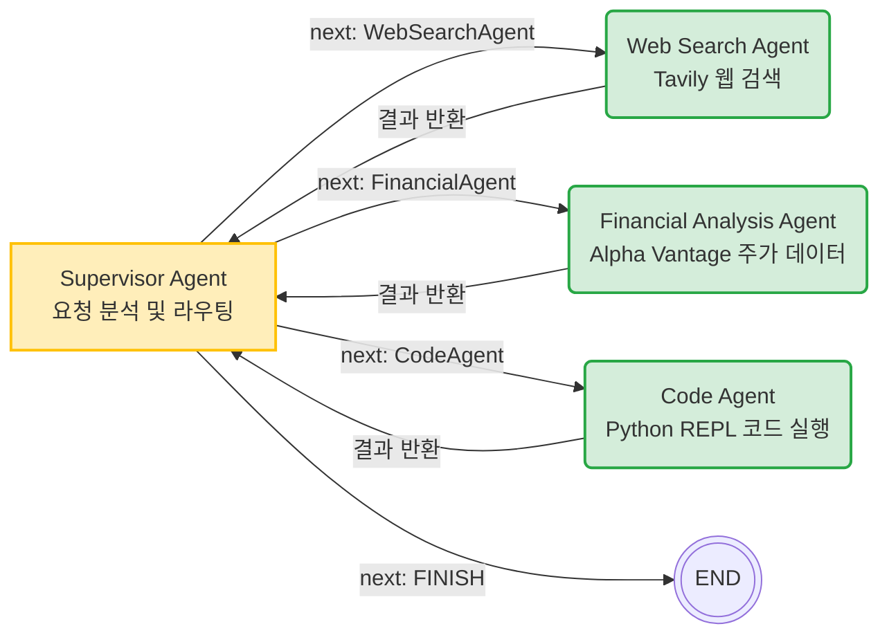

# Lesson 4.8: LangGraph 기반 협력형 멀티 에이전트 시스템 구축

## 1. 개요 및 이전 레슨(Reflection)과의 연결성

이전 **Lesson 4.7 (Reflection 패턴)** 에서는 에이전트가 "자신이 만든 결과물을 스스로 비평하고 수정하여 품질을 극대화"하는 미시적인 과정에 집중했습니다.
이번 **Lesson 4.8 (협력형 멀티 에이전트 시스템)** 은 다시 거시적인 관점으로 돌아와, **단일 에이전트의 한계를 극복**하는 방법에 초점을 맞춥니다. 

단일 에이전트가 웹 검색, 데이터 분석, 코드 실행 등 서로 다른 도메인의 도구(Tools)를 한꺼번에 다루다 보면, 아무리 뛰어난 모델(GPT-4 등)이라도 과부하가 걸려 논리적 오류를 범하기 쉽습니다. 이를 해결하기 위해 각 도메인에 특화된 **작업자(Worker) 에이전트**들을 생성하고, 이들을 지휘하는 **감독관(Supervisor) 에이전트**를 도입하는 **'분할 정복(Divide-and-Conquer)'** 아키텍처를 학습합니다.

---

## 2. 핵심 구조도 (Graph)

감독관 에이전트(Supervisor)가 중심에 서서 사용자의 요청을 분석하고, 가장 적합한 작업자(Worker) 에이전트에게 제어권을 넘겨주는(Routing) 구조입니다.



---

## 3. 통합 예시를 통한 동적 순환 흐름 분석

실제 코드의 예시인 **"지난주 동안의 Apple 종가 그래프를 그려주되, x축은 마감일로 설정해 주세요"** 라는 복합적인 요청을 기준으로, 시스템이 어떻게 상호작용하는지 분석합니다.

- **Step 1: 작업 할당 (Supervisor 노드)**
  - **상황**: 감독관이 전체 목표(Apple 주가 데이터 + 그래프 시각화)를 파악합니다.
  - **동작**: 당장 시각화를 하려면 먼저 주가 데이터가 필요하다는 것을 논리적으로 판단합니다.
  - **결정**: 제어권을 금융 분석 에이전트에게 넘깁니다. (`next: "FinancialAgent"`)

- **Step 2: 데이터 수집 (Financial Agent 노드)**
  - **동작**: 금융 분석 에이전트가 Alpha Vantage API 도구를 사용해 지난 1주일간의 AAPL 주가 데이터를 가져와 정리합니다.
  - **결정**: 데이터를 확보했으므로 다시 결과를 감독관에게 보고합니다.

- **Step 3: 다음 작업 지시 (Supervisor 노드)**
  - **동작**: 감독관은 대화 기록(State)에 주가 데이터가 추가된 것을 확인합니다. 목표 달성을 위해 이제 시각화가 남았음을 파악합니다.
  - **결정**: 제어권을 코딩 에이전트에게 넘깁니다. (`next: "CodeAgent"`)

- **Step 4: 코드 작성 및 시각화 (Code Agent 노드)**
  - **동작**: 코딩 에이전트는 전달받은 수치 데이터를 바탕으로 `matplotlib`를 이용한 Python 시각화 코드를 작성하고, Python REPL 도구를 통해 코드를 즉시 실행합니다.
  - **결과**: 화면에 주가 추이 그래프 이미지가 렌더링되며, 성공적으로 실행되었다는 기록을 감독관에게 반환합니다.

- **Step 5: 조건부 종료 (Supervisor 노드)**
  - **동작**: 감독관이 전체 대화 기록을 검토합니다. 목표였던 "Apple 종가 그래프 시각화"가 완수되었음을 확인합니다.
  - **결정**: 작업을 끝마칩니다. (`next: "FINISH"`)

---

## 4. 실습 코드 상세 가이드 (`lesson_8_multi_agent_system_financial_analysis.ipynb`)

### 4.1 작업자 에이전트(Worker Agents) 정의
각 분야에 특화된 에이전트들을 생성합니다. LangGraph의 `create_react_agent` 헬퍼 함수를 사용하여 빠르고 간편하게 ReAct 패턴의 에이전트를 만들 수 있습니다.

```python
# 1. Web Search Agent
system_prompt_web = "You are a web search agent. Your role is to use web search tools..."
web_search_agent = create_react_agent(llm, tools=[tavily_tool, get_current_date], state_modifier=system_prompt_web)

# 2. Financial Analysis Agent (차트를 그리지 말고 텍스트 데이터만 반환하도록 명시)
system_prompt_fin = "You are a financial analysis agent... Do not generate charts or plots. Only use the tools provided..."
financial_agent = create_react_agent(llm, tools=[alpha_vantage_tool, get_current_date], state_modifier=system_prompt_fin)

# 3. Code Agent (오직 파이썬 실행 및 시각화에만 집중하도록 지시)
system_prompt_code = "You are a visualization agent... Only use the Python REPL tool provided to generate plots..."
code_agent = create_react_agent(llm, tools=[python_repl_tool], state_modifier=system_prompt_code)
```

### 4.2 감독관 에이전트(Supervisor Agent) 출력 스키마 정의
감독관 에이전트는 일반적인 텍스트를 반환하는 것이 아니라, 다음에 실행할 에이전트의 이름을 **구조화된 데이터(Pydantic)** 형태로 반환해야 합니다.

```python
# 감독관이 선택할 수 있는 옵션 정의
options = ["FINISH"] + ["WebSearchAgent", "FinancialAgent", "CodeAgent"]

# 구조화된 출력 스키마 정의 (next 필드는 이 네 가지 중 하나여야 함)
class RouteResponse(BaseModel):
    next: Literal["FINISH", "WebSearchAgent", "FinancialAgent", "CodeAgent"]

# Supervisor Agent Function
def supervisor_agent(state):
    # with_structured_output을 통해 LLM의 출력을 RouteResponse 객체로 강제함
    supervisor_chain = supervisor_prompt | llm.with_structured_output(RouteResponse)
    return supervisor_chain.invoke(state)
```

### 4.3 그래프 상태(State) 및 노드 정의
State에는 주고받은 메시지 기록 외에도, 감독관이 결정한 `next` (다음 실행 대상) 필드가 포함되어야 합니다.

```python
class AgentState(TypedDict):
    messages: Annotated[Sequence[HumanMessage], operator.add]
    next: str  # 감독관이 결정한 다음 에이전트 이름이 저장됨
```

### 4.4 조건부 엣지(Conditional Edges) 연결
감독관 노드에서 반환된 `next` 값에 따라 어느 워커 노드로 갈지 분기하는 맵(Map)을 구축합니다.

```python
# Supervisor가 결정한 next 값에 따라 라우팅
conditional_map = {
    "WebSearchAgent": "WebSearchAgent",
    "FinancialAgent": "FinancialAgent",
    "CodeAgent": "CodeAgent",
    "FINISH": END
}

# lambda x: x["next"] 를 통해 State의 next 값을 읽고 conditional_map에 따라 이동
workflow.add_conditional_edges("Supervisor", lambda x: x["next"], conditional_map)

# 각 작업자 에이전트는 작업이 끝나면 항상 Supervisor에게 결과를 보고함
workflow.add_edge("WebSearchAgent", "Supervisor")
workflow.add_edge("FinancialAgent", "Supervisor")
workflow.add_edge("CodeAgent", "Supervisor")
```

---

## 5. 복잡한 부분 보충 설명

### 💡 왜 `create_react_agent` 함수를 사용하나요?
단일 에이전트 과정(Lesson 1~3)에서는 프롬프트를 엮고, 도구 바인딩(bind_tools)을 하고, ToolNode를 직접 연결하는 등 ReAct 패턴을 일일이 그래프로 구성했습니다. 하지만 워커(Worker) 에이전트를 3~4개씩 만들어야 하는 시스템에서는 이 과정이 너무 번거롭습니다. `create_react_agent`는 **"LLM + 지정된 도구"를 가진 완벽하게 작동하는 미니 서브그래프(ReAct Agent)**를 단 한 줄로 만들어주기 때문에, 멀티 에이전트를 구축할 때 시간을 크게 절약해줍니다.

### 💡 감독관 에이전트의 프롬프트에서 중요한 팁은?
작업자(Worker) 에이전트들이 어떤 능력을 가졌는지 감독관이 정확히 알아야 라우팅(Routing)을 올바르게 할 수 있습니다. 코드에서 `members` 딕셔너리에 각 에이전트의 역할(예: "An agent that analyzes financial data...")을 상세히 적어두고, 이를 포맷팅하여 감독관의 시스템 프롬프트에 동적으로 주입한 것을 눈여겨보아야 합니다. 팀원의 이력서를 감독관에게 쥐여준 것과 같습니다.

### 💡 감독관 라우팅의 핵심: 구조화된 출력(Structured Output)
감독관 에이전트는 일반적인 텍스트("금융 에이전트한테 넘길게")가 아니라, 정해진 스키마(FINISH, WebSearchAgent, FinancialAgent, CodeAgent 중 하나)에 맞는 단어만을 정확히 반환해야 합니다. 이를 위해 Pydantic의 `BaseModel`과 LangChain의 `with_structured_output(RouteResponse)`을 사용하여 LLM의 출력을 강제했습니다. 이 과정이 없으면 환각(Hallucination) 현상으로 인해 잘못된 에이전트 이름이 반환되어 라우팅 흐름이 끊길 수 있습니다.

### 💡 그래프 상태(State)의 `next` 필드는 어떻게 변경되나요?
작업자(Worker) 에이전트들은 작업이 끝나면 오직 `messages` 배열에 자신의 결과만 덧붙일 뿐입니다. 즉, 어떤 작업자도 스스로 `next` 값을 변경하여 제어권을 넘길 수 없습니다. 오직 **감독관(Supervisor) 에이전트만이 전체 메시지 맥락을 읽고 `next` 값을 결정**하여 State를 업데이트합니다. 이것이 바로 중앙 집중식 관리(Orchestration)가 충돌 없이 유지되는 원리입니다.

### 💡 Python REPL 도구 사용 시 주의할 점
`CodeAgent`에게 부여된 Python REPL 도구는 로컬 환경에서 파이썬 코드를 즉시 실행하는 매우 강력한 도구입니다. 하지만 이는 LLM이 의도치 않게 파일 시스템을 조작하는 등 위험한 명령어를 실행할 수도 있다는 의미이기도 합니다. 따라서 실무에 도입할 때는 도커(Docker) 컨테이너나 샌드박스(Sandbox)와 같이 격리된 실행 환경을 구축하여 보안을 강화하는 것이 필수적입니다.

---

## 6. 요약 (트랜스크립트 기반)

이 레슨에서 다룬 분할 정복(Divide-and-Conquer) 방식의 멀티 에이전트 시스템의 장점은 다음과 같습니다.
1. **효율성(Efficiency)**: 각 에이전트가 가장 잘하는 전문 분야에만 집중하므로 과부하가 걸리지 않고 정확도가 높습니다.
2. **확장성(Scalability)**: 시스템을 갈아엎을 필요 없이, 새로운 도구와 프롬프트를 가진 워커 에이전트를 쉽게 추가(Plug-and-play)할 수 있습니다.
3. **견고함(Robustness)**: 작업을 분해함으로써 한 에이전트에서 오류가 나더라도 시스템 전체가 붕괴하지 않고 유연하게 대처할 수 있습니다.

---

## 7. 실무적 활용 방안 (Practical Use Cases)

이러한 **Supervisor - Workers** 패턴은 실무에서 복잡한 B2B 솔루션이나 자동화 파이프라인을 구축할 때 표준적으로 사용되는 가장 안정적인 아키텍처입니다.

1. **지능형 CS(고객 지원) 라우팅 시스템**
   - **Supervisor**: 사용자의 문의를 분석하는 메인 라우터.
   - **Workers**: `환불 처리 에이전트`(DB 접근 및 결제 취소 API), `기술 지원 에이전트`(매뉴얼 RAG 검색), `컴플레인 대응 에이전트`(감성 분석 및 보상 쿠폰 발급).
   - **효과**: 기존의 규칙 기반(Rule-based) 챗봇과 달리, 문맥을 파악하여 적절한 부서(에이전트)로 티켓을 유연하게 배정하고 해결할 수 있습니다.

2. **콘텐츠/마케팅 자동화 팩토리**
   - **Supervisor**: 마케팅 캠페인 총괄 디렉터.
   - **Workers**: `리서치 에이전트`(트렌드 검색), `카피라이터 에이전트`(문구 작성), `이미지 생성 에이전트`(DALL-E 도구), `번역/검수 에이전트`.
   - **효과**: 하나의 목표("한국 20대를 위한 여름 화장품 마케팅 기획")를 던져주면, 4개의 에이전트가 순차적으로 자료를 조사하고, 글을 쓰고, 이미지를 생성하여 최종 캠페인 패키지를 완성합니다.

3. **고도화된 데이터 사이언스 파이프라인**
   - **Supervisor**: 시니어 데이터 분석가.
   - **Workers**: `SQL 에이전트`(DB에서 원시 데이터 추출), `데이터 클렌징 에이전트`(결측치 처리 등 파이썬 스크립트), `시각화 에이전트`(통계 모델 적용 및 차트 생성).
   - **효과**: 현업 담당자가 자연어로 "최근 3개월 지점별 매출 비교해줘"라고 요청하면, 에이전트들이 협력하여 실제 DB 쿼리부터 전처리, 최종 리포트 출력까지의 엔드투엔드 파이프라인을 자율적으로 수행합니다.
